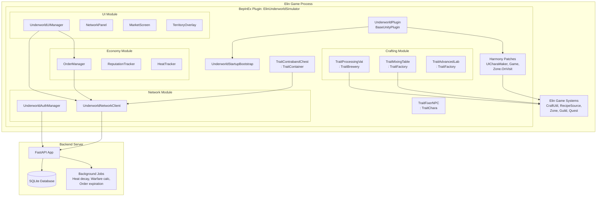
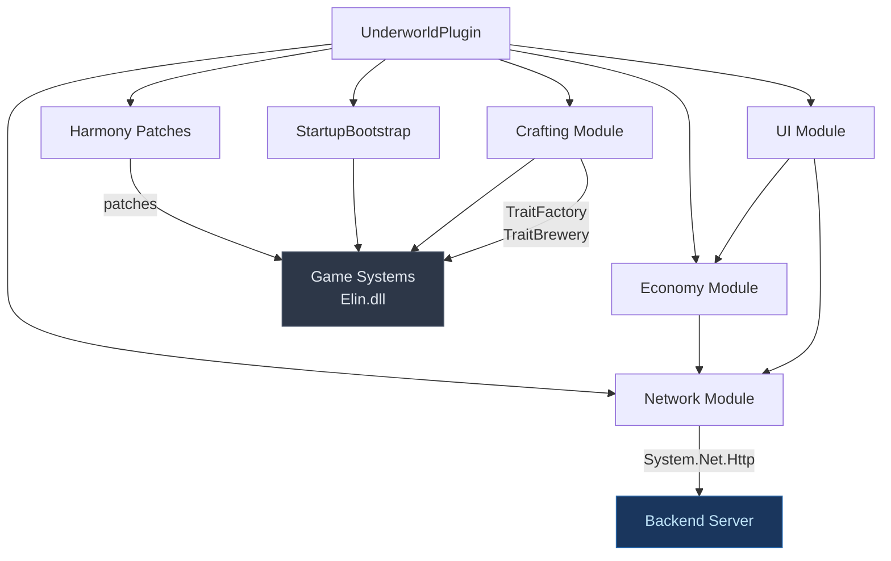
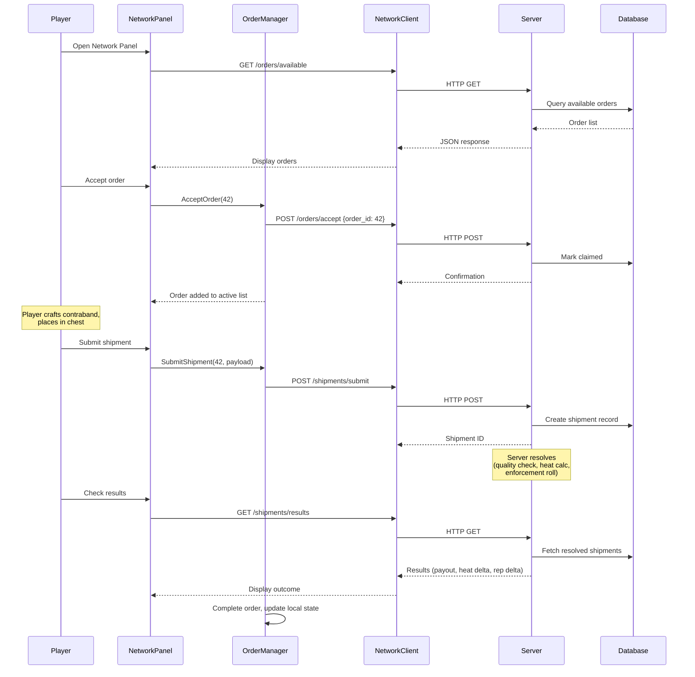

# 1 · Architecture

> Parent: [00_overview.md](./00_overview.md)

## 1.1 System Overview

Elin Underworld Simulator is a client-server system with two independently deployable components:

1. **Client Mod** — A BepInEx plugin (C# DLL) loaded into Elin via Harmony. Contains all game-side logic: startup scenario, crafting stations, UI panels, order management, and HTTP networking.
2. **Backend Server** — A Python FastAPI application serving a REST API. Manages the shared underworld economy: orders, shipments, territories, factions, and heat decay.

The client mod is fully functional offline (crafting, base building, NPC interaction). The server adds the multiplayer dimension — shared orders, competitive territory control, and cross-player faction warfare.

## 1.2 Component Diagram



## 1.3 Technology Stack

### Client Mod

| Component | Technology | Source |
|-----------|-----------|--------|
| Runtime | .NET Framework 4.8 (`net48`) | [Directory.Build.props](file:///c:/Users/mcounts/Documents/ElinMods/Directory.Build.props) L12 |
| Mod Framework | BepInEx 5.x | `BepInEx.Core.dll`, `BepInEx.Unity.dll` |
| Patching | Harmony 2.x (`0Harmony.dll`) | Prefix/Postfix/Transpiler patches |
| Game API | `Elin.dll`, `Plugins.BaseCore.dll`, `Plugins.Modding.dll`, `Plugins.UI.dll` | [Directory.Build.targets](file:///c:/Users/mcounts/Documents/ElinMods/Directory.Build.targets) L37-L52 |
| HTTP | `System.Net.Http` | Standard .NET 4.8 |
| JSON | `Newtonsoft.Json` (bundled with Elin) | [Directory.Build.targets](file:///c:/Users/mcounts/Documents/ElinMods/Directory.Build.targets) L53-L56 |
| UI | `UnityEngine.UI.dll` | Unity UGUI |

### Backend Server

| Component | Technology |
|-----------|-----------|
| Framework | Python 3.11+, FastAPI |
| Database | SQLite via `aiosqlite` |
| Server | uvicorn |
| Auth | Token-based (custom, matching SkyreaderGuildServer pattern) |
| Testing | pytest with `conftest.py` routing to `worklog/pytest/test_tmp` |
| Background Jobs | `asyncio` scheduled tasks |

### Asset Pipeline

| Component | Technology |
|-----------|-----------|
| Sprite Generation | Google Gemini API (image generation) |
| Image Processing | Pillow (Python) |
| XLSX Management | openpyxl (Python) with NPOI shared-string normalization |
| Build | MSBuild via `dotnet build` |

## 1.4 Module Decomposition

### 1.4.1 `UnderworldPlugin : BaseUnityPlugin`

The BepInEx entry point. Responsibilities:
- Register Harmony patches on `Awake()`
- Initialize config bindings (server URL, polling interval, tuning values)
- Instantiate and wire up all module singletons
- Manage plugin lifecycle (`OnEnable`, `OnDisable`)

```csharp
[BepInPlugin("mrmeagle.elin.underworldsimulator", "Elin Underworld Simulator", "0.1.0")]
public class UnderworldPlugin : BaseUnityPlugin
{
    public static UnderworldPlugin Instance { get; private set; }
    internal static ManualLogSource Log;
    internal Harmony harmony;
    
    // Module singletons
    internal UnderworldAuthManager AuthManager;
    internal UnderworldNetworkClient NetworkClient;
    internal OrderManager Orders;
    internal ReputationTracker Reputation;
    internal HeatTracker Heat;
    internal UnderworldUIManager UI;
    
    // Config entries
    internal ConfigEntry<string> ServerUrl;
    internal ConfigEntry<int> PollIntervalSeconds;
    internal ConfigEntry<bool> OfflineMode;
    
    void Awake() { ... }
}
```

**Source pattern**: [SkyreaderGuild.cs](file:///c:/Users/mcounts/Documents/ElinMods/SkyreaderGuild/SkyreaderGuild.cs) — same BepInPlugin attribute, Harmony init, config binding approach.

### 1.4.2 `UnderworldStartupBootstrap`

Static class handling the one-time new-game setup when the player selects "Underworld Startup". Called from a `Game.StartNewGame` postfix patch.

```csharp
public static class UnderworldStartupBootstrap
{
    public static void Apply()
    {
        // 1. Claim starting zone
        // 2. Start QuestHome, advance to phase 2
        // 3. DO NOT advance QuestMain beyond phase 0
        // 4. Spawn Fixer NPC
        // 5. Grant starter items (mixing table, ingredients, tools, gold)
        // 6. Place mixing table in base
        // 7. Set dialog flags
    }
}
```

**Source pattern**: [FastStartBootstrap.Apply()](file:///c:/Users/mcounts/Documents/ElinMods/FastStart/Plugin.cs#L144-L189) — zone claiming, quest manipulation, item granting. The key difference: FastStart replays vanilla quests to completion; Underworld simply leaves `QuestMain` at phase 0.

### 1.4.3 Crafting Module

Three crafting station traits, each inheriting from Elin's existing crafting hierarchy:

| Class | Base Class | `idFactory` | Purpose |
|-------|-----------|-------------|---------|
| `TraitMixingTable` | `TraitFactory` | `"uw_mixing_table"` | Basic contraband crafting |
| `TraitProcessingVat` | `TraitBrewery` | N/A (uses decay model) | Time-delayed refinement |
| `TraitAdvancedLab` | `TraitFactory` | `"uw_advanced_lab"` | High-tier contraband crafting |

**Source patterns**:
- `TraitFactory` hierarchy: [TraitFactory.cs](file:///c:/Users/mcounts/Documents/ElinMods/Elin-Decompiled-main/Elin/TraitFactory.cs) → [TraitWorkbench.cs](file:///c:/Users/mcounts/Documents/ElinMods/Elin-Decompiled-main/Elin/TraitWorkbench.cs) → [TraitAlchemyBench.cs](file:///c:/Users/mcounts/Documents/ElinMods/Elin-Decompiled-main/Elin/TraitAlchemyBench.cs)
- Decay-to-product: [TraitBrewery.cs](file:///c:/Users/mcounts/Documents/ElinMods/Elin-Decompiled-main/Elin/TraitBrewery.cs)

### 1.4.4 Network Module

| Class | Responsibility |
|-------|---------------|
| `UnderworldAuthManager` | Token storage, registration, login. Polls `GetOrCreateAuth()` on first network call. |
| `UnderworldNetworkClient` | HTTP methods (GET/POST) with auth headers, timeout handling, offline fallback. All calls return `Task<T>` or `null` on failure. |

**Source patterns**:
- [SkyreaderAuthManager.cs](file:///c:/Users/mcounts/Documents/ElinMods/SkyreaderGuild/SkyreaderAuthManager.cs) — identical token flow
- [SkyreaderOnlineClient.cs](file:///c:/Users/mcounts/Documents/ElinMods/SkyreaderGuild/SkyreaderOnlineClient.cs) — `HttpClient` usage, error handling, polling

### 1.4.5 Economy Module

| Class | Responsibility |
|-------|---------------|
| `OrderManager` | Local cache of accepted orders. State machine: Available → Accepted → Fulfilling → Shipped → Resolved. Persisted in mod save data. |
| `ReputationTracker` | Per-territory local rep (0-1000) + global rank (enum). Read from server, cached locally. |
| `HeatTracker` | Per-territory heat (0-100). Fetched from server. Influences order availability and enforcement event probability. |

### 1.4.6 UI Module

| Class | Responsibility |
|-------|---------------|
| `UnderworldUIManager` | Coordinates panel creation/destruction. Entry point: Fixer NPC interaction or contraband chest. |
| `NetworkPanel` | Main hub — tabbed view of contracts, active orders, shipment results, territory overview. |
| `MarketScreen` | Browse/filter/accept available orders. |
| `TerritoryOverlay` | Territory status: name, heat, demand, controlling faction. |

**Source pattern**: [SkyreaderLadderDialog.cs](file:///c:/Users/mcounts/Documents/ElinMods/SkyreaderGuild/SkyreaderLadderDialog.cs) — `ELayer`-based custom dialog, Unity UI construction.

### 1.4.7 Custom Traits

| Class | Base | Purpose |
|-------|------|---------|
| `TraitContrabandChest` | `TraitContainer` | Shipping chest — place contraband, submit to server |
| `TraitFixerNPC` | (custom or `TraitUnique`) | Fixer NPC interaction — opens NetworkPanel |

**Source patterns**:
- [TraitShippingChest.cs](file:///c:/Users/mcounts/Documents/ElinMods/Elin-Decompiled-main/Elin/TraitShippingChest.cs) — container gating
- SkyreaderGuild trait patterns for custom NPC interaction

## 1.5 Dependency Hierarchy



Key dependency rules:
- **Crafting Module** depends only on Elin game systems — no network calls during crafting
- **Economy Module** depends on Network Module for data fetching
- **UI Module** depends on Economy Module for data and Network Module for direct actions
- **Network Module** has no dependency on game systems — pure HTTP client
- **Bootstrap** runs once at game start and depends on game systems for zone/quest manipulation

## 1.6 Data Flow — Order Fulfillment



## 1.7 Testing & Verification

### Build Verification
- DLL compiles without errors against `net48` and all Elin references
- Plugin appears in Elin's Mod Viewer as `[Local] Elin Underworld Simulator`
- No errors in `BepInEx/LogOutput.log` on game startup
- No errors in `C:\Users\someuser\AppData\LocalLow\Lafrontier\Elin\Player.log`

### Architecture Integration Tests
- **Module isolation**: Verify crafting module works with no server running (offline mode)
- **Graceful degradation**: Start game with invalid `ServerUrl` config → confirm no crashes, warning logged, UI shows "offline mode"
- **Config system**: Change BepInEx config values → restart → verify all modules pick up new values

### Dependency Validation
```bash
# Verify all required assemblies resolve
dotnet build ElinUnderworldSimulator.csproj
# Expected: Build succeeded, 0 warnings about missing references
```
