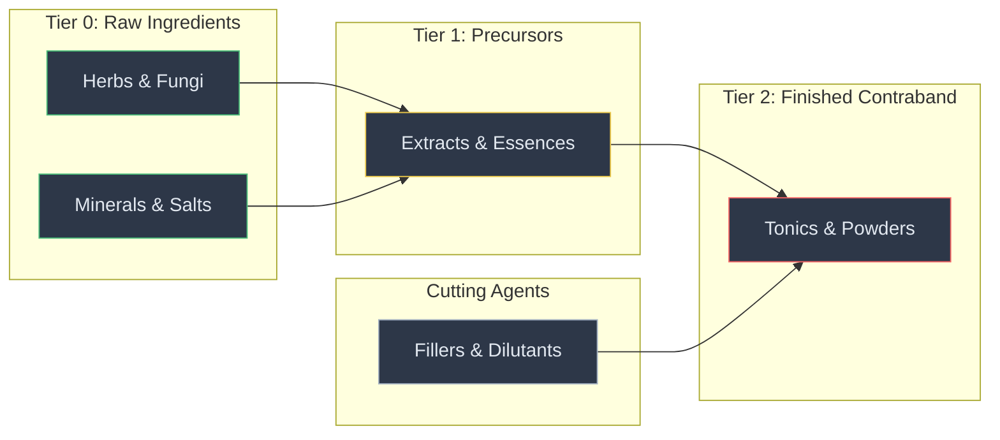

# 3 · Data Model

> Parent: [00_overview.md](./00_overview.md) · Architecture: [01_architecture.md](./01_architecture.md)

This document defines every custom item, category, and recipe in the mod. It includes complete SourceCard.xlsx row specifications — a developer can directly transcribe these tables into XLSX rows and produce a working item set.

---

## 3.1 SourceCard XLSX Column Reference

All Thing entries use the column mapping from the proven [add_meteor_items.py THING_COL](file:///c:/Users/mcounts/Documents/ElinMods/SkyreaderGuild/worklog/scripts/add_meteor_items.py#L171-L205):

| Column Name | Index | Type | Notes |
|-------------|-------|------|-------|
| `id` | 1 | string | Unique item ID. Prefix all with `uw_`. |
| `name_JP` | 2 | string | Japanese display name. May be empty for modding. |
| `unit_JP` | 4 | string | Japanese counter word (e.g. `冊` for books). |
| `name` | 6 | string | English display name. |
| `category` | 9 | string | Elin item category (e.g. `_item`, `potion`, `crafter`, `container`). |
| `sort` | 10 | string | Sort group (e.g. `junk`, `resource_ore`, `book_scroll`). |
| `sort_value` | 11 | **numeric** | Sort order within group. **Must remain numeric, not string.** |
| `_tileType` | 12 | string | Render type: empty for small, `ObjBig` for large furniture. |
| `_idRenderData` | 13 | string | Render profile: `@obj_S flat`, `@obj`, `@obj tall`, etc. |
| `tiles` | 14 | **numeric** | Fallback tile index. Custom PNGs by ID override this. |
| `altTiles` | 15 | **numeric** | Alternative tile (e.g. empty state). |
| `anime` | 16 | string | Animation spec (e.g. `"4,500"` for 4-frame 500ms). |
| `recipeKey` | 21 | string | Recipe discovery: `"*"` for always-known, empty for droponly. |
| `factory` | 22 | string | Required crafting station ID (e.g. `uw_mixing_table`). |
| `components` | 23 | string | Ingredient list: `"item_a/2,item_b/1"` format. |
| `defMat` | 25 | string | Default material (e.g. `glass`, `paper`, `granite`). |
| `value` | 27 | **numeric** | Base gold value. |
| `LV` | 28 | **numeric** | Required level. |
| `chance` | 29 | **numeric** | Random spawn chance. `0` = never spawns randomly. |
| `quality` | 30 | **numeric** | Base quality tier. |
| `HP` | 31 | **numeric** | Hit points for furniture. |
| `weight` | 32 | **numeric** | Weight in Elin units. |
| `trait` | 34 | string | Trait class name(s), comma-separated. |
| `elements` | 35 | string | Element values (e.g. `"fireproof/1,acidproof/1"`). |
| `lightData` | 41 | string | Light emission profile. |
| `tag` | 46 | string | Tags: `noShop`, `noWish`, `contraband`, etc. |
| `detail` | 52 | string | English description text. |

> **Critical NPOI Rule** (from [agents.md](file:///c:/Users/mcounts/Documents/ElinMods/AGENTS.md)): Numeric columns (`tiles`, `value`, `LV`, `weight`, `chance`, `quality`, `HP`, `sort_value`) **must** be written as numbers, not strings. The `sort` column (index 10) is a string category name, but `sort_value` (index 11) is numeric.

---

## 3.2 Item Taxonomy

Items are organized into four tiers that form the crafting pipeline:



### 3.2.1 Tier 0 — Raw Ingredients

Foraged or purchased materials. Available from merchants, wild zones, or player herb gardens.

| ID | Name | Category | Material | Value | Weight | Availability | Elin Analogue |
|----|------|----------|----------|-------|--------|--------------|---------------|
| `uw_herb_whisper` | Whispervine | `herb` | `leaf` | 30 | 100 | Forage (forest zones) | Vanilla herb items |
| `uw_herb_dream` | Dreamblossom | `herb` | `leaf` | 50 | 80 | Forage (rare, plains/forest) | Rare herb |
| `uw_herb_shadow` | Shadowcap | `mushroom` | `raw` | 40 | 120 | Forage (cave zones) | Vanilla mushroom |
| `uw_mineral_crude` | Crude Moonite | `ore` | `granite` | 20 | 500 | Mine (any mine zone) | Ore/mineral |
| `uw_mineral_crystal` | Voidstone Shard | `ore` | `obsidian` | 80 | 300 | Mine (deep dungeons) | Rare ore |
| `uw_herb_crimson` | Crimsonwort | `herb` | `leaf` | 60 | 90 | Forage (hot biomes) | Exotic herb |

### 3.2.2 Tier 1 — Precursors (Processed Ingredients)

Produced at the Mixing Table from raw ingredients. Used as inputs for finished contraband.

| ID | Name | Category | Factory | Components | Material | Value | Weight |
|----|------|----------|---------|------------|----------|-------|--------|
| `uw_extract_whisper` | Whispervine Extract | `_item` | `uw_mixing_table` | `uw_herb_whisper/3,potion_empty/1` | `glass` | 120 | 150 |
| `uw_extract_dream` | Dreamblossom Essence | `_item` | `uw_mixing_table` | `uw_herb_dream/3,potion_empty/1` | `glass` | 200 | 150 |
| `uw_extract_shadow` | Shadowcap Distillate | `_item` | `uw_mixing_table` | `uw_herb_shadow/4,potion_empty/1` | `glass` | 160 | 150 |
| `uw_powder_moonite` | Moonite Powder | `_item` | `uw_mixing_table` | `uw_mineral_crude/3` | `mineral` | 100 | 200 |
| `uw_crystal_void` | Void Crystal | `_item` | `uw_mixing_table` | `uw_mineral_crystal/2,potion_empty/1` | `obsidian` | 300 | 250 |

### 3.2.3 Tier 2 — Finished Contraband

The sellable products. Each has potency and toxicity values that determine payout and client satisfaction.

| ID | Name | Category | Factory | Components | Material | Value | Weight | Potency | Toxicity |
|----|------|----------|---------|------------|----------|-------|--------|---------|----------|
| `uw_tonic_whisper` | Whisper Tonic | `potion` | `uw_mixing_table` | `uw_extract_whisper/2,uw_powder_moonite/1` | `glass` | 500 | 200 | 40 | 10 |
| `uw_powder_dream` | Dream Powder | `_item` | `uw_mixing_table` | `uw_extract_dream/2,uw_powder_moonite/1` | `mineral` | 800 | 150 | 60 | 15 |
| `uw_elixir_shadow` | Shadow Elixir | `potion` | `uw_mixing_table` | `uw_extract_shadow/2,uw_crystal_void/1` | `glass` | 1200 | 200 | 75 | 20 |
| `uw_salts_void` | Void Salts | `_item` | `uw_advanced_lab` | `uw_crystal_void/3,uw_extract_dream/1` | `obsidian` | 2000 | 100 | 90 | 30 |
| `uw_elixir_crimson` | Crimson Elixir | `potion` | `uw_advanced_lab` | `uw_herb_crimson/4,uw_extract_shadow/2,uw_crystal_void/1` | `glass` | 3000 | 250 | 95 | 25 |

### 3.2.4 Cutting Agents

Existing Elin items used to modify output quality. No new items needed — these reference vanilla Thing IDs.

| Vanilla ID | Name | Effect on Contraband |
|-----------|------|---------------------|
| `flour` | Flour | Increases volume +50%, potency −30%, toxicity −10% |
| `water` | Water | Dilutes: potency −20%, toxicity −15% |
| `potion_empty` | Empty Bottle | Required container for liquid contraband (no stat change) |
| `ore_gem` | Gemstone | Increases potency +10%, value +20% |
| `mushroom` | Any mushroom | Wild card ingredient — varies by mushroom type |

---

## 3.3 Crafting Station Items

| ID | Name | Category | TileType | RenderData | Factory | Components | Material | Value | Weight | Trait | Detail |
|----|------|----------|----------|------------|---------|------------|----------|-------|--------|-------|--------|
| `uw_mixing_table` | Alchemist's Vice | `crafter` | `ObjBig` | `@obj` | `workbench` | `log/4,ingot/4,glass/2` | `oak` | 3000 | 15000 | `MixingTable,crafting` | A clandestine workstation fitted with vials, burners, and a crude distillation apparatus. The wood is stained with unidentifiable residues. |
| `uw_processing_vat` | Fermentation Cask | `crafter` | `ObjBig` | `@obj` | `uw_mixing_table` | `uw_mineral_crude/3,plank/6,ingot/2` | `oak` | 5000 | 20000 | `ProcessingVat` | A sealed oak barrel with copper fittings and alchemical tubing. Whatever is inside takes time to mature. |
| `uw_advanced_lab` | Shadow Laboratory | `crafter` | `ObjBig` | `@obj` | `uw_mixing_table` | `uw_crystal_void/2,glass/8,ingot/6,plank/4` | `glass` | 12000 | 25000 | `AdvancedLab,crafting` | A sophisticated alchemical apparatus of dark glass and polished metal. Only a seasoned underworld artisan could operate this. |
| `uw_contraband_chest` | Dead Drop Crate | `container` | (empty) | `@obj` | `uw_mixing_table` | `plank/4,bolt/2` | `oak` | 800 | 8000 | `ContrabandChest,3,3,crate` | A nondescript wooden crate. The Fixer's associates know to check under the false bottom. |

---

## 3.4 Element Properties for Contraband

Contraband items use Elin's element system to encode potency and toxicity. These are stored as element values on the item `Card`.

### 3.4.1 Custom Element IDs

| Element ID | Name | Type | Description |
|-----------|------|------|-------------|
| `uw_potency` | Potency | Positive | Primary quality factor. Higher = better payouts. Range 0-100. |
| `uw_toxicity` | Toxicity | Negative | Quality defect. Higher = reduced satisfaction, order failures. Range 0-100. |
| `uw_traceability` | Traceability | Negative | How easily traced. Higher = more heat generated per shipment. Range 0-50. |

### 3.4.2 How Elements Are Set During Crafting

When contraband is crafted, element values are calculated from:
1. **Base values**: Each recipe assigns default potency/toxicity (from the table in §3.2.3)
2. **Ingredient quality**: Higher-quality input ingredients boost potency. Elin's existing quality system (1-5 stars) multiplies the base:
   ```
   final_potency = base_potency * (1 + ingredient_quality * 0.1)
   ```
3. **Cutting agents**: Added agents modify values per the table in §3.2.4
4. **Crafting skill**: Player's crafting skill level provides a small potency bonus:
   ```
   final_potency += player.GetSkill("crafting").level * 0.5
   ```

The element values are written to the crafted item via:
```csharp
craftedItem.elements.SetBase("uw_potency", calculatedPotency);
craftedItem.elements.SetBase("uw_toxicity", calculatedToxicity);
```

---

## 3.5 NPOI Import Compliance

### 3.5.1 The Problem

Elin's source data importer uses NPOI, which reads string values exclusively from `xl/sharedStrings.xml`. Python's `openpyxl` library writes strings as `inlineStr` cells by default — these XML elements sit in the worksheet XML, not in `sharedStrings.xml`. NPOI ignores inline strings entirely, causing imported IDs to read as blank.

**Symptom:** Items created with the correct ID in the XLSX silently fail to load. ThingGen falls back to random junk items (historically: rubber ducks).

### 3.5.2 The Solution

After every openpyxl save, run the `normalize_shared_strings()` function from [add_meteor_items.py L49-L168](file:///c:/Users/mcounts/Documents/ElinMods/SkyreaderGuild/worklog/scripts/add_meteor_items.py#L49-L168). This function:

1. Opens the saved `.xlsx` as a ZIP archive
2. Iterates all worksheet XML files
3. Converts every `inlineStr` and `str` typed cell to `s` (shared string) type
4. Builds a new `xl/sharedStrings.xml` with all unique string values
5. Updates `[Content_Types].xml` to register the shared strings part
6. Updates `xl/_rels/workbook.xml.rels` to link the shared strings
7. Writes the corrected ZIP back to disk

### 3.5.3 Numeric Column Protection

When writing XLSX rows via openpyxl, numeric columns must be written as Python `int` or `float`, never as `str`:

```python
# CORRECT — openpyxl writes as numeric cell
ws.cell(row=r, column=THING_COL["tiles"]).value = 1552
ws.cell(row=r, column=THING_COL["value"]).value = 3000

# WRONG — openpyxl writes as string, breaks sort/value parsing
ws.cell(row=r, column=THING_COL["tiles"]).value = "1552"
ws.cell(row=r, column=THING_COL["value"]).value = "3000"
```

The `sort` column (index 10) is a **string** category name (e.g. `"junk"`, `"resource_ore"`).
The `sort_value` column (index 11) is a **numeric** sort order and must remain blank or numeric.

---

## 3.6 Complete XLSX Row Specifications

### 3.6.1 Thing Sheet — Raw Ingredients

```python
EXPECTED_THINGS = {
    "uw_herb_whisper": {
        "name_JP": "ウィスパーヴァイン",
        "name": "whispervine",
        "category": "herb",
        "sort": "resource_herb",
        "_idRenderData": "@obj_S flat",
        "tiles": 530,
        "defMat": "leaf",
        "value": 30,
        "LV": 1,
        "chance": 20,
        "weight": 100,
        "tag": "contraband",
        "detail": "A pale, creeping vine that hums faintly when touched. "
                  "Herbalists prize it. Others do too.",
    },
    "uw_herb_dream": {
        "name_JP": "ドリームブロッサム",
        "name": "dreamblossom",
        "category": "herb",
        "sort": "resource_herb",
        "_idRenderData": "@obj_S flat",
        "tiles": 530,
        "defMat": "leaf",
        "value": 50,
        "LV": 5,
        "chance": 10,
        "weight": 80,
        "tag": "contraband",
        "detail": "A luminous flower that blooms only at dusk. "
                  "Its petals dissolve in water, releasing a heady sweetness.",
    },
    "uw_herb_shadow": {
        "name_JP": "シャドウキャップ",
        "name": "shadowcap",
        "category": "mushroom",
        "sort": "resource_herb",
        "_idRenderData": "@obj_S flat",
        "tiles": 530,
        "defMat": "raw",
        "value": 40,
        "LV": 3,
        "chance": 15,
        "weight": 120,
        "tag": "contraband",
        "detail": "A dark, velvety mushroom found in deep caves. "
                  "It leaves a faint numbness on the tongue.",
    },
    "uw_mineral_crude": {
        "name_JP": "月石の原石",
        "name": "crude moonite",
        "category": "ore",
        "sort": "resource_ore",
        "_idRenderData": "@obj_S",
        "tiles": 503,
        "defMat": "granite",
        "value": 20,
        "LV": 1,
        "chance": 25,
        "weight": 500,
        "detail": "A rough, silvery mineral veined with pale luminescence. "
                  "Alchemists value it for its binding properties.",
    },
    "uw_mineral_crystal": {
        "name_JP": "虚石の欠片",
        "name": "voidstone shard",
        "category": "ore",
        "sort": "resource_ore",
        "_idRenderData": "@obj_S",
        "tiles": 503,
        "defMat": "obsidian",
        "value": 80,
        "LV": 10,
        "chance": 5,
        "weight": 300,
        "tag": "contraband",
        "detail": "A fragment of dark crystal that absorbs light. "
                  "The air around it feels thin and cold.",
    },
    "uw_herb_crimson": {
        "name_JP": "クリムゾンワート",
        "name": "crimsonwort",
        "category": "herb",
        "sort": "resource_herb",
        "_idRenderData": "@obj_S flat",
        "tiles": 530,
        "defMat": "leaf",
        "value": 60,
        "LV": 8,
        "chance": 8,
        "weight": 90,
        "tag": "contraband",
        "detail": "A blood-red herb that thrives near volcanic vents. "
                  "Its sap stains everything it touches.",
    },
}
```

### 3.6.2 Thing Sheet — Precursors, Contraband, and Stations

*(Same dictionary format as above. Full entries for all items in §3.2.2, §3.2.3, and §3.3 — including `recipeKey`, `factory`, `components`, and `trait` columns.)*

Each precursor/contraband entry additionally includes:
```python
    "recipeKey": "*",        # always-known recipe
    "factory": "uw_mixing_table",  # or "uw_advanced_lab"
    "components": "uw_extract_whisper/2,uw_powder_moonite/1",
    "chance": 0,             # never spawns randomly
```

### 3.6.3 Chara Sheet — The Fixer

See [§2.3.1](./02_game_integration.md#231-chara-source-sheet-entry) for the complete column specification.

---

## 3.7 Testing & Verification

### Data Integrity Tests

| Test | Steps | Expected |
|------|-------|----------|
| XLSX loads in Elin | Deploy mod → launch game → open Mod Viewer | No source loading errors in `LogOutput.log` |
| Item IDs resolve | `ThingGen.Create("uw_mixing_table")` | Returns valid Thing, not fallback junk |
| All items accessible | Check each `uw_*` ID via debug console | All items create successfully with correct names |
| Numeric columns correct | Inspect XLSX in Excel → check `tiles`, `value`, `LV` cells | All show as numbers, not text-formatted strings |
| SharedStrings present | Unzip XLSX → check `xl/sharedStrings.xml` | File exists and contains all string cell values |
| No inlineStr cells | Unzip XLSX → grep worksheets for `inlineStr` | Zero occurrences |

### Automated Validation Script

The asset pipeline script (`uw_asset_pipeline.py validate`) should:
1. Open the XLSX with openpyxl
2. Verify every expected row exists with correct column values
3. Verify numeric columns contain numeric cells (not strings)
4. Unzip the XLSX and confirm `xl/sharedStrings.xml` is present
5. Grep for `inlineStr` in worksheet XML — fail if found
6. Cross-reference every `factory` value against known station IDs
7. Cross-reference every `components` item ID against known Thing IDs

### Element System Tests

| Test | Expected |
|------|----------|
| Potency element on crafted item | Craft `uw_tonic_whisper` → check `elements.GetBase("uw_potency")` ≈ 40 |
| Toxicity element on crafted item | Same item → check `elements.GetBase("uw_toxicity")` ≈ 10 |
| Quality scaling | Craft with 3-star ingredients → potency > base value |
| Cutting agent effect | Add flour to recipe → volume increased, potency decreased |
