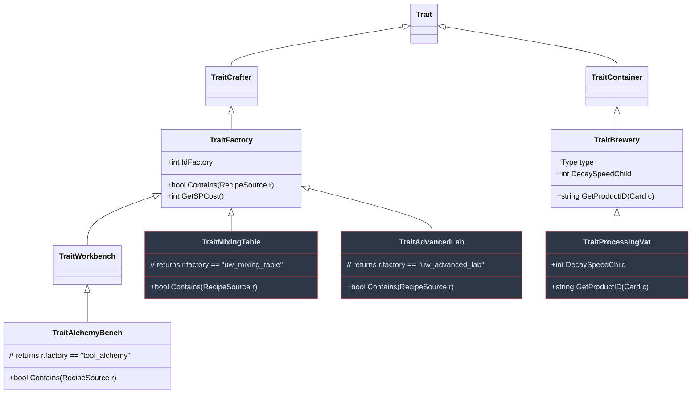

# 4 · Crafting System

> Parent: [00_overview.md](./00_overview.md) · Data Model: [03_data_model.md](./03_data_model.md)

This document specifies the implementation of three crafting stations: the Mixing Table, Processing Vat, and Advanced Lab. Each section provides exact class hierarchies, method signatures, and Elin source patterns.

---

## 4.1 Elin's Crafting Hierarchy

Understanding Elin's existing crafting class hierarchy is essential:



**Key source files:**
- [TraitFactory.cs](file:///c:/Users/mcounts/Documents/ElinMods/Elin-Decompiled-main/Elin/TraitFactory.cs) — Base crafting station: `Contains()`, `GetSPCost()`, act duration
- [TraitWorkbench.cs](file:///c:/Users/mcounts/Documents/ElinMods/Elin-Decompiled-main/Elin/TraitWorkbench.cs) — Simple subclass with no overrides
- [TraitAlchemyBench.cs](file:///c:/Users/mcounts/Documents/ElinMods/Elin-Decompiled-main/Elin/TraitAlchemyBench.cs) — Example pattern: filters recipes by `idFactory`
- [TraitBrewery.cs](file:///c:/Users/mcounts/Documents/ElinMods/Elin-Decompiled-main/Elin/TraitBrewery.cs) — Decay-to-product model: items placed inside the container transform over time

---

## 4.2 Mixing Table — `TraitMixingTable`

### 4.2.1 Class Implementation

```csharp
/// <summary>
/// Crafting station for basic contraband production.
/// Filters recipes that require factory "uw_mixing_table".
/// Placed in the player's base during Underworld Startup bootstrap.
/// </summary>
public class TraitMixingTable : TraitFactory
{
    /// <summary>
    /// Gate recipes to only those with factory="uw_mixing_table" in SourceCard.
    /// This is the exact same pattern used by TraitAlchemyBench (factory="tool_alchemy").
    /// See: Elin-Decompiled-main/Elin/TraitAlchemyBench.cs
    /// </summary>
    public override bool Contains(RecipeSource r)
    {
        return r.row.factory.Contains("uw_mixing_table");
    }
}
```

**How Elin discovers recipes for this station:**

1. Player interacts with the mixing table → `TraitFactory.OnUse()` fires
2. `TraitFactory` calls `RecipeManager.GetRecipesFor(this)` 
3. `RecipeManager` iterates all `RecipeSource` entries where `recipeKey == "*"` (or the player has learned the recipe)
4. For each recipe, it calls `this.Contains(recipe)` — our override filters to `factory == "uw_mixing_table"`
5. The filtered list populates the crafting UI

**Source reference:** [RecipeSource.cs L125-L196](file:///c:/Users/mcounts/Documents/ElinMods/Elin-Decompiled-main/Elin/RecipeSource.cs#L125-L196) — `GetIngredients()` method parses the `components` column.

### 4.2.2 Recipe Registration

Recipes are registered purely through SourceCard.xlsx Thing entries. No code-side recipe registration is needed. The recipe system works by:

1. **Thing row has `factory` column**: Setting `factory` to `"uw_mixing_table"` means this item can only be crafted at a Mixing Table.
2. **Thing row has `components` column**: The `"uw_herb_whisper/3,potion_empty/1"` format specifies required ingredients and quantities.
3. **Thing row has `recipeKey` column**: `"*"` means the recipe is always known. Omitting it means the player must find a recipe scroll.

**Component syntax** (from [RecipeSource.GetIngredients()](file:///c:/Users/mcounts/Documents/ElinMods/Elin-Decompiled-main/Elin/RecipeSource.cs#L125-L196)):
```
"item_id/quantity,item_id2/quantity2"
```
- Each comma-separated entry is one ingredient
- The `/` separates the Thing ID from the required count
- IDs must match entries in the Thing sheet
- Vanilla items can be referenced by their vanilla IDs

### 4.2.3 SP Cost and Duration

Crafting costs stamina (SP) and takes time. These are calculated by `TraitFactory`:

```csharp
// From TraitFactory.cs — SP cost scales with recipe value and components
public virtual int GetSPCost(RecipeSource recipe) 
{
    return recipe.row.value / 100 + recipe.ingredients.Count * 2;
}
```

For the Mixing Table, the default calculation is sufficient. Higher-value contraband costs more SP to produce, naturally gating production rate.

**Act duration** follows Elin's standard crafting timing — typically 2-5 seconds per craft, modified by player speed.

---

## 4.3 Processing Vat — `TraitProcessingVat`

### 4.3.1 Design

The Processing Vat uses Elin's **decay-to-product** model from [TraitBrewery](file:///c:/Users/mcounts/Documents/ElinMods/Elin-Decompiled-main/Elin/TraitBrewery.cs). Items placed inside the vat passively transform into refined contraband over time.

This is conceptually identical to how the Brewery turns berries into wine — raw items "ferment" into processed products.

### 4.3.2 Class Implementation

```csharp
/// <summary>
/// Time-delayed contraband processing station.
/// Items placed inside decay into refined products over time.
/// Inherits from TraitBrewery to get the decay-to-product lifecycle.
/// See: Elin-Decompiled-main/Elin/TraitBrewery.cs
/// </summary>
public class TraitProcessingVat : TraitBrewery
{
    /// <summary>
    /// Determines the output product ID for a given input item.
    /// Called by TraitBrewery's decay tick when the contained
    /// item's decay counter reaches zero.
    /// 
    /// See: TraitBrewery.GetProductID() in Elin-Decompiled-main
    /// </summary>
    public override string GetProductID(Card c)
    {
        // Map input items to output products
        return c.id switch
        {
            "uw_extract_whisper" => "uw_tonic_whisper_refined",
            "uw_extract_dream"  => "uw_powder_dream_refined",
            "uw_extract_shadow" => "uw_elixir_shadow_refined",
            "uw_tonic_whisper"  => "uw_tonic_whisper_aged",
            "uw_powder_dream"   => "uw_powder_dream_concentrated",
            _ => null, // No processing available for this item
        };
    }
    
    /// <summary>
    /// Controls how fast items decay (process) inside the vat.
    /// Lower = faster processing.
    /// TraitBrewery default is 10. We use 8 for slightly faster processing.
    /// </summary>
    public override int DecaySpeedChild => 8;
    
    /// <summary>
    /// The container type category for the vat.
    /// TraitBrewery uses Type.Drink for brewing. We reuse it
    /// since the processing model is identical.
    /// </summary>
    public override Type type => Type.Drink;
}
```

### 4.3.3 How TraitBrewery's Decay Model Works

From [TraitBrewery.cs](file:///c:/Users/mcounts/Documents/ElinMods/Elin-Decompiled-main/Elin/TraitBrewery.cs):

1. Player places item in the vat container
2. Elin's `CardManager` runs periodic decay ticks on all items
3. Items inside a `TraitBrewery` container receive accelerated decay (controlled by `DecaySpeedChild`)
4. When an item's decay counter hits zero, `TraitBrewery` calls `GetProductID(item)`
5. If a product ID is returned, the item is **replaced** with the new product (`ThingGen.Create(productId)`)
6. Quality and element values from the original are partially inherited by the product

**Visual indicator**: Items in the vat show a decay bar in their tooltip, giving the player a progress indicator.

### 4.3.4 Refined Product Items

Vat-processed versions of contraband have higher potency and value:

| Input | Output | Potency Change | Value Change | Processing Time |
|-------|--------|----------------|-------------|-----------------|
| `uw_extract_whisper` | `uw_tonic_whisper_refined` | +20 | ×2.0 | ~3 in-game days |
| `uw_extract_dream` | `uw_powder_dream_refined` | +25 | ×2.5 | ~4 in-game days |
| `uw_extract_shadow` | `uw_elixir_shadow_refined` | +30 | ×3.0 | ~5 in-game days |
| `uw_tonic_whisper` | `uw_tonic_whisper_aged` | +15 | ×1.8 | ~6 in-game days |
| `uw_powder_dream` | `uw_powder_dream_concentrated` | +20 | ×2.2 | ~7 in-game days |

---

## 4.4 Advanced Lab — `TraitAdvancedLab`

### 4.4.1 Class Implementation

```csharp
/// <summary>
/// High-tier crafting station for the most valuable contraband.
/// Same pattern as TraitMixingTable but with a different factory ID.
/// Unlocked at higher underworld ranks (Supplier or above).
/// </summary>
public class TraitAdvancedLab : TraitFactory
{
    public override bool Contains(RecipeSource r)
    {
        return r.row.factory.Contains("uw_advanced_lab");
    }
}
```

### 4.4.2 Rank-Gated Access

The Advanced Lab recipe requires `uw_crystal_void` — a rare ingredient only available in deep dungeons. Additionally, the lab's own crafting recipe requires items from the mixing table, creating a natural progression gate:

```
Raw ingredients → Mixing Table → Precursors → Mixing Table → Advanced Lab (furniture)
                                             → Advanced Lab → High-tier contraband
```

No code-side rank check is needed for the station itself — the progression is gated by ingredient availability and recipe prerequisites.

---

## 4.5 Quality Propagation

### 4.5.1 Elin's Existing Quality System

Elin already propagates ingredient quality through crafting via [CraftUtil.MixIngredients()](file:///c:/Users/mcounts/Documents/ElinMods/Elin-Decompiled-main/Elin/CraftUtil.cs#L374-L498):

```csharp
// From CraftUtil.cs — simplified quality propagation logic
public static void MixIngredients(Thing product, List<Thing> ingredients)
{
    int totalQuality = 0;
    int ingredientCount = 0;
    
    foreach (var ing in ingredients)
    {
        totalQuality += ing.Quality;
        ingredientCount++;
        
        // Elements with IsFoodTrait are inherited from ingredients
        foreach (var element in ing.elements.dict)
        {
            if (element.IsFoodTrait && !element.HasTag("noInherit"))
            {
                product.elements.ModBase(element.id, element.value / ingredientCount);
            }
        }
    }
    
    product.Quality = totalQuality / ingredientCount;
}
```

### 4.5.2 Custom Quality Calculations for Contraband

The mod hooks into or extends this system for potency/toxicity calculations:

```csharp
/// <summary>
/// Called after standard MixIngredients runs.
/// Calculates and applies potency and toxicity based on
/// ingredient quality, recipe base values, and player skill.
/// </summary>
public static void ApplyContrabandQuality(Thing product, List<Thing> ingredients)
{
    // Get base values from the recipe definition
    int basePotency = product.elements.GetBase("uw_potency");
    int baseToxicity = product.elements.GetBase("uw_toxicity");
    
    if (basePotency == 0 && baseToxicity == 0)
        return; // Not a contraband item
    
    // Quality scaling: average ingredient quality (1-5) provides up to +50%
    float avgQuality = ingredients.Average(i => (float)i.Quality);
    float qualityMultiplier = 1.0f + (avgQuality - 1) * 0.125f;
    
    // Player skill bonus
    int craftingLevel = EClass.pc.GetSkill("crafting")?.level ?? 0;
    float skillBonus = craftingLevel * 0.5f;
    
    // Apply
    int finalPotency = (int)(basePotency * qualityMultiplier + skillBonus);
    int finalToxicity = (int)(baseToxicity / qualityMultiplier); // High quality reduces toxicity
    
    // Clamp
    finalPotency = Math.Clamp(finalPotency, 1, 100);
    finalToxicity = Math.Clamp(finalToxicity, 0, 100);
    
    product.elements.SetBase("uw_potency", finalPotency);
    product.elements.SetBase("uw_toxicity", finalToxicity);
    
    // Traceability scales with potency (harder to hide good product)
    int traceability = finalPotency / 4;
    product.elements.SetBase("uw_traceability", traceability);
}
```

### 4.5.3 Cutting Agents — Quality Modifiers

When a cutting agent (flour, water, etc.) is included in the recipe ingredients, it affects the final calculation:

```csharp
// Detected during ApplyContrabandQuality by checking ingredient IDs
foreach (var ing in ingredients)
{
    switch (ing.id)
    {
        case "flour":
            finalPotency = (int)(finalPotency * 0.7f);    // -30% potency
            finalToxicity = (int)(finalToxicity * 0.9f);   // -10% toxicity
            // Product volume implicitly doubled by recipe yielding 2x
            break;
        case "water":
            finalPotency = (int)(finalPotency * 0.8f);    // -20% potency
            finalToxicity = (int)(finalToxicity * 0.85f);  // -15% toxicity
            break;
        case "ore_gem":
            finalPotency = (int)(finalPotency * 1.1f);    // +10% potency
            // Value bonus handled by element inheritance
            break;
    }
}
```

---

## 4.6 Testing & Verification

### Crafting Station Tests

| Test | Steps | Expected |
|------|-------|----------|
| Mixing Table recipe filtering | Place Mixing Table → interact | Only `uw_mixing_table` factory recipes appear in crafting list |
| Advanced Lab recipe filtering | Place Advanced Lab → interact | Only `uw_advanced_lab` factory recipes appear |
| Vanilla stations unaffected | Interact with Alchemy Bench | Only `tool_alchemy` recipes appear (no underworld recipes) |
| Recipe ingredient check | Attempt to craft without ingredients | Crafting blocked, ingredients listed in red |
| Successful craft | Provide correct ingredients → craft | Product created with correct ID and properties |
| SP cost | Craft item → check SP | SP reduced by expected amount |

### Quality Propagation Tests

| Test | Inputs | Expected Output |
|------|--------|-----------------|
| Base quality | 1-star ingredients | Potency ≈ base value (±5%) |
| High quality | 5-star ingredients | Potency ≈ base × 1.5 |
| Cutting with flour | Add flour to recipe | Potency −30%, toxicity −10% |
| Cutting with water | Add water to recipe | Potency −20%, toxicity −15% |
| Skill scaling | Level 20 crafting | Potency ≈ base + 10 |
| Traceability calc | Any craft | Traceability ≈ finalPotency / 4 |

### Processing Vat Tests

| Test | Steps | Expected |
|------|-------|----------|
| Item accepted | Place `uw_extract_whisper` in vat | Item appears inside with decay bar |
| Processing completes | Wait ~3 in-game days | `uw_extract_whisper` → `uw_tonic_whisper_refined` |
| Invalid item | Place non-processable item in vat | Item sits in vat, decay runs but no product swap (GetProductID returns null) |
| Quality inheritance | Place high-quality extract → wait | Refined product inherits quality boost |
| Multiple items | Place 5 extracts → wait | All 5 process independently |

### Edge Cases

| Test | Expected |
|------|----------|
| Craft with zero ingredients available | UI shows recipe but blocks "Craft" button |
| Place unsupported item in vat | No processing occurs; item decays naturally but is not replaced |
| Save/load during vat processing | Decay progress preserved across save/load |
| Remove item mid-processing | Item removed normally, no crash |
