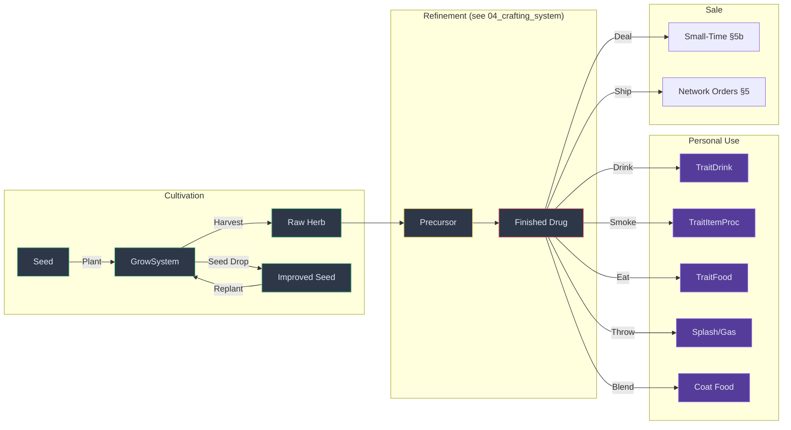

# 4 · Farming, Consumption & Personal Use

> Parent: [00_overview.md](./00_overview.md) · Data Model: [03_data_model.md](./03_data_model.md) · Dealing: [05_small_time_dealing.md](./05_small_time_dealing.md)

This document specifies the complete cultivation-to-consumption pipeline: how the player grows custom drug crops using Elin's seed/strain improvement system, how harvested materials are refined into 12 sellable drug products, and how each product can be personally consumed via five distinct administration routes. A developer implementing this document should be able to produce all SourceObj entries, SourceCard rows, trait classes, and condition classes without further research.

---

## 4.1 Overview



The pipeline has three phases:

1. **Cultivation** — Plant seeds, tend crops, harvest herbs. Elin's existing `GrowSystemHerb` handles growth stages, watering, fertilization, and seed leveling. Over repeated harvests, seed `encLV` increases and food trait elements accumulate — creating progressively stronger "strains."

2. **Refinement** — Raw herbs are processed at crafting stations into 12 finished drug products (see [§4.3](#43-the-12-product-drug-catalog)). Recipe details are in [04_crafting_system.md](./04_crafting_system.md).

3. **Personal Use & Sale** — Finished products can be consumed by the player (5 routes) for combat/exploration buffs, sold to NPCs via small-time dealing ([05_small_time_dealing.md](./05_small_time_dealing.md)), or shipped via the Fixer's network ([05_orders_reputation.md](./05_orders_reputation.md)).

---

## 4.2 Cultivation System

### 4.2.1 How Elin's Farming Pipeline Works

This section explains the vanilla systems the mod plugs into. A developer must understand this chain before implementing custom crops.

**Planting:**
1. A `Thing` with `TraitSeed` is placed on the ground by the player (right-click → Install)
2. `TraitSeed.TrySprout()` checks `cell.CanGrow(row, date)` → if valid, calls `pos.SetObj(row.id, 1, owner.dir)` to place the SourceObj entry on the map tile, then `EClass._map.AddPlant(pos, owner.Thing)` to create a `PlantData` entry linked to the seed's Thing (which carries food trait elements and `encLV`)
3. The seed Thing is destroyed; its data is preserved in the `PlantData.seed` field

**Growth:**
1. `GrowSystem.TryGrow(VirtualDate)` is called on each growth tick → checks `CanGrow(date)` (block, sunlight, underwater rules) → calls `Grow()`
2. `Grow()` increments `cell.objVal` by `Step * (watered ? 2 : 1)`. When `objVal / 30` crosses a stage boundary, the plant advances to the next growth stage
3. At `HarvestStage` (stage index 3 for herbs), the plant becomes harvestable (`stage.harvest = true`)
4. Watered plants grow 2× faster. `PlantData.water` is incremented each tick when watered

**Harvesting:**
1. Player interacts with the mature plant → `GrowSystem.Harvest(c)` → sets `cell.isHarvested = true` → calls `PopHarvest(c)`
2. `PopHarvest()` creates the harvest Thing via `ThingGen.Create(idHarvestThing)` → calls `ApplySeed(t)` to copy seed food trait elements to the harvested item → picks up the item
3. `ApplySeed()` reads `PlantData.seed.elements`, copies every food trait element at `value / 10 * 10` (rounded down), and propagates `encLV / 10 + 1` to the harvest

**Seed Leveling (Strain Improvement):**
1. On mine/harvest, `TryPopSeed(c)` may drop a new seed (chance based on `source.chance` and soil state)
2. `TraitSeed.MakeSeed(source, plantData)` creates the new seed → copies parent seed's food trait elements → calls `LevelSeed(seed, obj, num)` with a random `num` based on farming skill vs. seed LV
3. `LevelSeed()` loops `num` times: if `encLV == 0`, calls `CraftUtil.AddRandomFoodEnc(t)` to add a new random food trait element; otherwise calls `CraftUtil.ModRandomFoodEnc(t)` to boost an existing one (cap 60). Each loop also calls `ModEncLv(1)` to increase seed level
4. The leveled seed can be replanted → the new plant carries the improved traits → the cycle repeats

**Neighboring Equalization:**
- `EqualizePlants(pos)` checks all 4 cardinal neighbors. If a neighbor has the same `refVal` (same crop type) and a higher `encLV` seed, the current plant adopts that neighbor's seed data. This means planting crops adjacent to high-level seeds improves the whole field.

### 4.2.2 Custom SourceObj Entries for Drug Herbs

Each plantable drug herb requires a row in the mod's `SourceObj` sheet (or injected via Harmony). These define the growth system, tile graphics, harvest item, and growth parameters.

**SourceObj column reference** (from `SourceObj.Row`):

| Column | Type | Description |
|--------|------|-------------|
| `id` | int | Unique obj ID. Use 90100+ range to avoid collision. |
| `alias` | string | String identifier (e.g., `uw_herb_whisper_crop`). |
| `name` | string | Display name. |
| `_growth` | string[] | Growth system definition. Format: `"[GrowSystemType],[tileIndices],[harvestTile],[harvestThingId],[harvestCount]"` |
| `hp` | int | Hit points for the plant object. |
| `costSoil` | int | Soil fertility cost (×0.1 per growth tick). |
| `chance` | int | Random seed drop chance weight. Higher = more likely. |
| `tag` | string | Tags. `seed` tag = can produce seeds on harvest. |
| `components` | string | Material dropped when mined (e.g., `grass`). |
| `objType` | string | `"crop"` for standard crops. |

**Custom crop entries:**

| ID | Alias | Name | GrowSystem | Harvest Item | Harvest Count | Soil Cost | Chance | Tags |
|----|-------|------|-----------|-------------|---------------|-----------|--------|------|
| 90100 | `uw_crop_whisper` | Whispervine | `GrowSystemHerb` | `uw_herb_whisper` | 3 | 10 | 20 | `seed` |
| 90101 | `uw_crop_dream` | Dreamblossom | `GrowSystemHerb` | `uw_herb_dream` | 2 | 15 | 12 | `seed` |
| 90102 | `uw_crop_shadow` | Shadowcap | `GrowSystemKinoko` | `uw_herb_shadow` | 3 | 8 | 18 | `seed` |
| 90103 | `uw_crop_crimson` | Crimsonwort | `GrowSystemHerb` | `uw_herb_crimson` | 2 | 20 | 10 | `seed` |
| 90104 | `uw_crop_frostbloom` | Frostbloom | `GrowSystemHerb` | `uw_herb_frostbloom` | 1 | 25 | 8 | `seed` |
| 90105 | `uw_crop_ashveil` | Ashveil Moss | `GrowSystemHerb` | `uw_herb_ashveil` | 1 | 25 | 8 | `seed` |

**_growth array format** (5 elements):
```
[0] = GrowSystem class name (e.g., "Herb")
[1] = base tile indices (slash-separated: "530/531/532/533")
[2] = harvest tile index (e.g., "534")
[3] = harvest Thing ID (e.g., "uw_herb_whisper")
[4] = max harvest count (e.g., "3")
```

**Example `_growth` value for Whispervine:**
```
"Herb", "530/531/532/533", "534", "uw_herb_whisper", "3"
```

**GrowSystem assignment rationale:**
- Most herbs use `GrowSystemHerb` — 5 stages, harvest at stage 3, can reap seed at stage 2+
- Shadowcap uses `GrowSystemKinoko` (mushroom system) — does NOT require sunlight (`NeedSunlight = false` in base `GrowSystem`), appropriate for cave/indoor growing

### 4.2.3 Seed Items for Drug Herbs

Each SourceObj crop entry needs a corresponding seed item. Seeds use the vanilla `seed` Thing ID with `refVal` set to the SourceObj ID. Creation via:

```csharp
Thing seed = TraitSeed.MakeSeed(EClass.sources.objs.map[90100]); // Whispervine seed
```

**Seed distribution:**
- Starter seeds: 3 Whispervine + 2 Shadowcap seeds granted during bootstrap (see [§2.1.4](./02_game_integration.md))
- Dreamblossom/Crimsonwort seeds: Purchasable from the Fixer at Peddler rank
- Frostbloom/Ashveil seeds: Found only in their respective zones (see [§4.2.4](#424-region-locked-herbs))
- All seeds can self-replicate via `TryPopSeed()` after the first planting

### 4.2.4 Region-Locked Herbs

Two herbs can only be cultivated from seeds found in specific biome zones:

#### Frostbloom (Noyel / Winter)

| Property | Value |
|----------|-------|
| Seed Source | Forageable in Noyel zone (`Zone_Noyel`) or any zone during winter months (month 12) |
| Growth Restriction | `NeedSunlight = false` (grows under snow/roof) |
| Lore | *"Crystalline petals that only unfurl under fresh snowfall. Noyel's eternal winter nurtures them year-round, but elsewhere they bloom only in the coldest months."* |

**Implementation — Seed drop injection:**

```csharp
[HarmonyPatch(typeof(Zone), nameof(Zone.OnVisit))]
public static class PatchFrostbloomSeeds
{
    static void Postfix(Zone __instance)
    {
        // Only in Noyel or during winter
        bool isNoyel = __instance is Zone_Noyel;
        bool isWinter = EClass.world.date.month == 12;
        
        if (!isNoyel && !isWinter) return;
        
        // 15% chance to find 1 Frostbloom seed in forageable spots
        // Seeds are placed on random valid tiles during zone generation
        if (EClass.rnd(100) < UnderworldConfig.FrostbloomSeedChance.Value) // default 15
        {
            Thing frostSeed = TraitSeed.MakeSeed(
                EClass.sources.objs.map[90104] // uw_crop_frostbloom
            );
            Point randomPoint = __instance.bounds.GetRandomPoint();
            if (randomPoint.IsValid)
            {
                __instance.AddCard(frostSeed, randomPoint);
            }
        }
    }
}
```

#### Ashveil Moss (Lothria / Ashlands)

| Property | Value |
|----------|-------|
| Seed Source | Forageable in Lothria zone (`Zone_Lothria`) and surrounding dungeon zones |
| Growth Restriction | Standard `GrowSystemHerb`, but `costSoil` is high (25) — thrives in poor soil |
| Lore | *"A spongy moss that feeds on volcanic ash. Lothria's scorched earth is the only soil rich enough to sustain it, though a determined grower could cultivate it anywhere — at great cost."* |

**Implementation — Same pattern as Frostbloom but checks zone type:**

```csharp
static void Postfix(Zone __instance)
{
    bool isLothria = __instance is Zone_Lothria;
    // Also check parent zone for Lothria dungeons
    bool isLothriaDungeon = __instance.ParentZone is Zone_Lothria;
    
    if (!isLothria && !isLothriaDungeon) return;
    
    if (EClass.rnd(100) < UnderworldConfig.AshveilSeedChance.Value) // default 15
    {
        Thing ashSeed = TraitSeed.MakeSeed(
            EClass.sources.objs.map[90105] // uw_crop_ashveil
        );
        Point randomPoint = __instance.bounds.GetRandomPoint();
        if (randomPoint.IsValid)
        {
            __instance.AddCard(ashSeed, randomPoint);
        }
    }
}
```

### 4.2.5 Crop Economics

Raw herbs are sellable at NPC shops but priced to be unprofitable as a standalone crop:

| Herb | Base Value (gold) | Vanilla Crop Comparison | Effective Profit |
|------|-------------------|------------------------|-----------------|
| Whispervine | 30 | Wheat: 40, Apple: 50 | Below vanilla crops |
| Dreamblossom | 50 | Grape: 80 | Below vanilla crops |
| Shadowcap | 40 | Mushroom: 35 | Comparable to worst crops |
| Crimsonwort | 60 | Red Pepper: 70 | Below vanilla crops |
| Frostbloom | 45 | — | Rare but cheap raw |
| Ashveil Moss | 45 | — | Rare but cheap raw |

**Design intent:** Raw herbs exist as ingredients, not as an income source. The player must refine them into finished products (value 500-3000g) to make real money. This forces engagement with the crafting pipeline rather than allowing simple "plant and sell" farming.

**Configuration:**
```csharp
[BepInEx.Configuration]
public static ConfigEntry<float> RawHerbValueMultiplier; // default 1.0, range 0.5-2.0
```

### 4.2.6 Strain Improvement — The Genetics Loop

Elin's seed leveling system automatically creates a "genetics" loop for drug herbs:

```
Plant Seed (encLV 0)
  → Grow & Harvest
  → Seed drops with encLV 0 + 1 random food trait element
  → Replant improved seed (encLV 1)
    → Grow & Harvest
    → Seed drops with encLV 1, existing trait boosted
    → Replant (encLV 2)
      → ... repeat ...
        → encLV 10+ seed with multiple strong food traits
```

**What this means for drug quality:**
- Harvested herbs carry the seed's food trait elements (at `value / 10 * 10`)
- When these herbs are used as crafting ingredients for finished drugs, the food trait elements carry through
- A Whispervine seed at `encLV 10` with a strong `element 754` (Peace/Mind, value 30) produces herbs that, when refined into Whisper Tonic, give stronger `ConPeace` duration and stat effects
- **The player's farming skill directly impacts strain improvement rate** — `TraitSeed.MakeSeed()` uses `EClass.pc.Evalue(286)` (farming skill) to determine level-up chance

**Practical progression:**
1. **Early game** (encLV 0-2): Basic herbs, minimal food trait elements. Products produce short-duration, weak buffs.
2. **Mid game** (encLV 3-6): Herbs carry 1-2 food trait elements with moderate values. Products are noticeably stronger.
3. **Late game** (encLV 7+): Herbs carry 2-3 food trait elements with high values. Products produce powerful, long-lasting combat buffs. These strains are also worth significantly more when sold.

**No custom code is needed for strain improvement.** The vanilla `TraitSeed.LevelSeed()`, `CraftUtil.AddRandomFoodEnc()`, and `GrowSystem.ApplySeed()` handle everything automatically once the SourceObj rows are registered.

---

## 4.3 The 12-Product Drug Catalog

All 12 products are fully sellable via both small-time dealing ([§5b](./05_small_time_dealing.md)) and network orders ([§5](./05_orders_reputation.md)).

### 4.3.1 Base Products (5)

These are the core refined drugs, produced at the Mixing Table or Advanced Lab from precursor ingredients. SourceCard rows for these exist in [03_data_model.md §3.2.3](./03_data_model.md).

#### Product 1: Whisper Tonic — *"Numbs the body, steadies the hand"*

| Property | Value |
|----------|-------|
| ID | `uw_tonic_whisper` |
| Fallout Analogue | Med-X (damage resistance / pain suppression) |
| Route | **Drink** (`TraitDrug` — inherits `TraitDrink`) |
| Category | `potion` |
| Trait | `Drug,Buff,ConUWWhisperHigh` |
| Factory | `uw_mixing_table` |
| Components | `uw_extract_whisper/2,uw_powder_moonite/1` |
| Value | 500 |
| PC Effect | `ConUWWhisperHigh`: DV (dodge value) +10, PV (protection value) +15, SPD −5. Duration: 40 + potency×2 ticks. |
| Combat Use | **Tank hits.** Drink before engaging tough enemies. The PV bonus reduces incoming damage while the player absorbs hits. SPD penalty discourages kiting — this is a stand-and-fight drug. |
| Side Effect | 10% chance per use to apply `ConDim` (dim condition, PER −3) for 20 ticks when `ConUWWhisperHigh` expires. |
| Potency Scaling | Higher seed `encLV` → longer duration, stronger PV bonus (+1 PV per 5 potency above base). |

#### Product 2: Dream Powder — *"Opens the third eye"*

| Property | Value |
|----------|-------|
| ID | `uw_powder_dream` |
| Fallout Analogue | Mentats (INT + PER boost) |
| Route | **Smoke** (`TraitItemProc` — cigar pattern) or **Eat** (if blended into food) |
| Category | `_item` |
| Trait | `ItemProc,Buff,ConUWDreamHigh` |
| Factory | `uw_mixing_table` |
| Components | `uw_extract_dream/2,uw_powder_moonite/1` |
| Value | 800 |
| PC Effect | `ConUWDreamHigh`: INT +3, PER +2, Learning Rate +20% (implemented as `ModExp` bonus on skill gains). Duration: 60 + potency×2 ticks. |
| Combat Use | **Pre-combat preparation.** Boost INT/PER before identifying items, crafting, or exploring. PER bonus improves ranged accuracy and detection. |
| Side Effect | At potency ≥ 70: 15% chance to also apply `ConHallucination` for 30 ticks. The player sees visual distortions but gains enhanced learning. |
| Potency Scaling | Higher potency → stronger INT/PER bonus (up to +5/+4 at potency 90+). |

#### Product 3: Shadow Elixir — *"The world slows, you don't"*

| Property | Value |
|----------|-------|
| ID | `uw_elixir_shadow` |
| Fallout Analogue | Jet (speed / extra actions) |
| Route | **Drink** (`TraitDrug`) |
| Category | `potion` |
| Trait | `Drug,Buff,ConUWShadowRush` |
| Factory | `uw_mixing_table` |
| Components | `uw_extract_shadow/2,uw_crystal_void/1` |
| Value | 1200 |
| PC Effect | `ConUWShadowRush`: SPD +15, grants an extra action every 3rd turn (implemented via `Condition.Tick()` calling `owner.ModExp(78, 50)` for speed XP + `owner.actCount++` every 3 ticks). Duration: 25 + potency ticks (short!). |
| Combat Use | **Kiting and burst damage.** The speed boost and extra actions let the player get in multiple attacks before enemies can react. Ideal for dangerous flee situations. |
| Side Effect | **Crash debuff** when `ConUWShadowRush` expires: `ConUWShadowCrash` applies SPD −10, stamina drain −20 for 30 ticks. |
| Potency Scaling | Higher potency → more extra actions (every 2nd turn at potency 90+). |

#### Product 4: Void Salts — *"Rage crystallized"*

| Property | Value |
|----------|-------|
| ID | `uw_salts_void` |
| Fallout Analogue | Psycho (damage boost + aggression) |
| Route | **Eat** (`TraitFood`) |
| Category | `_item` |
| Trait | `Food` (with custom food trait elements) |
| Factory | `uw_advanced_lab` |
| Components | `uw_crystal_void/3,uw_extract_dream/1` |
| Value | 2000 |
| PC Effect | `ConUWVoidRage`: STR +3, melee damage +25% (implemented via food trait element with `foodEffect: "exp"` targeting melee skill), WIL −3. Duration: 50 + potency×2 ticks. |
| Combat Use | **Raw damage output.** Pop before melee combat for massive damage increase. The WIL penalty means magic resistance drops — pure berserker drug. |
| Side Effect | 20% chance to apply `ConConfuse` for 10 ticks when it wears off. WIL reduction makes this more likely to stick. |
| Potency Scaling | Higher potency → stronger STR bonus (up to +6 at potency 95+). |
| Special | Consumed as food (`CanEat = true`). Satisfies small hunger value (10). The `TraitFood` base handles `FoodEffect.Proc()` processing. The custom food trait element (see [§4.5.1](#451-custom-food-trait-element-ids)) triggers `ConUWVoidRage`. |

#### Product 5: Crimson Elixir — *"The blood of the earth, in your veins"*

| Property | Value |
|----------|-------|
| ID | `uw_elixir_crimson` |
| Fallout Analogue | Buffout (STR + END + MaxHP) |
| Route | **Drink** (`TraitDrug`) |
| Category | `potion` |
| Trait | `Drug,Buff,ConUWCrimsonSurge` |
| Factory | `uw_advanced_lab` |
| Components | `uw_herb_crimson/4,uw_extract_shadow/2,uw_crystal_void/1` |
| Value | 3000 |
| PC Effect | `ConUWCrimsonSurge`: STR +3, END +3, MaxHP +50 (temporary HP via `owner.ModTempElement()`). Duration: 60 + potency×2 ticks. |
| Combat Use | **Tanking and heavy melee.** The MaxHP bonus lets the player survive hits that would otherwise be fatal. Combine with armor for maximum survivability. |
| Side Effect | When `ConUWCrimsonSurge` expires, the temporary HP is removed. If current HP > new MaxHP, it is clamped (no instant death, but sudden vulnerability). |
| Potency Scaling | Higher potency → more temp HP (up to +100 at potency 95+). |

### 4.3.2 Smokeable Variants (2)

These use Elin's proven **cigar pattern** (`TraitItemProc` + `Buff` + condition name). They are hand-crafted from raw herbs — no mixing table required.

**How the cigar pattern works (for the implementor):**

```
SourceCard_Thing row:
  trait: "ItemProc,Buff,ConUWDreamHigh"
                  ↓         ↓
          EffectId.Buff   n1 = condition class name
                  ↓
  Chara.cs hard-coded cigar check (L8098):
    if (t.id == "cigar") → (t.trait as TraitItemProc).OnUse(this)
                  ↓
  TraitItemProc.OnUse(c):
    ActEffect.Proc(EffectId.Buff, power, blessedState, c, null, {n1="ConUWDreamHigh"})
    FoodEffect.ProcTrait(c, owner)   ← processes any food trait elements on the item
    owner.ModNum(-1)                 ← consumes one unit
```

> **IMPORTANT — Harmony patch required:** The vanilla `Chara.cs` only checks `if (t.id == "cigar")`. Our smokeable items have different IDs. We must patch this check to also recognize our items. See [§4.4.1](#441-smoking-route-implementation) for the exact patch.

#### Product 6: Whispervine Roll — *"A gentle numbness, one puff at a time"*

| Property | Value |
|----------|-------|
| ID | `uw_roll_whisper` |
| Fallout Analogue | Smokeable Med-X (weaker, portable) |
| Route | **Smoke** (`TraitItemProc`) |
| Category | `_item` |
| Trait | `ItemProc,Buff,ConUWWhisperCalm` |
| Factory | `self` (hand-crafted, like vanilla cigar) |
| Components | `uw_herb_whisper/3,bark/1` |
| Value | 200 |
| PC Effect | `ConUWWhisperCalm`: PV +10, sleepiness −20 (reduces sleepiness counter each tick, like `ConSmoking`). Duration: 30 + potency ticks. |
| Combat Use | **Light damage resistance** on the go. Weaker than Whisper Tonic but doesn't require a mixing table. Also fights drowsiness — useful for all-night crafting sessions. |
| Side Effect | None. This is the "mild" option. |
| Visual | Emits `psSmoke` particles while condition is active (see [§4.5.5](#455-smoke-particle-effects)). |

**SourceCard XLSX row:**
```python
"uw_roll_whisper": {
    "name_JP": "ウィスパーロール",
    "name": "whispervine roll",
    "category": "_item",
    "sort": "junk",
    "_idRenderData": "@obj_S flat",
    "tiles": 1119,          # same tile as vanilla cigar
    "recipeKey": "*",
    "factory": "self",       # hand-crafted
    "components": "uw_herb_whisper/3,bark/1",
    "defMat": "paper",
    "value": 200,
    "LV": 3,
    "chance": 0,
    "weight": 50,
    "trait": "ItemProc,Buff,ConUWWhisperCalm",
    "tag": "contraband",
    "detail": "Dried whispervine rolled in bark paper. The smoke "
              "carries a faint numbness that steadies the nerves.",
}
```

#### Product 7: Dreamweed Joint — *"Everybody's friend"*

| Property | Value |
|----------|-------|
| ID | `uw_roll_dream` |
| Fallout Analogue | Day Tripper (CHA + relaxation) |
| Route | **Smoke** (`TraitItemProc`) |
| Category | `_item` |
| Trait | `ItemProc,Buff,ConUWDreamCalm` |
| Factory | `self` |
| Components | `uw_herb_dream/3,bark/1` |
| Value | 250 |
| PC Effect | `ConUWDreamCalm`: CHA +3, conversation affinity bonus (reduces affinity loss during failed social checks). Duration: 40 + potency ticks. |
| Combat Use | **Social combat.** Use before dealing, negotiating, or interacting with NPCs. The CHA bonus improves deal prices and the affinity buffer prevents reputation damage. |
| Side Effect | 10% chance per use to apply `ConHallucination` at potency ≥ 60. |
| Visual | Emits `psSmoke` particles while condition is active. |

**SourceCard XLSX row:**
```python
"uw_roll_dream": {
    "name_JP": "ドリームジョイント",
    "name": "dreamweed joint",
    "category": "_item",
    "sort": "junk",
    "_idRenderData": "@obj_S flat",
    "tiles": 1119,
    "recipeKey": "*",
    "factory": "self",
    "components": "uw_herb_dream/3,bark/1",
    "defMat": "paper",
    "value": 250,
    "LV": 5,
    "chance": 0,
    "weight": 50,
    "trait": "ItemProc,Buff,ConUWDreamCalm",
    "tag": "contraband",
    "detail": "Dreamblossom petals wrapped in thin bark. "
              "The sweet smoke loosens inhibitions and sharpens the tongue.",
}
```

### 4.3.3 Advanced Blends (2)

These are dual-product combinations crafted at the Advanced Lab. They require two existing Tier 2 products as ingredients — representing the highest tier of drug crafting.

#### Product 8: Berserker's Draught — *"Strength beyond reason"*

| Property | Value |
|----------|-------|
| ID | `uw_draught_berserker` |
| Fallout Analogue | Psychobuff (Psycho + Buffout combined) |
| Route | **Drink** (`TraitDrug`) |
| Category | `potion` |
| Trait | `Drug,Buff,ConUWBerserkerRage` |
| Factory | `uw_advanced_lab` |
| Components | `uw_salts_void/1,uw_elixir_crimson/1` |
| Value | 4500 |
| PC Effect | `ConUWBerserkerRage`: STR +5, END +3, melee damage +20%, MaxHP +30. Duration: 40 + potency ticks. |
| Combat Use | **Ultimate melee buff.** Combines Void Salts' damage with Crimson Elixir's survivability. Expensive to craft, devastating in effect. |
| Side Effect | High toxicity. `ConUWBerserkerCrash` on expire: STR −3, END −2, `ConConfuse` for 15 ticks. |

**SourceCard XLSX row:**
```python
"uw_draught_berserker": {
    "name_JP": "狂戦士の薬酒",
    "name": "berserker's draught",
    "category": "potion",
    "sort": "junk",
    "_idRenderData": "@obj_S",
    "tiles": 792,
    "recipeKey": "*",
    "factory": "uw_advanced_lab",
    "components": "uw_salts_void/1,uw_elixir_crimson/1",
    "defMat": "glass",
    "value": 4500,
    "LV": 15,
    "chance": 0,
    "weight": 200,
    "trait": "Drug,Buff,ConUWBerserkerRage",
    "tag": "contraband",
    "detail": "A thick, ruby liquid that smells of iron and ozone. "
              "The fusion of void crystal aggression and crimsonwort vitality "
              "produces a state of fearless, superhuman power — briefly.",
}
```

#### Product 9: Shadow Rush — *"Lightning in a bottle"*

| Property | Value |
|----------|-------|
| ID | `uw_elixir_rush` |
| Fallout Analogue | Psycho Jet (Psycho + Jet combined) |
| Route | **Drink** (`TraitDrug`) |
| Category | `potion` |
| Trait | `Drug,Buff,ConUWShadowRushX` |
| Factory | `uw_advanced_lab` |
| Components | `uw_elixir_shadow/1,uw_salts_void/1` |
| Value | 3500 |
| PC Effect | `ConUWShadowRushX`: SPD +20, melee damage +15%, extra action every 2nd turn. Duration: 20 + potency/2 ticks (**very short**). |
| Combat Use | **Burst assassination.** The most intense combat drug — massive speed and damage for a very brief window. Use it to kill a boss before it can react, then suffer the consequences. |
| Side Effect | **Severe crash.** `ConUWRushCrash` on expire: SPD −15, stamina drain −40, `ConDim` for 40 ticks. The crash is proportional to the high — this drug is not for casual use. |

**SourceCard XLSX row:**
```python
"uw_elixir_rush": {
    "name_JP": "疾影一閃",
    "name": "shadow rush",
    "category": "potion",
    "sort": "junk",
    "_idRenderData": "@obj_S",
    "tiles": 792,
    "recipeKey": "*",
    "factory": "uw_advanced_lab",
    "components": "uw_elixir_shadow/1,uw_salts_void/1",
    "defMat": "glass",
    "value": 3500,
    "LV": 15,
    "chance": 0,
    "weight": 150,
    "trait": "Drug,Buff,ConUWShadowRushX",
    "tag": "contraband",
    "detail": "A violently effervescent black liquid. "
              "Time itself seems to stutter around the drinker — "
              "but the hangover is legendary.",
}
```

### 4.3.4 Edible Variant (1)

This product demonstrates the blend/cooking integration. It is NOT a standalone craftable — the player creates it by **blending** Dream Powder into an existing baked good.

#### Product 10: Dream Cookie — *"A sweet trip"*

| Property | Value |
|----------|-------|
| ID | N/A — this is a **vanilla food item** modified by the blend system |
| Fallout Analogue | Berry Mentats (INT variant + food) |
| Route | **Eat** (vanilla food consumption) |
| How to Create | Use `uw_powder_dream` on any baked food item (bread, pie, cookie). The blend system (see [§4.4.4](#444-blend-route-implementation)) adds `ConUWDreamHigh` food trait elements to the food. |
| PC Effect | Same as Dream Powder (`ConUWDreamHigh`: INT +2, PER +1) but with slower onset (food processing) and longer duration (+50% compared to smoked). Also satisfies hunger. |
| Value | Inherits base food value + Dream Powder value contribution |

**How blending works (implementation detail):**

The player holds `uw_powder_dream` and targets a food item. The blend handler adds the drug's food trait elements to the food item, then consumes the powder. See [§4.4.4](#444-blend-route-implementation) for the exact code.

### 4.3.5 Region-Locked Products (2)

These products require herbs that can only be sourced from specific biome zones (see [§4.2.4](#424-region-locked-herbs)). They create exploration incentive and have higher trade value due to scarcity.

#### Product 11: Frostbloom Elixir — *"Winter's embrace, distilled"*

| Property | Value |
|----------|-------|
| ID | `uw_elixir_frost` |
| Region | Noyel (snow town) / Winter season |
| Route | **Drink** (`TraitDrug`) |
| Category | `potion` |
| Trait | `Drug,Buff,ConUWFrostbloom` |
| Factory | `uw_mixing_table` |
| Components | `uw_herb_frostbloom/3,uw_extract_whisper/1,potion_empty/1` |
| Value | 1800 |
| Special Ingredient | `uw_herb_frostbloom` — only grows from seeds found in Noyel or during winter |
| PC Effect | `ConUWFrostbloom`: Cold Resistance +50, END +4, HP Regen +3/tick. Duration: 80 + potency×2 ticks (long-acting). |
| Combat Use | **Exploration survival.** Essential for cold zones and extended dungeon crawls. The regen effect provides sustained healing without consuming healing items. |
| Side Effect | Minor: reduces fire resistance by 10 while active (thematic — you're running on ice magic). |

**SourceCard XLSX row:**
```python
"uw_elixir_frost": {
    "name_JP": "霜花の霊薬",
    "name": "frostbloom elixir",
    "category": "potion",
    "sort": "junk",
    "_idRenderData": "@obj_S",
    "tiles": 792,
    "recipeKey": "*",
    "factory": "uw_mixing_table",
    "components": "uw_herb_frostbloom/3,uw_extract_whisper/1,potion_empty/1",
    "defMat": "glass",
    "value": 1800,
    "LV": 10,
    "chance": 0,
    "weight": 200,
    "trait": "Drug,Buff,ConUWFrostbloom",
    "tag": "contraband",
    "detail": "A pale blue elixir that frosts the glass it's kept in. "
              "Distilled from petals that only bloom under fresh snow, "
              "it fills the body with a deep, restorative cold.",
}
```

**New raw herb SourceCard row:**
```python
"uw_herb_frostbloom": {
    "name_JP": "フロストブルーム",
    "name": "frostbloom",
    "category": "herb",
    "sort": "resource_herb",
    "_idRenderData": "@obj_S flat",
    "tiles": 530,
    "defMat": "leaf",
    "value": 45,
    "LV": 8,
    "chance": 0,  # never spawns randomly — zone injection only
    "weight": 70,
    "tag": "contraband",
    "detail": "Crystalline petals that shimmer with trapped frost. "
              "They wilt in warm hands.",
}
```

#### Product 12: Ashveil Incense — *"See through the veil of ash"*

| Property | Value |
|----------|-------|
| ID | `uw_incense_ash` |
| Region | Lothria (ashlands) |
| Route | **Smoke** (personal) / **Throw** (area reveal) |
| Category | `_item` |
| Trait | `ItemProc,Buff,ConUWAshveil` |
| Factory | `uw_mixing_table` |
| Components | `uw_herb_ashveil/3,uw_powder_moonite/1` |
| Value | 2000 |
| Special Ingredient | `uw_herb_ashveil` — only forageable in Lothria and its dungeons |
| PC Effect (Smoked) | `ConUWAshveil`: Fire Resistance +30, PER +5, applies `ConSeeInvisible` (vanilla condition — reveals hidden/invisible enemies). Duration: 50 + potency ticks. |
| PC Effect (Thrown) | Creates a smoke cloud `CellEffect` tile (see [§4.4.5](#445-throw-route-implementation)) with `idEffect = EffectId.Buff` that applies `ConSeeInvisible` to anyone in the area. |
| Combat Use | **Tactical awareness.** Reveals invisible enemies and traps. PER bonus improves ranged accuracy. Fire resistance is useful in volcanic zones. |
| Side Effect | None — the incense is a utility tool, not a stat boost. |

**SourceCard XLSX row:**
```python
"uw_incense_ash": {
    "name_JP": "灰霞の香",
    "name": "ashveil incense",
    "category": "_item",
    "sort": "junk",
    "_idRenderData": "@obj_S flat",
    "tiles": 1119,
    "recipeKey": "*",
    "factory": "uw_mixing_table",
    "components": "uw_herb_ashveil/3,uw_powder_moonite/1",
    "defMat": "paper",
    "value": 2000,
    "LV": 10,
    "chance": 0,
    "weight": 80,
    "trait": "ItemProc,Buff,ConUWAshveil",
    "tag": "contraband",
    "detail": "Dense sticks of pressed ashveil moss. The smoke reveals "
              "what the eye cannot see — a trick the dead of Lothria "
              "knew well.",
}
```

**New raw herb SourceCard row:**
```python
"uw_herb_ashveil": {
    "name_JP": "灰のヴェール苔",
    "name": "ashveil moss",
    "category": "herb",
    "sort": "resource_herb",
    "_idRenderData": "@obj_S flat",
    "tiles": 530,
    "defMat": "leaf",
    "value": 45,
    "LV": 8,
    "chance": 0,
    "weight": 100,
    "tag": "contraband",
    "detail": "Spongy grey-green moss that feeds on volcanic ash. "
              "It crumbles to a fine aromatic powder when dried.",
}
```

### 4.3.6 Complete Product Summary Table

| # | ID | Name | Route | Factory | Value | Base Effect | Crash/Side Effect |
|---|-----|------|-------|---------|-------|-------------|-------------------|
| 1 | `uw_tonic_whisper` | Whisper Tonic | Drink | Mixing Table | 500 | PV +15, DV +10, SPD −5 | ConDim 10% on expire |
| 2 | `uw_powder_dream` | Dream Powder | Smoke | Mixing Table | 800 | INT +3, PER +2, LER +20% | ConHallucination at high potency |
| 3 | `uw_elixir_shadow` | Shadow Elixir | Drink | Mixing Table | 1200 | SPD +15, extra action/3 turns | SPD −10 crash |
| 4 | `uw_salts_void` | Void Salts | Eat | Adv. Lab | 2000 | STR +3, DMG +25%, WIL −3 | ConConfuse 20% on expire |
| 5 | `uw_elixir_crimson` | Crimson Elixir | Drink | Adv. Lab | 3000 | STR +3, END +3, MaxHP +50 | Temp HP removed on expire |
| 6 | `uw_roll_whisper` | Whispervine Roll | Smoke | Self | 200 | PV +10, sleepiness −20 | None |
| 7 | `uw_roll_dream` | Dreamweed Joint | Smoke | Self | 250 | CHA +3, social buffer | ConHallucination 10% |
| 8 | `uw_draught_berserker` | Berserker's Draught | Drink | Adv. Lab | 4500 | STR +5, END +3, DMG +20%, HP +30 | STR −3, ConConfuse crash |
| 9 | `uw_elixir_rush` | Shadow Rush | Drink | Adv. Lab | 3500 | SPD +20, DMG +15%, extra action/2 turns | SPD −15, severe crash |
| 10 | *(blended)* | Dream Cookie | Eat | Blend | — | INT +2, PER +1, hunger | None |
| 11 | `uw_elixir_frost` | Frostbloom Elixir | Drink | Mixing Table | 1800 | Cold Res +50, END +4, Regen +3 | Fire Res −10 |
| 12 | `uw_incense_ash` | Ashveil Incense | Smoke/Throw | Mixing Table | 2000 | Fire Res +30, PER +5, See Invisible | None |

---

## 4.4 Administration Routes — Implementation

### 4.4.1 Smoking Route Implementation

**Pattern:** Reuse Elin's existing cigar system (`TraitItemProc` + `Buff` + condition class name).

**Problem:** Vanilla `Chara.cs` (line 8098) has a hard-coded check: `if (t.id == "cigar")`. Our smokeable items (`uw_roll_whisper`, `uw_roll_dream`, `uw_powder_dream`, `uw_incense_ash`) have different IDs and will not be recognized.

**Solution — Harmony Prefix patch on `Chara.UseItem()`:**

```csharp
/// <summary>
/// Extends the vanilla cigar smoking check to recognize all Underworld
/// smokeable items. The vanilla code only checks `t.id == "cigar"` —
/// we check if the item's trait is TraitItemProc AND the first trait
/// param is "Buff" AND the condition name starts with "ConUW".
/// </summary>
[HarmonyPatch(typeof(Chara), nameof(Chara.TryUse))]
public static class PatchSmokeableItems
{
    // List of our smokeable item IDs for fast lookup
    private static readonly HashSet<string> SmokeableIds = new()
    {
        "uw_roll_whisper",
        "uw_roll_dream",
        "uw_powder_dream",
        "uw_incense_ash"
    };

    static bool Prefix(Chara __instance, Thing t, ref bool __result)
    {
        if (!SmokeableIds.Contains(t.id)) return true; // not ours, let vanilla handle

        if (t.trait is TraitItemProc itemProc)
        {
            itemProc.OnUse(__instance);
            __result = true;
            return false; // skip original method for this item
        }
        return true;
    }
}
```

**Why this works:** `TraitItemProc.OnUse()` already handles everything:
1. Calls `ActEffect.Proc(EffectId.Buff, power, blessedState, c, null, {n1 = conditionName})` — which adds the named condition to the character
2. Calls `FoodEffect.ProcTrait(c, owner)` — which processes any food trait elements on the item
3. Calls `owner.ModNum(-1)` — which consumes one unit of the item

**No other code is needed.** The condition class handles the actual stat effects (see [§4.5](#45-player-drug-effects--conditions)).

### 4.4.2 Drinking Route Implementation

**Pattern:** Standard `TraitDrink` / `TraitDrug` — no custom code needed.

Items with `category: "potion"` and `trait: "Drug,Buff,ConUW[Name]"` automatically work with Elin's drinking pipeline:

1. Player right-clicks potion → `Chara.TryUse()` → `t.trait.CanDrink(this)` returns `true` (inherited from `TraitDrink`)
2. `Chara.Drink(t)` is called → `t.trait.OnDrink(c)` fires
3. `TraitDrink.OnDrink()` calls `ActEffect.Proc(IdEffect, Power, ...)` with the trait params
4. For `trait: "Drug,Buff,ConUWShadowRush"`:
   - `GetParam(1)` = `"Buff"` → `IdEffect = EffectId.Buff`
   - `GetParam(2)` = `"ConUWShadowRush"` → passed as `n1` to `ActEffect.Proc`
   - `ActEffect.Proc` applies the named condition to the character
5. `FoodEffect.ProcTrait(c, owner)` processes any food trait elements
6. `owner.ModNum(-1)` consumes the item

**Affected products:** Whisper Tonic, Shadow Elixir, Crimson Elixir, Berserker's Draught, Shadow Rush, Frostbloom Elixir.

> **Note on `TraitDrug` vs `TraitDrink`:** `TraitDrug` is an empty subclass of `TraitDrink` in vanilla. Using `Drug` in the trait string ensures the item is categorized as a drug for any vanilla systems that check trait type. The actual behavior is identical to `TraitDrink`.

### 4.4.3 Eating Route Implementation

**Pattern:** `TraitFood` with custom food trait elements.

Items with `trait: "Food"` and food trait elements in the `elements` column are consumed via the standard food pipeline:

1. Player right-clicks → `t.trait.CanEat(this)` returns `true`
2. `AI_Eat` goal is set → `FoodEffect.Proc(c, food)` processes all food trait elements
3. `FoodEffect.ProcTrait(c, food)` reads each element with an `IsTrait` flag and applies effects

**Affected products:** Void Salts (primary), Dream Cookie (via blend).

For Void Salts, the `elements` column in SourceCard should include:
```
"elements": "754/-3"  // element 754 (Mind) at value -3 → triggers ConConfuse + ConHallucination
```

However, for stronger/custom effects that go beyond vanilla food trait elements, we register **custom food trait elements** (see [§4.5.1](#451-custom-food-trait-element-ids)) that trigger our custom conditions.

### 4.4.4 Blend Route Implementation

**Pattern:** `TraitDrink.CanBlend()` / `OnBlend()` — extend to support drug blending into food.

The Dream Cookie is created by blending Dream Powder into a baked good. We need to extend the blend system:

**Harmony Postfix on `TraitDrink.CanBlend()`:**

```csharp
/// <summary>
/// Allows drug powder items to be blended into food. Vanilla only allows
/// poison, love, acidproof, and water blending. We add drug items.
/// </summary>
[HarmonyPatch(typeof(TraitDrink), nameof(TraitDrink.CanBlend))]
public static class PatchDrugBlend
{
    static void Postfix(TraitDrink __instance, Thing t, ref bool __result)
    {
        if (__result) return; // vanilla already approved
        
        // Allow drug items (identified by our IDs) to blend into food
        if (__instance.owner.id == "uw_powder_dream" && t.IsFood)
        {
            __result = true;
        }
    }
}

/// <summary>
/// Handles the actual blending: copies the drug's food trait elements
/// onto the target food item, then consumes the drug.
/// </summary>
[HarmonyPatch(typeof(TraitDrink), nameof(TraitDrink.OnBlend))]
public static class PatchDrugBlendEffect
{
    static void Postfix(TraitDrink __instance, Thing t, Chara c)
    {
        if (__instance.owner.id != "uw_powder_dream") return;
        
        // Copy drug's custom food trait elements to the food
        Thing drug = __instance.owner;
        Thing food = t.Split(1); // split 1 unit to modify
        
        // Add the ConUWDreamHigh food trait element to the food
        // Element ID 90021 = UW_DREAM_HIGH (see §4.5.1)
        int drugPotency = drug.Evalue(90020); // uw_potency element
        food.elements.ModBase(90021, Mathf.Max(drugPotency / 10, 1));
        
        c.Say("blend_drug", food, c); // "You lace the food with a fine powder."
        c.Pick(food);
        
        // Note: owner.ModNum(-1) is already called by base OnBlend
    }
}
```

### 4.4.5 Throw Route Implementation

**Pattern:** `TraitDrink.OnThrowGround()` — creates `CellEffect` puddles/clouds.

Liquid drugs (all potions with `category: "potion"`) automatically support throwing via `TraitDrink`:
- Whisper Tonic, Shadow Elixir, Crimson Elixir, Berserker's Draught, Shadow Rush, Frostbloom Elixir — all create a potion puddle when thrown
- `ThrowType.Potion` animation plays automatically

**Ashveil Incense special throw behavior:**

Ashveil Incense is `TraitItemProc` (not `TraitDrink`), so it doesn't natively support throwing. We add throwing support via a custom override:

```csharp
/// <summary>
/// Custom trait for Ashveil Incense that supports both smoking (OnUse)
/// and throwing (creates a smoke cloud CellEffect that grants See Invisible).
/// </summary>
public class TraitAshveilIncense : TraitItemProc
{
    public override bool IsThrowMainAction => true;
    public override ThrowType ThrowType => ThrowType.Potion;

    public override void OnThrowGround(Chara c, Point p)
    {
        // Create a smoke cloud cell effect
        CellEffect cellEffect = new CellEffect
        {
            id = 4,                     // potion puddle type
            idEffect = EffectId.Buff,
            power = owner.Power,
            amount = 8,                 // lasts 8 ticks  
            isHostileAct = false,
            n1 = "ConSeeInvisible",
            color = BaseTileMap.GetColorInt(
                ref owner.GetRandomColor(), 
                owner.sourceRenderCard.colorMod
            ),
        };
        EClass._map.SetLiquid(p.x, p.z, cellEffect);
    }
}
```

If using this custom trait class, update the SourceCard row trait to `"AshveilIncense,Buff,ConUWAshveil"` (for personal smoking) and register `TraitAshveilIncense` in the trait map. Alternatively, keep `ItemProc,Buff,ConUWAshveil` and handle throwing via a Harmony postfix on `Chara.Throw()` that checks the item ID.

---

## 4.5 Player Drug Effects & Conditions

### 4.5.1 Custom Food Trait Element IDs

These extend the 90010-90014 range already defined in [03_data_model.md §3.4.1](./03_data_model.md):

| Element ID | Name | Type | FoodEffect Handler | Description |
|-----------|------|------|-------------------|-------------|
| 90020 | `UW_POTENCY` | Item property | — | Already defined. Primary quality factor for all contraband. |
| 90021 | `UW_DREAM_TRAIT` | Food trait | `foodEffect: "uw_dream"` | When eaten, applies `ConUWDreamHigh`. Used on blended "Dream Cookie" food items. |
| 90022 | `UW_VOID_TRAIT` | Food trait | `foodEffect: "uw_void"` | When eaten, applies `ConUWVoidRage`. Used on Void Salts. |

**FoodEffect integration** requires a Harmony postfix on `FoodEffect.ProcTrait()`:

```csharp
/// <summary>
/// Extends FoodEffect.ProcTrait to handle custom Underworld food trait
/// elements. Vanilla only processes elements 753-761. We add handling
/// for 90021-90022.
/// </summary>
[HarmonyPatch(typeof(FoodEffect), nameof(FoodEffect.ProcTrait))]
public static class PatchFoodEffectDrugs
{
    static void Postfix(Chara c, Card t)
    {
        foreach (Element value in t.elements.dict.Values)
        {
            if (!value.IsTrait) continue;
            
            switch (value.id)
            {
                case 90021: // UW_DREAM_TRAIT
                    int dreamPower = Mathf.Abs(value.Value) * 20;
                    c.AddCondition<ConUWDreamHigh>(dreamPower);
                    break;
                    
                case 90022: // UW_VOID_TRAIT
                    int voidPower = Mathf.Abs(value.Value) * 20;
                    c.AddCondition<ConUWVoidRage>(voidPower);
                    break;
            }
        }
    }
}
```

### 4.5.2 Custom Condition Classes

Each drug effect is implemented as a `Condition` subclass. These are registered in SourceGame_Stat (the condition/buff database) and instantiated by `ActEffect.Proc()` when the drug is consumed.

**Base class pattern** (from vanilla `ConSmoking`):**

```csharp
public class ConSmoking : Condition
{
    public override int GetPhase() => 0;      // always phase 0
    
    public override void Tick()
    {
        base.Tick();                           // handles duration countdown
        if (EClass.rnd(2) == 0)
        {
            owner.sleepiness.Mod(-1);          // reduces sleepiness
        }
    }
}
```

Our conditions follow the same pattern with custom stat modifications.

#### ConUWWhisperHigh — Whisper Tonic effect

```csharp
public class ConUWWhisperHigh : Condition
{
    public override int GetPhase() => 0;

    // Stat modifications applied while condition is active
    // These are set via SourceGame_Stat elements column
    // PV +15, DV +10, SPD -5
    
    public override void OnRemoved()
    {
        base.OnRemoved();
        // 10% chance of ConDim on expire
        if (EClass.rnd(10) == 0)
        {
            owner.AddCondition<ConDim>(200);
        }
    }
}
```

#### ConUWShadowRush — Shadow Elixir effect

```csharp
public class ConUWShadowRush : Condition
{
    private int tickCounter = 0;

    public override int GetPhase() => 0;

    public override void Tick()
    {
        base.Tick();
        tickCounter++;
        
        // Grant extra action every 3 ticks (every 2 at high power)
        int interval = (base.power >= 90) ? 2 : 3;
        if (tickCounter % interval == 0)
        {
            // Effectively grants an extra turn by adding to act count
            owner.actCount++;
        }
    }

    public override void OnRemoved()
    {
        base.OnRemoved();
        // Apply crash debuff
        owner.AddCondition<ConUWShadowCrash>(300);
    }
}
```

#### ConUWShadowCrash — Shadow Elixir crash

```csharp
public class ConUWShadowCrash : BadCondition
{
    public override int GetPhase() => 0;

    public override void Tick()
    {
        base.Tick();
        // Drain stamina each tick
        if (EClass.rnd(2) == 0)
        {
            owner.stamina.Mod(-2);
        }
    }
}
```

#### ConUWDreamHigh — Dream Powder / Dream Cookie effect

```csharp
public class ConUWDreamHigh : Condition
{
    public override int GetPhase() => 0;

    // INT +3, PER +2 applied via SourceGame_Stat elements
    
    public override void Tick()
    {
        base.Tick();
        // 20% learning rate bonus — add extra skill XP periodically
        // This is handled by the stat elements; the condition just needs to exist
    }
    
    public override void OnAdded()
    {
        base.OnAdded();
        // High potency hallucination chance
        if (base.power >= 70 && EClass.rnd(100) < 15)
        {
            owner.AddCondition<ConHallucination>(300);
        }
    }
}
```

#### ConUWVoidRage — Void Salts effect

```csharp
public class ConUWVoidRage : Condition
{
    public override int GetPhase() => 0;

    // STR +3, WIL -3 applied via SourceGame_Stat elements
    // Melee damage +25% is applied via the STR boost and a damage multiplier element
    
    public override void OnRemoved()
    {
        base.OnRemoved();
        if (EClass.rnd(5) == 0) // 20%
        {
            owner.AddCondition<ConConfuse>(100);
        }
    }
}
```

#### ConUWCrimsonSurge — Crimson Elixir effect

```csharp
public class ConUWCrimsonSurge : Condition
{
    private int tempHpGranted = 0;

    public override int GetPhase() => 0;

    public override void OnAdded()
    {
        base.OnAdded();
        // Grant temporary MaxHP
        tempHpGranted = 50 + (base.power >= 95 ? 50 : base.power / 2);
        owner.SetInt(90030, tempHpGranted); // store for removal
        // Actual MaxHP increase via modifying the END-derived HP formula
        // is handled by the stat element boost on END
    }

    public override void OnRemoved()
    {
        base.OnRemoved();
        // Clamp HP if above new max (don't kill, just make vulnerable)
        if (owner.hp > owner.MaxHP)
        {
            owner.hp = owner.MaxHP;
        }
    }
}
```

#### ConUWWhisperCalm — Whispervine Roll (smoked) effect

```csharp
public class ConUWWhisperCalm : Condition
{
    public override int GetPhase() => 0;

    // PV +10 applied via SourceGame_Stat elements

    public override void Tick()
    {
        base.Tick();
        // Reduce sleepiness (same as ConSmoking)
        if (EClass.rnd(2) == 0)
        {
            owner.sleepiness.Mod(-1);
        }
    }
}
```

#### ConUWDreamCalm — Dreamweed Joint (smoked) effect

```csharp
public class ConUWDreamCalm : Condition
{
    public override int GetPhase() => 0;

    // CHA +3 applied via SourceGame_Stat elements

    public override void OnAdded()
    {
        base.OnAdded();
        if (base.power >= 60 && EClass.rnd(10) == 0)
        {
            owner.AddCondition<ConHallucination>(200);
        }
    }
}
```

#### ConUWBerserkerRage — Berserker's Draught effect

```csharp
public class ConUWBerserkerRage : Condition
{
    public override int GetPhase() => 0;

    // STR +5, END +3, MaxHP +30 via stat elements

    public override void OnRemoved()
    {
        base.OnRemoved();
        owner.AddCondition<ConUWBerserkerCrash>(150);
    }
}

public class ConUWBerserkerCrash : BadCondition
{
    public override int GetPhase() => 0;
    // STR -3, END -2 via stat elements
    
    public override void OnAdded()
    {
        base.OnAdded();
        owner.AddCondition<ConConfuse>(150);
    }
}
```

#### ConUWShadowRushX — Shadow Rush (enhanced) effect

```csharp
public class ConUWShadowRushX : Condition
{
    private int tickCounter = 0;

    public override int GetPhase() => 0;

    // SPD +20 via stat elements

    public override void Tick()
    {
        base.Tick();
        tickCounter++;
        // Extra action every 2 ticks (more aggressive than base Shadow Rush)
        if (tickCounter % 2 == 0)
        {
            owner.actCount++;
        }
    }

    public override void OnRemoved()
    {
        base.OnRemoved();
        owner.AddCondition<ConUWRushCrash>(400); // severe crash
    }
}

public class ConUWRushCrash : BadCondition
{
    public override int GetPhase() => 0;
    // SPD -15 via stat elements

    public override void Tick()
    {
        base.Tick();
        owner.stamina.Mod(-3); // heavy stamina drain
    }

    public override void OnAdded()
    {
        base.OnAdded();
        owner.AddCondition<ConDim>(400);
    }
}
```

#### ConUWFrostbloom — Frostbloom Elixir effect

```csharp
public class ConUWFrostbloom : Condition
{
    public override int GetPhase() => 0;

    // END +4, Cold Res +50 via stat elements

    public override void Tick()
    {
        base.Tick();
        // HP regen: +3 HP every tick
        if (owner.hp < owner.MaxHP)
        {
            owner.HealHP(3);
        }
    }
}
```

#### ConUWAshveil — Ashveil Incense effect

```csharp
public class ConUWAshveil : Condition
{
    public override int GetPhase() => 0;

    // PER +5, Fire Res +30 via stat elements

    public override void OnAdded()
    {
        base.OnAdded();
        // Grant See Invisible (vanilla condition)
        owner.AddCondition<ConSeeInvisible>(base.power);
    }
}
```

### 4.5.3 SourceGame_Stat Entries

Each condition requires a row in SourceGame_Stat. Format follows the vanilla `ConSmoking` pattern:

| id (int) | alias | name_JP | name | group | type | elements | duration | tags | textPhase1_JP | textPhase1 | textStart_JP | textStart | textEnd_JP | textEnd | detail_JP | detail |
|----------|-------|---------|------|-------|------|----------|----------|------|---------------|------------|-------------|-----------|-----------|---------|-----------|--------|
| 90100 | ConUWWhisperHigh | 静寂の陶酔 | Whisper High | — | Buff | PV/15,DV/10,SPD/-5 | p/5 | buff | — | — | (start text) | #1 takes a sip and feels a soothing numbness spread through #his body. | (end text) | The numbness fades. #1 feels exposed again. | — | Protection and dodge are enhanced, but movement is sluggish. |
| 90101 | ConUWShadowRush | 影の奔流 | Shadow Rush | — | Buff | SPD/15 | p/3 | buff | — | — | (start) | #1 drinks the dark liquid. Time seems to slow to a crawl. | (end) | The rush ends — reality catches up with a vengeance. | — | Massively increased speed. Extra actions every 3 turns. |
| 90102 | ConUWShadowCrash | 影の反動 | Shadow Crash | — | Debuff | SPD/-10 | 30 | debuff | — | — | (start) | #1 staggers. The world snaps back to full speed. | (end) | #1 feels normal again. | — | Speed penalty and stamina drain. The cost of borrowed time. |
| 90103 | ConUWDreamHigh | 夢幻の啓示 | Dream Lucidity | — | Buff | INT/3,PER/2 | p/5 | buff | — | — | (start) | #1 inhales deeply. The world sharpens into crystalline focus. | (end) | The clarity fades like a dream upon waking. | — | Enhanced intelligence and perception. Learning comes easier. |
| 90104 | ConUWVoidRage | 虚空の激昂 | Void Rage | — | Buff | STR/3,WIL/-3 | p/5 | buff | — | — | (start) | #1 crunches the void salts. A hot fury rises from within. | (end) | The rage subsides, leaving a trembling emptiness. | — | Massive strength boost, but willpower is shattered. |
| 90105 | ConUWCrimsonSurge | 紅蓮の活力 | Crimson Surge | — | Buff | STR/3,END/3 | p/5 | buff | — | — | (start) | #1 drinks the crimson liquid. Veins pulse with unnatural vitality. | (end) | The surge of vitality drains away. #1 feels fragile. | — | Strength, endurance, and health surge beyond natural limits. |
| 90106 | ConUWWhisperCalm | 静寂の安息 | Whisper Calm | — | Buff | PV/10 | p/4 | buff,cigar | — | — | (start) | #1 lights a whispervine roll. A calming smoke rises. | (end) | #1 stubs out the ember. | — | Mild protection boost. Eases drowsiness. |
| 90107 | ConUWDreamCalm | 夢見の微笑 | Dream Ease | — | Buff | CHA/3 | p/5 | buff,cigar | — | — | (start) | #1 takes a slow drag. A lazy smile spreads. | (end) | The easygoing warmth fades. | — | Enhanced charisma and social ease. |
| 90108 | ConUWBerserkerRage | 狂戦の嵐 | Berserker Fury | — | Buff | STR/5,END/3 | p/4 | buff | — | — | (start) | #1 gulps the ruby draught. Muscles swell with terrible power. | (end) | The power drains as quickly as it came. | — | Extreme strength and endurance. The cost is devastating. |
| 90109 | ConUWBerserkerCrash | 狂戦の反動 | Berserker Crash | — | Debuff | STR/-3,END/-2 | 15 | debuff | — | — | (start) | #1's muscles scream. The borrowed power takes its toll. | (end) | #1 recovers from the aftereffects. | — | Strength and endurance penalty. Confusion. |
| 90110 | ConUWShadowRushX | 疾影一閃 | Shadow Blitz | — | Buff | SPD/20 | p/2 | buff | — | — | (start) | #1 drinks. Everything goes dark, then impossibly fast. | (end) | Light returns. Sound returns. Pain returns. | — | Extreme speed and extra actions. Very short duration. |
| 90111 | ConUWRushCrash | 疾影の代償 | Blitz Aftermath | — | Debuff | SPD/-15 | 40 | debuff | — | — | (start) | #1 collapses. The world is too slow, too heavy, too real. | (end) | #1's body finally remembers how to work. | — | Severe speed penalty, stamina drain, dimness. |
| 90112 | ConUWFrostbloom | 霜花の抱擁 | Frostbloom Embrace | — | Buff | END/4 | p/6 | buff | — | — | (start) | #1 drinks. A deep, restorative cold fills #his body. | (end) | The warmth of the world returns. | — | Endurance boost, cold resistance, continuous healing. |
| 90113 | ConUWAshveil | 灰霞の啓示 | Ashveil Clarity | — | Buff | PER/5 | p/5 | buff,cigar | — | — | (start) | #1 breathes the ash-scented smoke. Hidden things reveal themselves. | (end) | The smoke clears. The veil falls again. | — | Enhanced perception, fire resistance, reveals invisible foes. |

### 4.5.4 Effect Duration & Stacking Rules

**Duration formula:**
```
actual_duration = base_duration + (potency × scaling_factor)
```
Where `base_duration` and `scaling_factor` are defined per condition in the SourceGame_Stat `duration` column. The `p/N` format means `power / N` ticks.

**Stacking:**
- **Same condition:** Re-applying the same condition resets the duration to whichever is longer (new or remaining). Effects do NOT stack additively — you can't get +30 PV from two Whisper Tonics.
- **Different drug conditions:** Different `ConUW*` conditions DO stack. The player can be under `ConUWWhisperHigh` AND `ConUWShadowRush` simultaneously.
- **Drug + vanilla conditions:** Drug conditions stack with all vanilla conditions (e.g., `ConUWDreamHigh` stacks with vanilla `ConPeace`).
- **Crash conditions:** Crash conditions ARE overwritten by re-applying the parent drug. Taking another Shadow Elixir while under `ConUWShadowCrash` removes the crash and applies a fresh `ConUWShadowRush`. This incentivizes re-dosing but increases addiction risk.

### 4.5.5 Smoke Particle Effects

When the PC has any smoking-type condition (`ConUWWhisperCalm`, `ConUWDreamCalm`, `ConUWAshveil`, or vanilla `ConSmoking`), emit smoke particles during movement.

**Harmony Postfix on `Chara._Move()`:**

```csharp
/// <summary>
/// Emits smoke particles when the PC has an active smoking condition.
/// Hooks into the same location as the vanilla speed-smoke effect
/// (Chara.cs ~L3039-3043) but triggers based on condition, not game speed.
/// </summary>
[HarmonyPatch(typeof(Chara), nameof(Chara._Move))]
public static class PatchSmokeParticles
{
    private static readonly HashSet<string> SmokingConditions = new()
    {
        "ConUWWhisperCalm",
        "ConUWDreamCalm", 
        "ConUWAshveil"
    };

    static void Postfix(Chara __instance)
    {
        if (!__instance.IsPC) return;
        if (__instance.renderer?.position == null) return;

        bool isSmoking = false;
        foreach (Condition con in __instance.conditions)
        {
            if (SmokingConditions.Contains(con.GetType().Name))
            {
                isSmoking = true;
                break;
            }
        }

        if (isSmoking)
        {
            PCOrbit pcOrbit = EClass.screen.pcOrbit;
            Scene scene = EClass.scene;
            scene.psSmoke.transform.position = 
                __instance.renderer.position + pcOrbit.smokePos;
            scene.psSmoke.Emit(pcOrbit.emitSmoke);
        }
    }
}
```

### 4.5.6 PC Self-Addiction (Configurable)

**Default: OFF.** When enabled via BepInEx config, the player develops addiction from personal drug use.

```csharp
[BepInEx.Configuration]
public static ConfigEntry<bool> EnablePCSelfAddiction; // default false
```

**When enabled:**
1. Each personal drug use increments a hidden `PC_ADDICTION` counter (stored via `EClass.player.SetInt(90040, value)`)
2. Counter increases by `1 + potency / 20` per use
3. If `PC_ADDICTION > 30` and no drug condition is active, the PC gains `ConUWWithdrawal` (same condition used for NPC withdrawal in dealing system)
4. Withdrawal debuffs: all stats −2, stamina regen halved, periodic "craving" messages
5. Taking any drug removes withdrawal and resets the timer
6. `PC_ADDICTION` decays by 1 per day without drug use (slow natural recovery)
7. An `Alchemist's Reprieve` (`uw_antidote_vial`) consumed on self instantly reduces `PC_ADDICTION` by 20

**Implementation:** A Harmony postfix on each condition's `OnAdded()` method that increments the counter, plus a daily tick check in the mod's `OnGameTick()` loop.

---

## 4.6 SourceCard Thing Entries — Complete New Rows

These are the SourceCard XLSX entries for items NOT already defined in [03_data_model.md](./03_data_model.md). The 5 base products and raw herbs are already specified there.

```python
# === NEW ITEMS (these must be added to SourceCard.xlsx Thing sheet) ===

UW_NEW_THINGS = {
    # --- Smokeable Variants ---
    "uw_roll_whisper": {
        "name_JP": "ウィスパーロール",
        "name": "whispervine roll",
        "category": "_item",
        "sort": "junk",
        "_idRenderData": "@obj_S flat",
        "tiles": 1119,
        "recipeKey": "*",
        "factory": "self",
        "components": "uw_herb_whisper/3,bark/1",
        "defMat": "paper",
        "value": 200,
        "LV": 3,
        "chance": 0,
        "weight": 50,
        "trait": "ItemProc,Buff,ConUWWhisperCalm",
        "tag": "contraband",
        "detail": "Dried whispervine rolled in bark paper. The smoke "
                  "carries a faint numbness that steadies the nerves.",
    },
    "uw_roll_dream": {
        "name_JP": "ドリームジョイント",
        "name": "dreamweed joint",
        "category": "_item",
        "sort": "junk",
        "_idRenderData": "@obj_S flat",
        "tiles": 1119,
        "recipeKey": "*",
        "factory": "self",
        "components": "uw_herb_dream/3,bark/1",
        "defMat": "paper",
        "value": 250,
        "LV": 5,
        "chance": 0,
        "weight": 50,
        "trait": "ItemProc,Buff,ConUWDreamCalm",
        "tag": "contraband",
        "detail": "Dreamblossom petals wrapped in thin bark. "
                  "The sweet smoke loosens inhibitions and sharpens the tongue.",
    },

    # --- Advanced Blends ---
    "uw_draught_berserker": {
        "name_JP": "狂戦士の薬酒",
        "name": "berserker's draught",
        "category": "potion",
        "sort": "junk",
        "_idRenderData": "@obj_S",
        "tiles": 792,
        "recipeKey": "*",
        "factory": "uw_advanced_lab",
        "components": "uw_salts_void/1,uw_elixir_crimson/1",
        "defMat": "glass",
        "value": 4500,
        "LV": 15,
        "chance": 0,
        "weight": 200,
        "trait": "Drug,Buff,ConUWBerserkerRage",
        "tag": "contraband",
        "detail": "A thick, ruby liquid that smells of iron and ozone. "
                  "The fusion of void crystal aggression and crimsonwort vitality "
                  "produces a state of fearless, superhuman power — briefly.",
    },
    "uw_elixir_rush": {
        "name_JP": "疾影一閃",
        "name": "shadow rush",
        "category": "potion",
        "sort": "junk",
        "_idRenderData": "@obj_S",
        "tiles": 792,
        "recipeKey": "*",
        "factory": "uw_advanced_lab",
        "components": "uw_elixir_shadow/1,uw_salts_void/1",
        "defMat": "glass",
        "value": 3500,
        "LV": 15,
        "chance": 0,
        "weight": 150,
        "trait": "Drug,Buff,ConUWShadowRushX",
        "tag": "contraband",
        "detail": "A violently effervescent black liquid. "
                  "Time itself seems to stutter around the drinker — "
                  "but the hangover is legendary.",
    },

    # --- Region-Locked Products ---
    "uw_elixir_frost": {
        "name_JP": "霜花の霊薬",
        "name": "frostbloom elixir",
        "category": "potion",
        "sort": "junk",
        "_idRenderData": "@obj_S",
        "tiles": 792,
        "recipeKey": "*",
        "factory": "uw_mixing_table",
        "components": "uw_herb_frostbloom/3,uw_extract_whisper/1,potion_empty/1",
        "defMat": "glass",
        "value": 1800,
        "LV": 10,
        "chance": 0,
        "weight": 200,
        "trait": "Drug,Buff,ConUWFrostbloom",
        "tag": "contraband",
        "detail": "A pale blue elixir that frosts the glass it's kept in. "
                  "Distilled from petals that only bloom under fresh snow, "
                  "it fills the body with a deep, restorative cold.",
    },
    "uw_incense_ash": {
        "name_JP": "灰霞の香",
        "name": "ashveil incense",
        "category": "_item",
        "sort": "junk",
        "_idRenderData": "@obj_S flat",
        "tiles": 1119,
        "recipeKey": "*",
        "factory": "uw_mixing_table",
        "components": "uw_herb_ashveil/3,uw_powder_moonite/1",
        "defMat": "paper",
        "value": 2000,
        "LV": 10,
        "chance": 0,
        "weight": 80,
        "trait": "ItemProc,Buff,ConUWAshveil",
        "tag": "contraband",
        "detail": "Dense sticks of pressed ashveil moss. The smoke reveals "
                  "what the eye cannot see — a trick the dead of Lothria "
                  "knew well.",
    },

    # --- New Raw Herbs (region-locked) ---
    "uw_herb_frostbloom": {
        "name_JP": "フロストブルーム",
        "name": "frostbloom",
        "category": "herb",
        "sort": "resource_herb",
        "_idRenderData": "@obj_S flat",
        "tiles": 530,
        "defMat": "leaf",
        "value": 45,
        "LV": 8,
        "chance": 0,
        "weight": 70,
        "tag": "contraband",
        "detail": "Crystalline petals that shimmer with trapped frost. "
                  "They wilt in warm hands.",
    },
    "uw_herb_ashveil": {
        "name_JP": "灰のヴェール苔",
        "name": "ashveil moss",
        "category": "herb",
        "sort": "resource_herb",
        "_idRenderData": "@obj_S flat",
        "tiles": 530,
        "defMat": "leaf",
        "value": 45,
        "LV": 8,
        "chance": 0,
        "weight": 100,
        "tag": "contraband",
        "detail": "Spongy grey-green moss that feeds on volcanic ash. "
                  "It crumbles to a fine aromatic powder when dried.",
    },
}
```

---

## 4.7 Existing Item Trait Updates

The 5 base products defined in [03_data_model.md §3.2.3](./03_data_model.md) need their `trait` column updated to include the condition class name:

| ID | Current Trait | Updated Trait |
|----|--------------|---------------|
| `uw_tonic_whisper` | *(not specified)* | `Drug,Buff,ConUWWhisperHigh` |
| `uw_powder_dream` | *(not specified)* | `ItemProc,Buff,ConUWDreamHigh` |
| `uw_elixir_shadow` | *(not specified)* | `Drug,Buff,ConUWShadowRush` |
| `uw_salts_void` | *(not specified)* | `Food` + elements: `90022/3` |
| `uw_elixir_crimson` | *(not specified)* | `Drug,Buff,ConUWCrimsonSurge` |

---

## 4.8 Configuration & Tunability

All tunable values are exposed via BepInEx config (`UnderworldConfig` class):

| Config Key | Type | Default | Range | Description |
|-----------|------|---------|-------|-------------|
| `EnablePCSelfAddiction` | bool | `false` | — | Enable/disable PC addiction from personal drug use |
| `DrugDurationMultiplier` | float | `1.0` | 0.25–4.0 | Global multiplier on all drug condition durations |
| `CrashSeverityMultiplier` | float | `1.0` | 0.0–3.0 | Global multiplier on crash/comedown debuff durations |
| `SmokeParticleEnabled` | bool | `true` | — | Enable/disable smoke particle effects |
| `RawHerbValueMultiplier` | float | `1.0` | 0.5–2.0 | Multiplier on raw herb sell prices |
| `FrostbloomSeedChance` | int | `15` | 1–100 | % chance to find Frostbloom seed in Noyel/winter |
| `AshveilSeedChance` | int | `15` | 1–100 | % chance to find Ashveil seed in Lothria |
| `StrainLevelingBonus` | float | `1.0` | 0.5–3.0 | Multiplier on seed level-up chance during harvesting |
| `DrugStatBonusMultiplier` | float | `1.0` | 0.5–2.0 | Global multiplier on all drug stat bonuses |

---

## 4.9 Testing & Verification

### 4.9.1 Cultivation Tests

| Test | Steps | Expected |
|------|-------|----------|
| Seed planting | Place `uw_crop_whisper` seed on farmable tile → wait | Plant appears, grows through 5 stages |
| Seed drop on harvest | Harvest mature whispervine | Seed sometimes drops (chance based on `source.chance`) |
| Seed leveling | Harvest repeatedly (10+ cycles) | Seed `encLV` increases, new food trait elements appear |
| Strain inheritance | Plant encLV 5 seed → harvest → check herb | Herb carries food trait elements at `value / 10 * 10` |
| Neighboring equalization | Plant low-level seed next to high-level same-type | Low seed adopts high seed's data |
| Shadowcap indoor growth | Plant shadowcap in roofed area | Grows (Kinoko system, no sunlight needed) |
| Frostbloom seed spawn | Visit Noyel → check zone for seed | 15% chance to find seed on ground |
| Ashveil seed spawn | Visit Lothria → check zone for seed | 15% chance to find seed on ground |
| Frostbloom winter spawn | Visit any zone in month 12 → check for seed | 15% chance (winter enables global spawn) |

### 4.9.2 Consumption Tests

| Test | Steps | Expected |
|------|-------|----------|
| Drink Whisper Tonic | Right-click → Drink | `ConUWWhisperHigh` applied: PV +15, DV +10, SPD −5. Message: "feels a soothing numbness" |
| Smoke Whispervine Roll | Right-click → Use | `ConUWWhisperCalm` applied: PV +10. Smoke particles emit. Sleepiness decreases. |
| Smoke Dreamweed Joint | Right-click → Use | `ConUWDreamCalm` applied: CHA +3. Hallucination possible at high potency. |
| Eat Void Salts | Right-click → Eat | `ConUWVoidRage` applied: STR +3, WIL −3. Satisfies small hunger. |
| Blend Dream Powder into food | Use Dream Powder on bread | Bread gains `ConUWDreamHigh` food trait element. Eating bread applies INT +2, PER +1. |
| Throw Shadow Elixir | Throw at tile with NPC | Potion puddle created. NPC stepping on it gets `ConUWShadowRush`. |
| Throw Ashveil Incense | Throw at tile | Smoke cloud created. Applies See Invisible to anyone in area. |

### 4.9.3 Effect Tests

| Test | Steps | Expected |
|------|-------|----------|
| Shadow Rush extra action | Drink Shadow Elixir → count actions per turn | Extra action every 3rd turn (every 2nd at potency 90+) |
| Shadow Crash on expire | Wait for `ConUWShadowRush` to expire | `ConUWShadowCrash` applied: SPD −10, stamina drain |
| Berserker Draught stacking | Drink while Whisper Tonic active | Both conditions active simultaneously (different ConUW types) |
| Same drug re-dose | Drink Whisper Tonic while already under it | Duration resets to max(new, remaining). Stats do NOT double. |
| Crash removal via re-dose | Drink Shadow Elixir while under Shadow Crash | Crash removed, fresh Shadow Rush applied |
| Crimson Surge HP clamp | Let `ConUWCrimsonSurge` expire with high HP | HP is clamped to new MaxHP (no instant death) |
| PC addiction (when enabled) | Enable config → use 31+ drugs → stop | `ConUWWithdrawal` applied. All stats −2. Taking drug cures it. |

### 4.9.4 Integration Tests

| Test | Steps | Expected |
|------|-------|----------|
| Deal any of 12 products | Offer each product type to NPC dealer | All 12 are valid deal items with correct prices |
| Network order for new products | Fixer generates orders for blends/regionals | Orders accept `uw_draught_berserker`, `uw_elixir_frost`, etc. |
| Strain quality → deal price | Sell high-encLV product vs low-encLV | High-strain product fetches higher deal price |
| Mod packaging | Build mod, deploy, launch game | All 12 items createable via debug console. No NPOI errors. |

### 4.9.5 Automated Validation

Add to `uw_asset_pipeline.py validate`:
```python
# Verify all 12 product IDs resolve
EXPECTED_PRODUCT_IDS = [
    "uw_tonic_whisper", "uw_powder_dream", "uw_elixir_shadow",
    "uw_salts_void", "uw_elixir_crimson",
    "uw_roll_whisper", "uw_roll_dream",
    "uw_draught_berserker", "uw_elixir_rush",
    "uw_elixir_frost", "uw_incense_ash",
    "uw_herb_frostbloom", "uw_herb_ashveil",
]

for item_id in EXPECTED_PRODUCT_IDS:
    assert item_id in xlsx_thing_ids, f"Missing product: {item_id}"

# Verify trait columns contain valid condition names
for item_id in EXPECTED_PRODUCT_IDS:
    trait = xlsx_things[item_id]["trait"]
    if "ConUW" in trait:
        con_name = trait.split(",")[-1]
        assert con_name in EXPECTED_CONDITIONS, f"Unknown condition: {con_name}"
```
