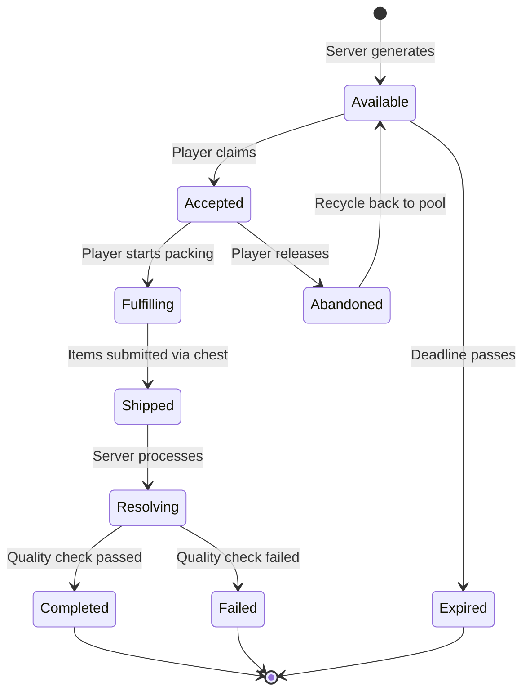

# 5 · Orders & Reputation

> Parent: [00_overview.md](./00_overview.md) · Server API: [09_server_api.md](./09_server_api.md)

This document specifies the order lifecycle, client archetypes, reputation tracks, and satisfaction algorithm.

---

## 5.1 Client Archetypes

Orders come from server-generated clients of different types. Each archetype defines the demand profile, risk exposure, and payout characteristics.

| Archetype | Volume | Min Potency | Payment Timing | Payout Multiplier | Risk Multiplier | Heat Cost | Nerve Cost | Unlock Rank |
|-----------|--------|-------------|----------------|-------------------|-----------------|-----------|------------|-------------|
| **Street Buyer** | 1-5 | 20 | Immediate | 1.0× | 0.5× | Low (+2) | 5 | Novice |
| **Regular** | 5-15 | 40 | Immediate | 1.2× | 1.0× | Medium (+5) | 10 | Novice |
| **Dependent** | 10-30 | 10 | Immediate | 0.8× | 0.3× | Low (+2) | 5 | Peddler |
| **Broker** | 20-50 | 60 | Delayed (2-5 days) | 2.0× | 2.0× | High (+10) | 20 | Supplier |
| **Syndicate** | 50-100 | 80 | Delayed (5-10 days) | 3.5× | 3.0× | Very High (+20) | 40 | Kingpin |

**Elin-flavored client names** (for display in the Network UI):
- Street Buyer → "Alley Patron"
- Regular → "Returning Customer"
- Dependent → "Desperate Soul"
- Broker → "Shadow Broker"
- Syndicate → "Guild Commissary"

---

## 5.2 Order Lifecycle

### 5.2.1 State Machine



### 5.2.2 State Definitions

| State | Where Stored | Description |
|-------|-------------|-------------|
| `Available` | Server only | Order visible in market but unclaimed |
| `Accepted` | Server + client cache | Player has claimed the order. Timer starts. |
| `Fulfilling` | Client-side only | Player is packing contraband (UI state) |
| `Shipped` | Server only | Contraband submitted. Pending resolution. |
| `Resolving` | Server only | Server processing quality check, heat roll, enforcement. |
| `Completed` | Server (historical) | Order fulfilled. Payout issued. |
| `Failed` | Server (historical) | Quality check failed or enforcement intercepted. |
| `Expired` | Server only | Deadline passed with no shipment. Rep penalty. |
| `Abandoned` | Server only | Player released the order. Minor rep penalty. Returns to `Available`. |

### 5.2.3 Order Data Model

```python
# Server-side Order table
class Order:
    id: int                  # Auto-increment
    territory_id: int        # Which territory demand this serves
    client_type: str         # "street_buyer", "regular", "dependent", "broker", "syndicate"
    product_type: str        # Required contraband category (e.g., "tonic", "powder", "elixir")
    product_id: str          # Specific item ID requested (or null for any)
    min_quantity: int         # Minimum units required
    max_quantity: int         # Maximum units accepted
    min_potency: int          # Minimum potency element value
    max_toxicity: int         # Maximum acceptable toxicity
    base_payout: int          # Gold payout at minimum quantity and minimum potency
    payout_per_potency: float # Bonus gold per potency point above minimum
    deadline_hours: int       # Real-time hours until expiration
    status: str              # Current state
    assigned_player_id: int   # Null if Available
    created_at: datetime
    expires_at: datetime
```

---

## 5.3 Reputation System

### 5.3.1 Dual Track

| Track | Scope | Range | Storage | Purpose |
|-------|-------|-------|---------|---------|
| **Local Rep** | Per territory | 0 – 1000 | Server DB (`reputation` table) | Determines order quality and volume in that territory |
| **Global Rank** | Player-wide | Enum (5 tiers) | Server DB (`players.underworld_rank`) | Unlocks client types, crafting stations, recipes |

### 5.3.2 Global Rank Tiers

| Rank | Required Total Rep | Benefits |
|------|-------------------|----------|
| **Novice** | 0 | Access to Street Buyer and Regular clients. Mixing Table recipes. |
| **Peddler** | 500 | Access to Dependent clients. Processing Vat recipe. +10% payout. |
| **Supplier** | 2000 | Access to Broker clients. Advanced Lab recipe. +20% payout. Reduced heat decay. |
| **Kingpin** | 5000 | Access to Syndicate clients. All recipes. +35% payout. |
| **Overlord** | 10000 | Faction leadership bonuses. Territory control advantages. +50% payout. |

### 5.3.3 Reputation Gain/Loss Formula

```python
def calculate_rep_change(order, shipment_result):
    """Calculate reputation delta from a completed or failed shipment."""
    base_rep = order.min_quantity  # 1 rep per unit at minimum
    
    if shipment_result.status == "completed":
        # Bonus for exceeding potency requirements
        potency_bonus = max(0, shipment_result.avg_potency - order.min_potency) * 0.5
        # Bonus for larger volumes
        volume_bonus = max(0, shipment_result.quantity - order.min_quantity) * 0.3
        # Client type multiplier
        type_mult = CLIENT_REP_MULTIPLIERS[order.client_type]
        
        return int((base_rep + potency_bonus + volume_bonus) * type_mult)
    
    elif shipment_result.status == "failed":
        # Failure costs rep — more for higher-tier orders
        return -int(base_rep * 1.5 * CLIENT_REP_MULTIPLIERS[order.client_type])
    
    elif shipment_result.status == "expired":
        return -int(base_rep * 0.5)  # Smaller penalty for expiration
    
    elif shipment_result.status == "abandoned":
        return -int(base_rep * 0.3)  # Smallest penalty for releasing early

CLIENT_REP_MULTIPLIERS = {
    "street_buyer": 1.0,
    "regular": 1.5,
    "dependent": 0.8,
    "broker": 2.5,
    "syndicate": 4.0,
}
```

**Reference:** The pricing model is inspired by [GuildThief.SellStolenPrice](file:///c:/Users/mcounts/Documents/ElinMods/Elin-Decompiled-main/Elin/GuildThief.cs#L17-L24): `price * 100 / (190 - rank * 2)`. We use a similar rank-scaling formula for payout bonuses:

```python
def rank_payout_bonus(rank_tier: int) -> float:
    """Rank-scaled payout multiplier, modeled on GuildThief formula."""
    # rank_tier: 0=Novice, 1=Peddler, 2=Supplier, 3=Kingpin, 4=Overlord
    return 100.0 / (190 - rank_tier * 20)  # 0.526 → 0.555 → 0.588 → 0.625 → 0.667
```

---

## 5.4 Satisfaction Algorithm

When a shipment is resolved, the server evaluates quality against order requirements.

### 5.4.1 Satisfaction Score

```python
def calculate_satisfaction(order, shipment):
    """
    Returns satisfaction score 0.0-2.0.
    1.0 = exactly met requirements.
    >1.0 = exceeded (bonus payout).
    <1.0 = underperformed (reduced payout, possible failure).
    <0.3 = failure threshold.
    """
    # Potency factor: ratio of delivered vs. required
    potency_factor = shipment.avg_potency / max(1, order.min_potency)
    potency_score = min(2.0, potency_factor)  # Cap at 2.0×
    
    # Toxicity factor: penalty for high toxicity
    if order.max_toxicity > 0 and shipment.avg_toxicity > order.max_toxicity:
        toxicity_penalty = (shipment.avg_toxicity - order.max_toxicity) / 100.0
    else:
        toxicity_penalty = 0.0
    
    # Volume factor: bonus for delivering more than minimum
    volume_factor = min(1.5, shipment.quantity / max(1, order.min_quantity))
    
    # Combined score
    satisfaction = (potency_score * 0.5 + volume_factor * 0.3 + (1.0 - toxicity_penalty) * 0.2)
    
    return max(0.0, min(2.0, satisfaction))
```

### 5.4.2 Payout Calculation

```python
def calculate_payout(order, satisfaction, player_rank_tier):
    """Final gold payout for a completed shipment."""
    base = order.base_payout * satisfaction
    rank_bonus = rank_payout_bonus(player_rank_tier)
    
    return int(base * rank_bonus)
```

### 5.4.3 Resolution Outcomes

| Satisfaction Range | Outcome | Effect |
|-------------------|---------|--------|
| 0.0 – 0.3 | **Failed** | No payout. Rep loss. Client angry → future orders harder. |
| 0.3 – 0.7 | **Partial Success** | 50% payout. Small rep gain. Client unsatisfied. |
| 0.7 – 1.0 | **Success** | Full payout. Normal rep gain. |
| 1.0 – 1.5 | **Exceeded** | 120% payout. Bonus rep. Client may generate follow-on order. |
| 1.5 – 2.0 | **Outstanding** | 150% payout. Large rep bonus. Client becomes recurring. |

---