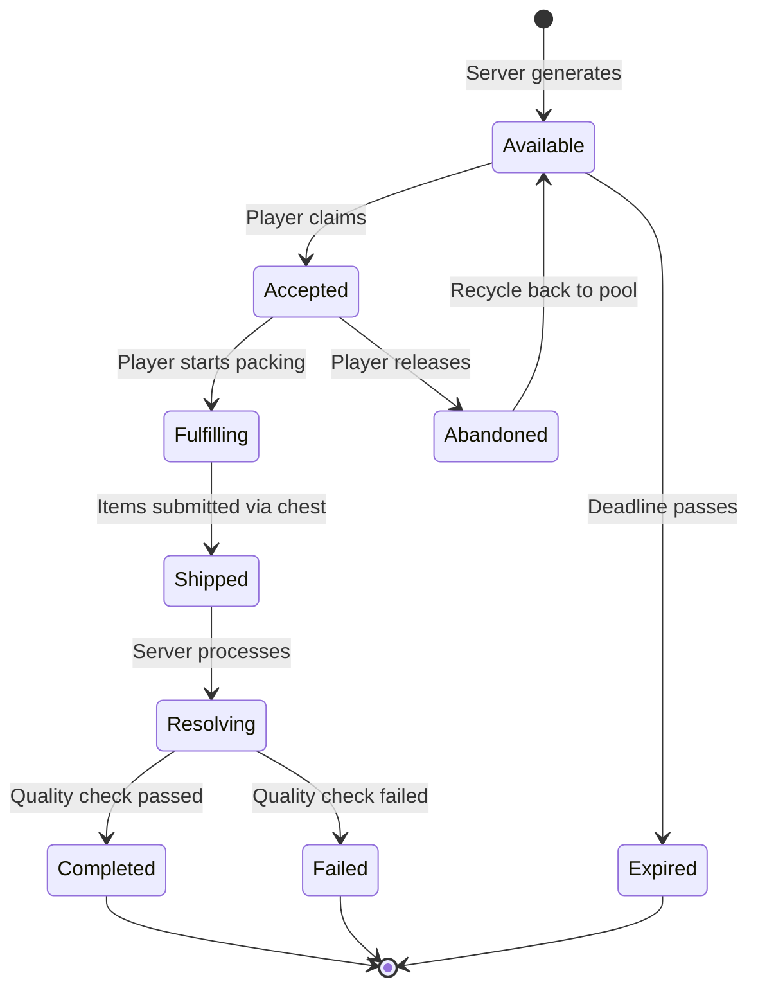
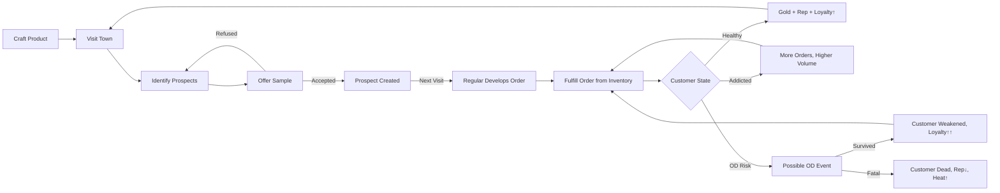

# 5 · Orders & Reputation

> Parent: [00_overview.md](./00_overview.md) · Server API: [09_server_api.md](./09_server_api.md)

This document specifies the order lifecycle, client archetypes, reputation tracks, and satisfaction algorithm.

---

## 5.1 Client Archetypes

Orders come from server-generated clients of different types. Each archetype defines the demand profile, risk exposure, and payout characteristics.

| Archetype | Volume | Min Potency | Payment Timing | Payout Multiplier | Risk Multiplier | Heat Cost | Nerve Cost | Unlock Rank |
|-----------|--------|-------------|----------------|-------------------|-----------------|-----------|------------|-------------|
| **Street Buyer** | 1-5 | 20 | Immediate | 1.0× | 0.5× | Low (+2) | 5 | Novice |
| **Regular** | 5-15 | 40 | Immediate | 1.2× | 1.0× | Medium (+5) | 10 | Novice |
| **Dependent** | 10-30 | 10 | Immediate | 0.8× | 0.3× | Low (+2) | 5 | Peddler |
| **Broker** | 20-50 | 60 | Delayed (2-5 days) | 2.0× | 2.0× | High (+10) | 20 | Supplier |
| **Syndicate** | 50-100 | 80 | Delayed (5-10 days) | 3.5× | 3.0× | Very High (+20) | 40 | Kingpin |

**Elin-flavored client names** (for display in the Network UI):
- Street Buyer → "Alley Patron"
- Regular → "Returning Customer"
- Dependent → "Desperate Soul"
- Broker → "Shadow Broker"
- Syndicate → "Guild Commissary"

---

## 5.2 Order Lifecycle

### 5.2.1 State Machine



### 5.2.2 State Definitions

| State | Where Stored | Description |
|-------|-------------|-------------|
| `Available` | Server only | Order visible in market but unclaimed |
| `Accepted` | Server + client cache | Player has claimed the order. Timer starts. |
| `Fulfilling` | Client-side only | Player is packing contraband (UI state) |
| `Shipped` | Server only | Contraband submitted. Pending resolution. |
| `Resolving` | Server only | Server processing quality check, heat roll, enforcement. |
| `Completed` | Server (historical) | Order fulfilled. Payout issued. |
| `Failed` | Server (historical) | Quality check failed or enforcement intercepted. |
| `Expired` | Server only | Deadline passed with no shipment. Rep penalty. |
| `Abandoned` | Server only | Player released the order. Minor rep penalty. Returns to `Available`. |

### 5.2.3 Order Data Model

```python
# Server-side Order table
class Order:
    id: int                  # Auto-increment
    territory_id: int        # Which territory demand this serves
    client_type: str         # "street_buyer", "regular", "dependent", "broker", "syndicate"
    product_type: str        # Required contraband category (e.g., "tonic", "powder", "elixir")
    product_id: str          # Specific item ID requested (or null for any)
    min_quantity: int         # Minimum units required
    max_quantity: int         # Maximum units accepted
    min_potency: int          # Minimum potency element value
    max_toxicity: int         # Maximum acceptable toxicity
    base_payout: int          # Gold payout at minimum quantity and minimum potency
    payout_per_potency: float # Bonus gold per potency point above minimum
    deadline_hours: int       # Real-time hours until expiration
    status: str              # Current state
    assigned_player_id: int   # Null if Available
    created_at: datetime
    expires_at: datetime
```

---

## 5.3 Reputation System

### 5.3.1 Dual Track

| Track | Scope | Range | Storage | Purpose |
|-------|-------|-------|---------|---------|
| **Local Rep** | Per territory | 0 – 1000 | Server DB (`reputation` table) | Determines order quality and volume in that territory |
| **Global Rank** | Player-wide | Enum (5 tiers) | Server DB (`players.underworld_rank`) | Unlocks client types, crafting stations, recipes |

### 5.3.2 Global Rank Tiers

| Rank | Required Total Rep | Benefits |
|------|-------------------|----------|
| **Novice** | 0 | Access to Street Buyer and Regular clients. Mixing Table recipes. |
| **Peddler** | 500 | Access to Dependent clients. Processing Vat recipe. +10% payout. |
| **Supplier** | 2000 | Access to Broker clients. Advanced Lab recipe. +20% payout. Reduced heat decay. |
| **Kingpin** | 5000 | Access to Syndicate clients. All recipes. +35% payout. |
| **Overlord** | 10000 | Faction leadership bonuses. Territory control advantages. +50% payout. |

### 5.3.3 Reputation Gain/Loss Formula

```python
def calculate_rep_change(order, shipment_result):
    """Calculate reputation delta from a completed or failed shipment."""
    base_rep = order.min_quantity  # 1 rep per unit at minimum
    
    if shipment_result.status == "completed":
        # Bonus for exceeding potency requirements
        potency_bonus = max(0, shipment_result.avg_potency - order.min_potency) * 0.5
        # Bonus for larger volumes
        volume_bonus = max(0, shipment_result.quantity - order.min_quantity) * 0.3
        # Client type multiplier
        type_mult = CLIENT_REP_MULTIPLIERS[order.client_type]
        
        return int((base_rep + potency_bonus + volume_bonus) * type_mult)
    
    elif shipment_result.status == "failed":
        # Failure costs rep — more for higher-tier orders
        return -int(base_rep * 1.5 * CLIENT_REP_MULTIPLIERS[order.client_type])
    
    elif shipment_result.status == "expired":
        return -int(base_rep * 0.5)  # Smaller penalty for expiration
    
    elif shipment_result.status == "abandoned":
        return -int(base_rep * 0.3)  # Smallest penalty for releasing early

CLIENT_REP_MULTIPLIERS = {
    "street_buyer": 1.0,
    "regular": 1.5,
    "dependent": 0.8,
    "broker": 2.5,
    "syndicate": 4.0,
}
```

**Reference:** The pricing model is inspired by [GuildThief.SellStolenPrice](file:///c:/Users/mcounts/Documents/ElinMods/Elin-Decompiled-main/Elin/GuildThief.cs#L17-L24): `price * 100 / (190 - rank * 2)`. We use a similar rank-scaling formula for payout bonuses:

```python
def rank_payout_bonus(rank_tier: int) -> float:
    """Rank-scaled payout multiplier, modeled on GuildThief formula."""
    # rank_tier: 0=Novice, 1=Peddler, 2=Supplier, 3=Kingpin, 4=Overlord
    return 100.0 / (190 - rank_tier * 20)  # 0.526 → 0.555 → 0.588 → 0.625 → 0.667
```

---

## 5.4 Satisfaction Algorithm

When a shipment is resolved, the server evaluates quality against order requirements.

### 5.4.1 Satisfaction Score

```python
def calculate_satisfaction(order, shipment):
    """
    Returns satisfaction score 0.0-2.0.
    1.0 = exactly met requirements.
    >1.0 = exceeded (bonus payout).
    <1.0 = underperformed (reduced payout, possible failure).
    <0.3 = failure threshold.
    """
    # Potency factor: ratio of delivered vs. required
    potency_factor = shipment.avg_potency / max(1, order.min_potency)
    potency_score = min(2.0, potency_factor)  # Cap at 2.0×
    
    # Toxicity factor: penalty for high toxicity
    if order.max_toxicity > 0 and shipment.avg_toxicity > order.max_toxicity:
        toxicity_penalty = (shipment.avg_toxicity - order.max_toxicity) / 100.0
    else:
        toxicity_penalty = 0.0
    
    # Volume factor: bonus for delivering more than minimum
    volume_factor = min(1.5, shipment.quantity / max(1, order.min_quantity))
    
    # Combined score
    satisfaction = (potency_score * 0.5 + volume_factor * 0.3 + (1.0 - toxicity_penalty) * 0.2)
    
    return max(0.0, min(2.0, satisfaction))
```

### 5.4.2 Payout Calculation

```python
def calculate_payout(order, satisfaction, player_rank_tier):
    """Final gold payout for a completed shipment."""
    base = order.base_payout * satisfaction
    rank_bonus = rank_payout_bonus(player_rank_tier)
    
    return int(base * rank_bonus)
```

### 5.4.3 Resolution Outcomes

| Satisfaction Range | Outcome | Effect |
|-------------------|---------|--------|
| 0.0 – 0.3 | **Failed** | No payout. Rep loss. Client angry → future orders harder. |
| 0.3 – 0.7 | **Partial Success** | 50% payout. Small rep gain. Client unsatisfied. |
| 0.7 – 1.0 | **Success** | Full payout. Normal rep gain. |
| 1.0 – 1.5 | **Exceeded** | 120% payout. Bonus rep. Client may generate follow-on order. |
| 1.5 – 2.0 | **Outstanding** | 150% payout. Large rep bonus. Client becomes recurring. |

---

## 5.6 Small-Time Dealing — Street-Level Sales

The dealing system is the **early-game income engine** — the player's primary revenue source before they have the infrastructure for network-scale operations. It's inspired by *Drug Dealer Simulator*'s customer management and *Weedcraft Inc*'s demographic targeting, adapted to Elin's NPC-rich towns.

### 5.6.1 Design Inspiration

| Inspiration | Mechanic | Elin Adaptation |
|-------------|----------|----------------|
| DDS — Free Samples | Give NPCs 1g samples to gain new clients | Offer a single contraband item to a wandering NPC to build local rep |
| DDS — Customer Orders | Clients text you with specific requests | NPCs develop preferences after receiving samples; return visits |
| DDS — Addiction | Addicting clients increases order frequency | Custom `UW_ADDICTION` element drives volume and OD risk |
| DDS — Overdose | Customers OD on too-potent product, removed from client list | Fatal OD kills NPC (respawns later as stranger); heat/karma penalties |
| DDS — Packaging | Manually weigh and pack product | Use Elin's item splitting to create small-quantity stacks |
| DDS — Concealment | "Pockets" mechanic hides drugs from police | Shadow Guise skill + Sample Kit item |
| Weedcraft — Customer Groups | Different demographics prefer different products | Elin NPC archetypes have different preferences |
| Weedcraft — Pricing | Adjust price based on customer spending power | Haggling via Silver Tongue; price influenced by archetype and addiction |

### 5.6.2 Loop Overview



**Entry points:**

| Entry | Trigger | UI |
|-------|---------|-----|
| **Talk to NPC** | Player has contraband + NPC is in a town zone | "Offer a taste" dialog option injected via `DramaCustomSequence.Build` postfix |
| **Dealer's Ledger** | Interact with `uw_dealers_ledger` item | Custom panel showing all customers, status, addiction, product preferences |

**Party member immunity:** All party members (`IsPCParty`) and PC faction members (`IsPCFaction`) are excluded from the dealing system. They cannot be offered samples, cannot develop addiction, and cannot OD. The Fixer and all recruited allies are always immune. See [TraitChara.cs](file:///c:/Users/mcounts/Documents/ElinMods/Elin-Decompiled-main/Elin/TraitChara.cs) for the faction check pattern.

---

### 5.6.3 First Contact — Sample Offering

The player speaks to a town NPC while carrying contraband. A Harmony postfix on `DramaCustomSequence.Build` injects the dialog option.

**Acceptance formula:**
```python
accept_chance = BASE_ACCEPT_CHANCE                   # Config: 50
              + (silver_tongue_level * 2)             # Skill bonus
              + ARCHETYPE_MODIFIER[npc_archetype]     # Per-archetype
              - (10 if guard_within_radius else 0)    # Guard proximity penalty

ARCHETYPE_MODIFIER = {
    "laborer":     +10,   # Farmers, miners — susceptible
    "adventurer":   +0,   # Warriors, thieves — neutral
    "noble":       -25,   # Aristocrats — resistant
    "scholar":     -35,   # Wizards, priests — very resistant
    "rogue":       +20,   # Thieves, Juere — eager
    "guard":      -999,   # Guards — NEVER accepts (hard block in code)
}
```

**On accept:**
- 1 item consumed from player inventory
- NPC gains custom element `UW_LOYALTY` = 1 (Prospect tier)
- NPC gains custom element `UW_PREFERRED_PRODUCT` = the product type given
- NPC gains custom element `UW_ADDICTION` = 0 (clean)
- NPC gains custom element `UW_TOLERANCE` = 0 (no tolerance built up)
- Local territory rep +1
- Silver Tongue XP gain

**On refuse:**
- No penalty
- NPC gains a "cooldown" flag (custom element `UW_OFFER_COOLDOWN` = 72) — cannot be offered again for 72 in-game hours
- 25% chance (nobles, scholars): NPC alerts nearby guards → karma −2

**Implementation:**

```csharp
[HarmonyPatch(typeof(DramaCustomSequence), nameof(DramaCustomSequence.Build))]
public static class PatchDealerOffer
{
    static void Postfix(DramaCustomSequence __instance, Chara c)
    {
        // Party members are immune
        if (c.IsPC || c.IsPCParty || c.IsPCFaction) return;
        
        // Must be in a town zone with contraband
        if (!EClass._zone.IsTown || !HasContraband(EClass.pc)) return;
        
        // Never offer to guards
        if (c.trait is TraitGuard) return;
        
        int loyalty = c.elements.GetBase(UW_LOYALTY_ID);
        int cooldown = c.elements.GetBase(UW_OFFER_COOLDOWN_ID);
        
        if (cooldown > 0) return; // Still on cooldown
        
        if (loyalty >= REGULAR_THRESHOLD)
        {
            __instance.AddChoice("uw_deal_fulfill", () => FulfillDeal(c));
        }
        else
        {
            __instance.AddChoice("uw_deal_offer", () => OfferSample(c));
        }
    }
}
```

---

### 5.6.4 Customer Loyalty Tiers

Loyalty is tracked as the `UW_LOYALTY` element value on the NPC.

| Tier | Element Value | Deals to Reach | Order Volume | Markup | Special Effect |
|------|-------------|----------------|-------------|--------|---------------|
| **Prospect** | 1-2 | 1 sample | 1 item | ×0.8 | 50% chance to return next visit |
| **Regular** | 3-7 | 3 successful deals | 1-3 items | ×1.0 | Always returns. Has standing order. |
| **Devoted** | 8-14 | 8 deals | 2-5 items | ×1.2 | May refer new prospects (5% per visit). |
| **Hooked** | 15+ | 15 deals | 3-8 items | ×1.3 | Always has order. Generates +1 passive rep/day. Likely addicted. |

**Loyalty increases by +1 per successful deal.** Failed deals (no stock, OD event) do not increase loyalty.

### 5.6.5 Standing Orders

When a customer has loyalty ≥ Regular, they generate a **standing order** each time the player enters their town:

```python
def generate_standing_order(npc):
    """Generate a local deal order for a returning customer."""
    tier = get_loyalty_tier(npc)
    volume = random.randint(*TIER_VOLUME_RANGE[tier])
    preferred = npc.elements.GetBase(UW_PREFERRED_PRODUCT)
    
    return DealOrder(
        npc_uid=npc.uid,
        product_type=preferred,
        quantity=volume,
        # Addicted customers demand higher potency
        min_potency=max(10, npc.elements.GetBase(UW_TOLERANCE) * 2),
    )
```

Addicted NPCs demand higher-potency product because their tolerance has built up.

### 5.6.6 NPC Customer Archetypes

| NPC Type | Accept Chance (base) | Preferred Product | Markup Tolerance | Risk to Player |
|----------|---------------------|-------------------|-----------------|---------------|
| **Laborers** (farmer, miner) | 60% | Tonics (energy/stimulant) | Low (accepts cheap) | Very Low |
| **Adventurers** (warrior, thief) | 45% | Powders (performance) | Medium | Low |
| **Nobles** (aristocrat, merchant) | 25% | Elixirs (luxury/potent) | High (pays premium) | Medium (may report) |
| **Scholars** (wizard, priest) | 15% | Void products (esoteric) | Very High | High (moral objection likely) |
| **Rogues** (thief, Juere) | 70% | Any | Medium | Very Low |
| **Guards** | 0% | Never accepts | — | Instant detection! |

---

### 5.6.7 Risk & Detection During Dealing

| Scenario | Risk Level | Consequence |
|----------|-----------|-------------|
| Offering to a friendly NPC in a quiet area | Low | Normal deal proceeds |
| Offering while guards are nearby (within 5 tiles) | Medium | Guard has a detection chance: `20% - (Shadow Guise * 2)`% |
| Offering to a noble who refuses | Medium-High | NPC may alert guards (25% chance). Karma -2. |
| Offering to a guard (forbidden) | Instant | Immediate criminal flag. Guard aggro. Karma -10. |
| Carrying contraband in a Sample Kit | Safe | Items in the kit don't trigger `IsCriminal` checks |

---

## 5.7 Addiction System

> Addiction is a **double-edged sword**. Addicted customers buy more frequently, in larger volumes, and are more loyal. But they also develop tolerance (requiring stronger product), risk overdose, and create heat when they OD.

### 5.7.1 Addiction Model

Each dealing customer tracks two values as custom elements on the NPC:

| Element | ID | Range | Purpose |
|---------|-----|-------|---------|
| `UW_ADDICTION` | 90010 | 0-100 | How dependent the NPC is. Drives order frequency and OD risk. |
| `UW_TOLERANCE` | 90011 | 0-50 | How much potency the NPC needs to feel the effect. Increases min potency requirement. |

### 5.7.2 Addiction Progression

```python
def process_deal_addiction(npc, product):
    """Called after every successful deal. Updates addiction and tolerance."""
    current_addiction = npc.elements.GetBase(UW_ADDICTION)
    current_tolerance = npc.elements.GetBase(UW_TOLERANCE)
    
    # Addiction increases based on product potency
    addiction_gain = int(product.potency * ADDICTION_GAIN_PER_POTENCY)  # Config: 0.3
    addiction_gain = max(1, addiction_gain)  # Always at least 1
    
    new_addiction = min(100, current_addiction + addiction_gain)
    npc.elements.SetBase(UW_ADDICTION, new_addiction)
    
    # Tolerance increases more slowly
    # Only increases when potency exceeds current tolerance
    if product.potency > current_tolerance * 2:
        tolerance_gain = max(1, int(product.potency * TOLERANCE_GAIN_PER_POTENCY))  # Config: 0.1
        new_tolerance = min(50, current_tolerance + tolerance_gain)
        npc.elements.SetBase(UW_TOLERANCE, new_tolerance)
```

### 5.7.3 Addiction Tiers

| Tier | Addiction Range | Effect on NPC | Effect on Player |
|------|----------------|--------------|-----------------|
| **Clean** | 0-10 | Normal behavior. Orders infrequently. | Standard pricing, low risk. |
| **Casual** | 11-30 | Slight preference for your product. | +10% order frequency. Orders may mention craving. |
| **Dependent** | 31-60 | Visible signs (dialog changes). Buys every visit. | +25% order volume. −10% price sensitivity. Withdrawal if not served within 3 visits. |
| **Addicted** | 61-85 | Desperate. Dialog urgent. Pays premium. | +50% order volume. +30% markup tolerance. Min potency = tolerance × 2. OD risk begins. |
| **Severe** | 86-100 | In crisis. Visible condition. May approach you unbidden. | +75% order volume. +50% markup tolerance. High OD risk. May die from OD. |

### 5.7.4 Withdrawal

When a Dependent+ customer is not served for too long, they enter **withdrawal**:

| Addiction Tier | Visits Without Service | Withdrawal Effect |
|---------------|----------------------|-------------------|
| Dependent | 3 visits | NPC dialog: *"You got anything? I'm... not feeling great."* Mild stat debuffs. |
| Addicted | 2 visits | NPC actively seeks the player. Dialog: *"Please... I need it."* NPC gains `ConUWWithdrawal`. |
| Severe | 1 visit | NPC collapses. Gains `ConUWWithdrawal` (severe). May approach any party member. |

**`ConUWWithdrawal`** — a custom `BadCondition` ([ConPoison.cs](file:///c:/Users/mcounts/Documents/ElinMods/Elin-Decompiled-main/Elin/ConPoison.cs) as reference):

```csharp
public class ConUWWithdrawal : BadCondition
{
    public override bool UseElements => true;
    
    public override void OnChangePhase(int lastPhase, int newPhase)
    {
        switch (newPhase)
        {
            case 0: // Mild
                elements.SetBase(70, -5);  // SPD -5
                break;
            case 1: // Moderate
                elements.SetBase(70, -10); // SPD -10
                elements.SetBase(77, -5);  // STR -5
                break;
            case 2: // Severe
                elements.SetBase(70, -15); // SPD -15
                elements.SetBase(77, -10); // STR -10
                elements.SetBase(79, -5);  // WIL -5
                break;
        }
    }
    
    public override void Tick()
    {
        // Withdrawal doesn't decay on its own — only cured by receiving product
        // Periodic vomiting at severe phase
        if (GetPhase() >= 2 && EClass.rnd(100) == 0)
        {
            owner.Vomit();
        }
    }
}
```

**Serving a withdrawing customer** immediately removes `ConUWWithdrawal` and grants loyalty +3. They become fiercely loyal — but their addiction deepens.

### 5.7.5 Natural Addiction Decay

- Addiction does **NOT** decay naturally by default (configurable via `AddictionNaturalDecayEnabled`). This makes addiction a permanent strategic consequence.
- If enabled, addiction decays by 1 per in-game day when the NPC is not served.
- Tolerance always decays by 1 per 3 in-game days (the NPC's body adapts back when not using).

---

## 5.8 Overdose System

### 5.8.1 OD Trigger

An OD check occurs **at the moment of each deal**, after the product is handed over. The check is purely client-side.

```python
def check_overdose(npc, product):
    """Roll for overdose after a deal. Returns OD severity or None."""
    addiction = npc.elements.GetBase(UW_ADDICTION)
    tolerance = npc.elements.GetBase(UW_TOLERANCE)
    potency = product.potency
    toxicity = product.toxicity
    
    # OD only possible at Addicted+ tier (addiction >= 61)
    if addiction < OD_ADDICTION_THRESHOLD:  # Config: 61
        return None
    
    # OD probability formula
    potency_excess = max(0, potency - (tolerance * 2))
    toxicity_factor = toxicity / 100.0
    addiction_factor = (addiction - 60) / 40.0  # 0.0 at 61, 1.0 at 100
    
    od_chance = (
        OD_BASE_CHANCE                        # Config: 0.02 (2%)
        + (potency_excess * OD_POTENCY_FACTOR) # Config: 0.005 per point
        + (toxicity_factor * OD_TOXICITY_FACTOR) # Config: 0.10
    ) * (1.0 + addiction_factor)               # Addiction amplifies
    
    od_chance = min(od_chance, OD_MAX_CHANCE)   # Config: 0.40 (40% cap)
    
    if random.random() < od_chance:
        severity_roll = random.random()
        if severity_roll < OD_FATAL_CHANCE:    # Config: 0.15 (15% of ODs are fatal)
            return "fatal"
        elif severity_roll < 0.50:
            return "severe"
        else:
            return "mild"
    
    return None
```

**Why these defaults:**
- **2% base OD chance** → ~1 in 50 deals at threshold triggers an OD. Rare enough to not punish, frequent enough to demand attention.
- **15% fatal rate** → ~1 in 333 deals at threshold is a kill. Many "close calls" as warnings before death.
- **40% max cap** → prevents degenerate scenarios where every deal is a coin flip.

### 5.8.2 OD Severity Levels

| Severity | Effect on NPC | Effect on Player | Flavor |
|----------|--------------|-----------------|--------|
| **Mild** | Gains `ConUWOverdose` (phase 0) for 24h. Visible distress. Continues as customer after recovery. | Loyalty +1 (they still came back). No other penalty. | *"They stumble and clutch their chest, but wave you off. 'I'm fine... I'm fine.'"* |
| **Severe** | Gains `ConUWOverdose` (phase 2) for 72h. Collapses. Other NPCs nearby may notice. | Heat +5 in territory. 20% chance guard alerted. Loyalty +2 (desperation). | *"They collapse in the alley. Someone is going to notice."* |
| **Fatal** | NPC dies. Added to `map.deadCharas`. Respawns on next revive cycle as a stranger (all dealing data lost). | Heat +15. Karma −5. Local rep −20. Guard alert (100%). Nearby customers may flee (30% chance per customer). | *"They're not breathing. You need to leave. Now."* |

### 5.8.3 NPC Death and Customer Data

Town NPCs auto-revive through Elin's `Zone.Revive()` system ([Zone.cs L1126-1158](file:///c:/Users/mcounts/Documents/ElinMods/Elin-Decompiled-main/Elin/Zone.cs#L1126-L1158)). Imported town NPCs satisfy `CanAutoRevive` ([TraitChara.cs L19-29](file:///c:/Users/mcounts/Documents/ElinMods/Elin-Decompiled-main/Elin/TraitChara.cs#L19-L29)) because `isImported=true` and `!IsGlobal`. Towns also regenerate periodically via `ShouldRegenerate` + `dateRegenerate`.

**When a customer dies from a fatal OD:**
- NPC is killed via standard `DamageHP()` — added to `map.deadCharas`
- NPC respawns on the next revive/regeneration cycle
- **All custom element data (loyalty, addiction, tolerance) is lost** — the respawned NPC is a fresh instance
- The player loses their *investment* in that customer relationship, not the NPC permanently
- The Dealer's Ledger records: *"[NPC Name] — Deceased (overdose). Customer relationship lost."*

### 5.8.4 `ConUWOverdose` — Condition Implementation

```csharp
/// <summary>
/// Applied to an NPC who overdoses on contraband.
/// Phase 0 = mild (stat debuffs), Phase 2 = severe (collapse).
/// Fatal ODs skip this condition and kill the NPC directly.
/// </summary>
public class ConUWOverdose : BadCondition
{
    public override Emo2 EmoIcon => Emo2.angry;
    public override bool UseElements => true;
    public override bool PreventRegen => true;
    
    public override void OnChangePhase(int lastPhase, int newPhase)
    {
        switch (newPhase)
        {
            case 0: // Mild
                elements.SetBase(70, -10);  // SPD -10
                elements.SetBase(77, -5);   // STR -5
                break;
            case 1: // Moderate
                elements.SetBase(70, -20);  // SPD -20
                elements.SetBase(77, -10);  // STR -10
                elements.SetBase(79, -10);  // WIL -10
                break;
            case 2: // Severe — collapse
                elements.SetBase(70, -30);  // SPD -30
                elements.SetBase(77, -15);  // STR -15
                elements.SetBase(79, -15);  // WIL -15
                owner.AddCondition<ConParalyze>(50);
                break;
        }
    }
    
    public override void Tick()
    {
        // Slow recovery — only decrements every 10 ticks
        if (EClass.rnd(10) == 0) Mod(-1);
        
        // Severe: periodic vomiting
        if (GetPhase() >= 2 && EClass.rnd(50) == 0) owner.Vomit();
    }
}
```

### 5.8.5 Fatal OD Processing

```csharp
private void ProcessFatalOverdose(Chara npc)
{
    npc.DamageHP(npc.hp + 1, AttackSource.Condition);
    
    Msg.Say("uw_od_fatal", npc.Name);
    
    UnderworldPlugin.Instance.Heat.AddHeat(
        GetLocalTerritory(), 
        UnderworldConfig.ODFatalHeatGain.Value);
    EClass.player.ModKarma(UnderworldConfig.ODFatalKarmaPenalty.Value);
    UnderworldPlugin.Instance.Reputation.ModLocalRep(
        GetLocalTerritory(), 
        UnderworldConfig.ODFatalRepPenalty.Value);
    
    AlertGuards();
    CascadeCustomerFlight(npc);
    DealerLedger.RecordDeath(npc.uid);
}
```

### 5.8.6 Cascade Effects — Customer Flight

When a customer dies from an OD, other customers in the same territory may lose trust:

```python
def cascade_customer_flight(dead_npc, territory):
    for customer in get_customers_in_territory(territory):
        if customer.uid == dead_npc.uid:
            continue
        
        flight_chance = CUSTOMER_FLIGHT_CHANCE  # Config: 0.30
        
        # Devoted+ customers are more resistant
        if get_loyalty_tier(customer) >= "devoted":
            flight_chance *= 0.5
        
        # Addicted+ customers almost never flee (they need you)
        if customer.elements.GetBase(UW_ADDICTION) >= 61:
            flight_chance *= 0.1
        
        if random.random() < flight_chance:
            customer.elements.SetBase(UW_LOYALTY, 0)
            customer.elements.SetBase(UW_ADDICTION, 0)
            customer.elements.SetBase(UW_TOLERANCE, 0)
```

---

## 5.9 Dealing Items

### 5.9.1 Item Table

| ID | Name | Category | Grid | Purpose |
|----|------|----------|------|---------|
| `uw_dealers_ledger` | Dealer's Ledger | `book` | — | Opens customer management UI. Shows all customers, status, addiction level, preferred product, pending orders. Bootstrap starter item. |
| `uw_sample_kit` | Sample Kit | `container` | 1×3 | Concealed pouch. Contents don't trigger `IsCriminal`. Max 3 items. Craftable: `leather/2,bolt/1`. |
| `uw_antidote_vial` | Alchemist's Reprieve | `potion` | — | Emergency OD treatment. Cures `ConUWOverdose`, restores 50% HP. Craftable: `uw_herb_whisper/2,uw_herb_shadow/1,potion_empty/1`. |

### 5.9.2 Alchemist's Reprieve — OD Recovery

The player isn't powerless against ODs:
- **Use**: Target an NPC with `ConUWOverdose` → removes the condition, restores 50% HP
- **Cannot prevent fatal ODs** — fatal is determined at the instant of the deal. The vial only helps with mild/severe ODs already in progress
- **Strategic value**: Saving a customer through a severe OD grants loyalty +3 and the dialog: *"You... saved me. I owe you everything."*

---

## 5.10 Dealing UI — Dealer's Ledger Panel

Interacting with the Dealer's Ledger opens a custom `ELayer` panel:

```
┌──────────────────────────────────────────────────────────────┐
│  DEALER'S LEDGER                                              │
│──────────────────────────────────────────────────────────────│
│  Town: Palmia          Customers: 7          Rep: 142         │
│──────────────────────────────────────────────────────────────│
│  NAME           LOYALTY    ADDICTION   STATUS    WANTS         │
│  ─────────────  ─────────  ──────────  ────────  ──────────── │
│  Larn (farmer)  Regular    Casual ░░▓░░  Ready   3× Tonic     │
│  Kyra (thief)   Devoted    Dependent ▓▓▓░░  Ready  5× Powder │
│  Voss (merchant)Hooked     Addicted ▓▓▓▓░  ⚠ OD Risk  8× Elixir│
│  Tena (bard)    Prospect   Clean ░░░░░  Cooldown  —           │
│──────────────────────────────────────────────────────────────│
│  ○ Clean  ░ Casual  ▓ Dependent  ▓▓ Addicted  ⚠ Severe       │
│                                                               │
│  ALERTS:                                                      │
│  ⚠ Voss is showing signs of severe dependency.                │
│  💀 Marn (miner) died from an overdose 2 days ago. (-20 rep)  │
└──────────────────────────────────────────────────────────────┘
```

The ledger tracks customers across all towns. Customer data persists in mod save data.

---

## 5.11 Dealing Payout Formula

```python
def calculate_deal_payout(product, npc):
    """Calculate gold for a direct NPC sale."""
    base_price = product.value
    
    loyalty_tier = get_loyalty_tier(npc)
    archetype = classify_npc_archetype(npc)
    addiction = npc.elements.GetBase(UW_ADDICTION)
    silver_tongue = EClass.pc.elements.GetBase(UW_SILVER_TONGUE_ID)
    
    archetype_mult = ARCHETYPE_PAY_MULTIPLIERS[archetype]
    loyalty_mult = LOYALTY_PAY_MULTIPLIERS[loyalty_tier]
    
    # Addiction desperation bonus — addicted customers pay more
    addiction_bonus = 1.0
    if addiction >= 31:  # Dependent+
        addiction_bonus += (addiction - 30) * ADDICTION_PRICE_BONUS_PER_POINT  # Config: 0.005
    
    skill_bonus = 1.0 + (silver_tongue / 200.0)
    config_mult = DEALING_PAYOUT_MULTIPLIER / 100.0  # Config: 100
    
    return max(1, int(base_price * archetype_mult * loyalty_mult 
                      * addiction_bonus * skill_bonus * config_mult))

ARCHETYPE_PAY_MULTIPLIERS = {
    "laborer": 0.6,
    "adventurer": 0.8,
    "noble": 1.5,
    "scholar": 1.8,
    "rogue": 0.7,
}

LOYALTY_PAY_MULTIPLIERS = {
    "prospect": 0.8,
    "regular": 1.0,
    "devoted": 1.2,
    "hooked": 1.3,
}
```

### 5.11.1 Integration with Network Orders

Small-time dealing and network orders are complementary:

- **Early game**: Player relies on street dealing for income while building processing capability
- **Mid game**: Network orders become primary income; street dealing provides supplementary gold and local rep
- **Late game**: Street dealing can be automated by recruiting dealer residents (§8.4.1), freeing the player for network-scale operations

Local rep earned from dealing counts toward territory reputation.

---

## 5.12 Configuration & Tunability

### 5.12.1 Client-Side Config (BepInEx)

```csharp
// ── Dealing ──
ConfigSampleAcceptChanceBase = Config.Bind("Dealing", "SampleAcceptChanceBase", 50,
    "Base percent chance an NPC accepts a sample (modified by archetype).");
ConfigDealingPayoutMultiplier = Config.Bind("Dealing", "DealingPayoutMultiplier", 100,
    "Percent multiplier on all street deal payouts (100 = normal).");
ConfigSampleKitSlots = Config.Bind("Dealing", "SampleKitSlots", 3,
    "Number of items the Sample Kit can conceal.");
ConfigGuardDetectionRadius = Config.Bind("Dealing", "GuardDetectionRadius", 5,
    "Tile radius within which guards can detect dealing activity.");

// ── Addiction ──
ConfigAddictionGainPerPotency = Config.Bind("Addiction", "AddictionGainPerPotency", 0.3f,
    "Addiction gain per potency point of product sold.");
ConfigToleranceGainPerPotency = Config.Bind("Addiction", "ToleranceGainPerPotency", 0.1f,
    "Tolerance gain per potency point (when potency > tolerance*2).");
ConfigAddictionNaturalDecayEnabled = Config.Bind("Addiction", "NaturalDecayEnabled", false,
    "If true, addiction decays by 1/day when NPC isn't served.");
ConfigAddictionPriceBonusPerPoint = Config.Bind("Addiction", "PriceBonusPerPoint", 0.005f,
    "Price bonus per addiction point above 30 (Dependent+).");

// ── Overdose ──
ConfigODAddictionThreshold = Config.Bind("Overdose", "AddictionThreshold", 61,
    "Minimum addiction level for OD risk.");
ConfigODBaseChance = Config.Bind("Overdose", "BaseChance", 0.02f,
    "Base OD probability per deal at threshold.");
ConfigODPotencyFactor = Config.Bind("Overdose", "PotencyFactor", 0.005f,
    "Additional OD chance per potency point above tolerance.");
ConfigODToxicityFactor = Config.Bind("Overdose", "ToxicityFactor", 0.10f,
    "OD chance contribution from toxicity.");
ConfigODMaxChance = Config.Bind("Overdose", "MaxChance", 0.40f,
    "Maximum OD probability cap.");
ConfigODFatalChance = Config.Bind("Overdose", "FatalChance", 0.15f,
    "Percent of ODs that are fatal (vs mild/severe).");
ConfigODFatalHeatGain = Config.Bind("Overdose", "FatalHeatGain", 15,
    "Territory heat added on fatal OD.");
ConfigODFatalKarmaPenalty = Config.Bind("Overdose", "FatalKarmaPenalty", -5,
    "Karma change on fatal OD.");
ConfigODFatalRepPenalty = Config.Bind("Overdose", "FatalRepPenalty", -20,
    "Local rep change on fatal OD.");
ConfigCustomerFlightChance = Config.Bind("Overdose", "CustomerFlightChance", 0.30f,
    "Chance other customers flee after a fatal OD.");
```

### 5.12.2 Server-Side Config (config.py)

```python
# Reputation
REP_GAIN_PER_DEAL = 1
REP_LOSS_FAILED_ORDER = 0.5
RANK_THRESHOLDS = [0, 500, 2000, 5000, 10000]

# Satisfaction algorithm
SATISFACTION_FAIL_THRESHOLD = 0.3
SATISFACTION_PARTIAL_THRESHOLD = 0.7
SATISFACTION_EXCEED_THRESHOLD = 1.0
SATISFACTION_OUTSTANDING_THRESHOLD = 1.5

# Payouts
PAYOUT_PARTIAL_MULTIPLIER = 0.5
PAYOUT_EXCEED_MULTIPLIER = 1.2
PAYOUT_OUTSTANDING_MULTIPLIER = 1.5

# Client archetype weights per territory
CLIENT_WEIGHTS = {
    "street_buyer": 30, "regular": 25,
    "dependent": 20, "broker": 15, "syndicate": 10,
}
```

### 5.12.3 Config Reference Table

| Config Key | Type | Default | Side | Used In |
|------------|------|---------|------|---------|
| `SampleAcceptChanceBase` | int | 50 | Client | Sample offering |
| `DealingPayoutMultiplier` | int | 100 | Client | Payout calculation |
| `SampleKitSlots` | int | 3 | Client | Sample Kit |
| `GuardDetectionRadius` | int | 5 | Client | Detection checks |
| `AddictionGainPerPotency` | float | 0.3 | Client | Addiction progression |
| `ToleranceGainPerPotency` | float | 0.1 | Client | Tolerance progression |
| `NaturalDecayEnabled` | bool | false | Client | Addiction decay |
| `PriceBonusPerPoint` | float | 0.005 | Client | Payout bonus |
| `ODAddictionThreshold` | int | 61 | Client | OD check |
| `ODBaseChance` | float | 0.02 | Client | OD probability |
| `ODPotencyFactor` | float | 0.005 | Client | OD probability |
| `ODToxicityFactor` | float | 0.10 | Client | OD probability |
| `ODMaxChance` | float | 0.40 | Client | OD probability cap |
| `ODFatalChance` | float | 0.15 | Client | Fatal OD rate |
| `ODFatalHeatGain` | int | 15 | Client | Fatal OD heat |
| `ODFatalKarmaPenalty` | int | -5 | Client | Fatal OD karma |
| `ODFatalRepPenalty` | int | -20 | Client | Fatal OD rep |
| `CustomerFlightChance` | float | 0.30 | Client | Cascade flight |
| `REP_GAIN_PER_DEAL` | int | 1 | Server | Rep accumulation |
| `RANK_THRESHOLDS` | list | [0,500,...] | Server | Rank promotion |

---

## 5.13 Testing & Verification

### Order Lifecycle Tests (Server-side — pytest)

```python
async def test_order_accept(client):
    """Accept an available order → status changes to 'accepted'."""
    orders = await client.get("/api/orders/available")
    order_id = orders.json()[0]["id"]
    resp = await client.post("/api/orders/accept", json={"order_id": order_id})
    assert resp.status_code == 200
    assert resp.json()["status"] == "accepted"

async def test_order_expire(client, time_machine):
    """Order past deadline → status changes to 'expired'."""

async def test_order_abandon(client):
    """Abandon accepted order → returns to 'available'."""
```

### Reputation Tests (Server-side — pytest)

```python
async def test_rep_gain_on_success(client):
    """Successful shipment → positive rep delta."""

async def test_rep_loss_on_failure(client):
    """Failed shipment → negative rep delta."""

async def test_rank_promotion(client):
    """Accumulate enough rep → rank upgrades."""
```

### Satisfaction Algorithm Tests

| Input | Expected Satisfaction |
|-------|---------------------|
| Potency 40, required 40, no toxicity | ~1.0 |
| Potency 80, required 40, no toxicity | ~1.5+ |
| Potency 20, required 40, no toxicity | ~0.5 (partial) |
| Potency 40, required 40, tox 50 (max 30) | Reduced due to penalty |
| Volume 10, required 5, potency exact | >1.0 (volume bonus) |

### Dealing Loop Tests (Client-side)

| Test | Steps | Expected |
|------|-------|----------|
| Offer appears | Talk to NPC while carrying contraband | "Offer a taste" dialog option appears |
| Guard blocked | Talk to guard NPC | No offer option appears |
| Party member blocked | Talk to Fixer or ally | No offer option appears |
| Sample accepted | Offer to rogue NPC | ~70% acceptance. Item consumed. Rep +1. |
| Sample refused | Offer to scholar NPC | ~85% refusal. No penalty. Cooldown set. |
| Regular returns | Offer sample → wait → return to town | NPC flagged as regular with standing order |
| Direct sale | Talk to regular → fulfill order | Gold received. Loyalty +1. |
| Sample Kit concealment | Place contraband in Sample Kit → enter lawful zone | `IsCriminal` NOT triggered |
| Guard detection | Deal within 5 tiles of guard | Detection roll modified by Shadow Guise |
| Ledger shows customers | Read Dealer's Ledger | UI shows all prospects/regulars across towns |
| Config override payout | Set `DealingPayoutMultiplier=200` | All deal payouts doubled |

### Addiction Tests (Client-side)

| Test | Setup | Expected |
|------|-------|----------|
| First deal increases addiction | Sell potency-40 tonic to clean NPC | Addiction ≈ 12 (40 × 0.3) |
| Tolerance increases on high potency | Sell potency-80 to NPC with tolerance 0 | Tolerance increases by ~8 |
| Tolerance doesn't increase below threshold | Sell potency-20 to NPC with tolerance 15 | Tolerance unchanged (20 < 30) |
| Addiction tier thresholds | Set addiction to 31, 61, 86 | Classified as Dependent, Addicted, Severe |
| Withdrawal triggers | Set addiction=65, skip 2 town visits | NPC gains `ConUWWithdrawal` |
| Serving cures withdrawal | Deal to NPC with `ConUWWithdrawal` | Condition removed, loyalty +3 |
| Natural decay (enabled) | Enable config, wait 5 days | Addiction decreases by 5 |
| NPC respawns as stranger | Kill customer via OD → wait for revive cycle | NPC alive, no dealing elements |

### Overdose Tests (Client-side)

| Test | Setup | Expected |
|------|-------|----------|
| No OD below threshold | Addiction=50, potency=100 | OD never triggers |
| Mild OD | Addiction=70, trigger OD (mild) | `ConUWOverdose` phase 0, no heat |
| Severe OD | Addiction=80, trigger OD (severe) | NPC collapses, heat +5, 20% guard alert |
| Fatal OD | Addiction=90, trigger OD (fatal) | NPC dies, heat +15, karma −5, rep −20, guard alert |
| Antidote saves NPC | NPC has `ConUWOverdose` → use Alchemist's Reprieve | Condition removed, loyalty +3 |
| Customer flight | Fatal OD with 5 other customers | ~1-2 customers reset to stranger |
| Addicted don't flee | Fatal OD near addiction=75 customer | Does NOT flee (×0.1 chance) |
| Config: OD disabled | Set `ODBaseChance=0` | No ODs ever |

### Client-side Integration Tests (Network)

| Test | Steps | Expected |
|------|-------|----------|
| Orders display | Open Network Panel → Market tab | Available orders listed |
| Accept order | Click "Accept" on an order | Order moves to "Active Orders" tab |
| Active order timer | Accept order with deadline | Timer displays countdown |
| Order filtering | Filter by territory | Only matching orders shown |

