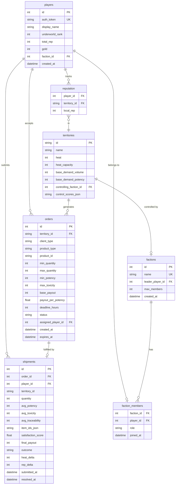
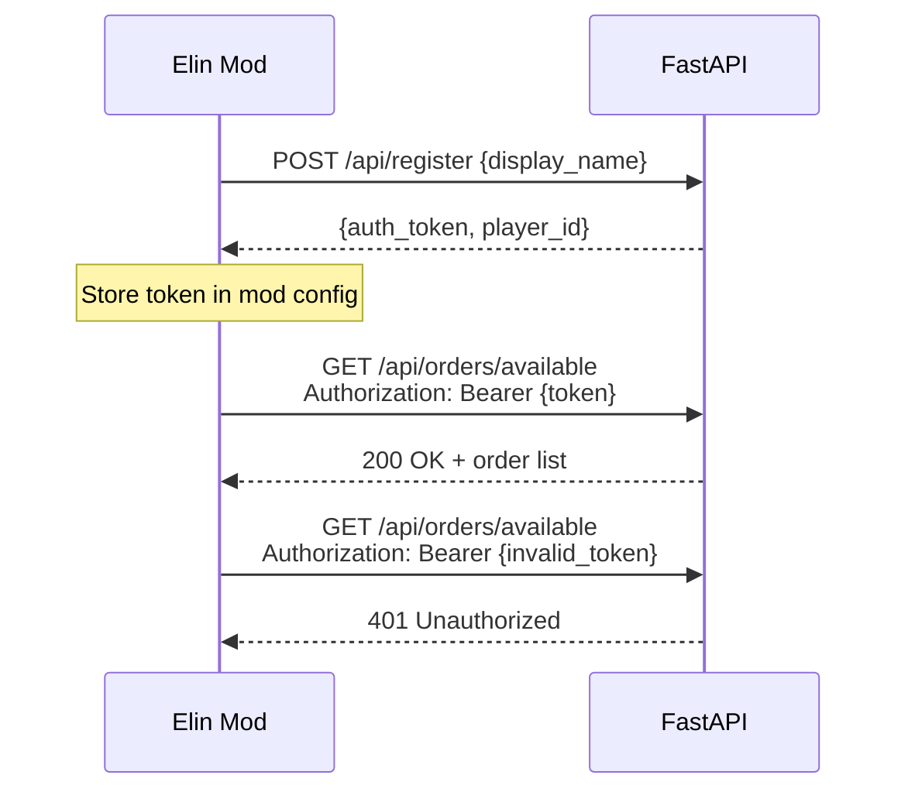

# 9 · Server API

> Parent: [00_overview.md](./00_overview.md) · Architecture: [01_architecture.md](./01_architecture.md)

This document is the complete API specification for the Underworld backend server — a first-class deliverable matching the [SkyreaderGuildServer](file:///c:/Users/mcounts/Documents/ElinMods/SkyreaderGuildServer/) patterns.

---

## 9.1 Technology Stack

| Component | Choice | Rationale |
|-----------|--------|-----------|
| Framework | **FastAPI** (Python 3.11+) | Async-native, auto OpenAPI docs, proven in SkyreaderGuildServer |
| Database | **SQLite** via `aiosqlite` | Zero-config, single-file, sufficient for async multiplayer workloads |
| Server | **uvicorn** | ASGI standard, used by SkyreaderGuildServer |
| Auth | **Custom token-based** | Matches [SkyreaderAuthManager](file:///c:/Users/mcounts/Documents/ElinMods/SkyreaderGuild/SkyreaderAuthManager.cs) client-side flow |
| Testing | **pytest** + `httpx.AsyncClient` | State routed to `worklog/pytest/test_tmp` per agents.md |
| Background Jobs | **asyncio tasks** | In-process scheduled coroutines (no external task queue needed) |

## 9.2 Project Structure

```
UnderworldServer/
├── main.py                 # FastAPI app, lifespan, router registration
├── config.py               # Tuning constants, env vars
├── database.py             # Schema creation, connection pool, migrations
├── auth.py                 # Token generation, validation middleware
├── orders.py               # /orders/* endpoints
├── shipments.py            # /shipments/* endpoints  
├── territories.py          # /territories/* endpoints
├── factions.py             # /factions/* endpoints
├── players.py              # /player/* endpoints
├── jobs.py                 # Background: heat decay, order gen, warfare
├── resolution.py           # Shipment resolution logic (satisfaction, enforcement)
├── requirements.txt
├── pytest.ini
├── worklog/
│   └── pytest/             # Test state (per agents.md)
└── tests/
    ├── conftest.py          # Fixtures, tmp_path → worklog/pytest/test_tmp
    ├── test_auth.py
    ├── test_orders.py
    ├── test_shipments.py
    ├── test_territories.py
    ├── test_factions.py
    └── test_resolution.py
```

---

## 9.3 Database Schema



### 9.3.1 Schema Creation

```python
# database.py
SCHEMA = """
CREATE TABLE IF NOT EXISTS players (
    id INTEGER PRIMARY KEY AUTOINCREMENT,
    auth_token TEXT UNIQUE NOT NULL,
    display_name TEXT NOT NULL,
    underworld_rank INTEGER DEFAULT 0,
    total_rep INTEGER DEFAULT 0,
    gold INTEGER DEFAULT 0,
    faction_id INTEGER REFERENCES factions(id),
    created_at TEXT DEFAULT (datetime('now'))
);

CREATE TABLE IF NOT EXISTS orders (
    id INTEGER PRIMARY KEY AUTOINCREMENT,
    territory_id TEXT NOT NULL,
    client_type TEXT NOT NULL,
    product_type TEXT NOT NULL,
    product_id TEXT,
    min_quantity INTEGER NOT NULL,
    max_quantity INTEGER NOT NULL,
    min_potency INTEGER DEFAULT 20,
    max_toxicity INTEGER DEFAULT 80,
    base_payout INTEGER NOT NULL,
    payout_per_potency REAL DEFAULT 0.0,
    deadline_hours INTEGER DEFAULT 48,
    status TEXT DEFAULT 'available',
    assigned_player_id INTEGER REFERENCES players(id),
    created_at TEXT DEFAULT (datetime('now')),
    expires_at TEXT
);

CREATE TABLE IF NOT EXISTS shipments (
    id INTEGER PRIMARY KEY AUTOINCREMENT,
    order_id INTEGER NOT NULL REFERENCES orders(id),
    player_id INTEGER NOT NULL REFERENCES players(id),
    territory_id TEXT NOT NULL,
    quantity INTEGER NOT NULL,
    avg_potency INTEGER DEFAULT 0,
    avg_toxicity INTEGER DEFAULT 0,
    avg_traceability INTEGER DEFAULT 0,
    item_ids_json TEXT,
    satisfaction_score REAL,
    final_payout INTEGER,
    outcome TEXT,
    heat_delta INTEGER DEFAULT 0,
    rep_delta INTEGER DEFAULT 0,
    submitted_at TEXT DEFAULT (datetime('now')),
    resolved_at TEXT
);

CREATE TABLE IF NOT EXISTS territories (
    id TEXT PRIMARY KEY,
    name TEXT NOT NULL,
    heat INTEGER DEFAULT 0,
    heat_capacity INTEGER DEFAULT 100,
    base_demand_volume INTEGER DEFAULT 10,
    base_demand_potency INTEGER DEFAULT 30,
    controlling_faction_id INTEGER REFERENCES factions(id),
    control_scores_json TEXT DEFAULT '{}'
);

CREATE TABLE IF NOT EXISTS factions (
    id INTEGER PRIMARY KEY AUTOINCREMENT,
    name TEXT UNIQUE NOT NULL,
    leader_player_id INTEGER NOT NULL REFERENCES players(id),
    max_members INTEGER DEFAULT 10,
    created_at TEXT DEFAULT (datetime('now'))
);

CREATE TABLE IF NOT EXISTS faction_members (
    faction_id INTEGER NOT NULL REFERENCES factions(id),
    player_id INTEGER NOT NULL REFERENCES players(id),
    role TEXT DEFAULT 'member',
    joined_at TEXT DEFAULT (datetime('now')),
    PRIMARY KEY (faction_id, player_id)
);

CREATE TABLE IF NOT EXISTS reputation (
    player_id INTEGER NOT NULL REFERENCES players(id),
    territory_id TEXT NOT NULL REFERENCES territories(id),
    local_rep INTEGER DEFAULT 0,
    PRIMARY KEY (player_id, territory_id)
);

CREATE INDEX IF NOT EXISTS idx_orders_status ON orders(status);
CREATE INDEX IF NOT EXISTS idx_orders_territory ON orders(territory_id);
CREATE INDEX IF NOT EXISTS idx_shipments_player ON shipments(player_id);
"""
```

---

## 9.4 Authentication

### 9.4.1 Flow

Token-based auth matching the [SkyreaderAuthManager](file:///c:/Users/mcounts/Documents/ElinMods/SkyreaderGuild/SkyreaderAuthManager.cs) pattern:



### 9.4.2 Token Generation

```python
# auth.py
import secrets

def generate_token() -> str:
    """Generate a 32-byte hex token."""
    return secrets.token_hex(32)

async def validate_token(token: str, db) -> int | None:
    """Returns player_id if valid, None if not."""
    row = await db.fetchone(
        "SELECT id FROM players WHERE auth_token = ?", (token,)
    )
    return row["id"] if row else None
```

### 9.4.3 Middleware

```python
from fastapi import Request, HTTPException

async def auth_middleware(request: Request):
    """Extract and validate auth token from Authorization header."""
    auth_header = request.headers.get("Authorization", "")
    if not auth_header.startswith("Bearer "):
        raise HTTPException(status_code=401, detail="Missing auth token")
    
    token = auth_header[7:]
    player_id = await validate_token(token, request.app.state.db)
    if player_id is None:
        raise HTTPException(status_code=401, detail="Invalid auth token")
    
    request.state.player_id = player_id
```

---

## 9.5 Endpoint Specifications

### 9.5.1 Registration & Auth

#### `POST /api/register`

```python
# Request
{"display_name": "ShadowTrader42"}

# Response 200
{
    "player_id": 1,
    "auth_token": "a3f8c2...",
    "display_name": "ShadowTrader42",
    "underworld_rank": 0
}

# Response 400
{"detail": "Display name already taken"}
```

#### `POST /api/login`

```python
# Request (re-login with existing token)
{"auth_token": "a3f8c2..."}

# Response 200
{
    "player_id": 1,
    "display_name": "ShadowTrader42",
    "underworld_rank": 2,
    "total_rep": 2500,
    "faction_id": 3
}

# Response 401
{"detail": "Invalid token"}
```

### 9.5.2 Orders

#### `GET /api/orders/available`

Returns orders filtered by player rank, territory, and availability.

```python
# Query params: ?territory_id=derphy_underground&limit=20

# Response 200
{
    "orders": [
        {
            "id": 42,
            "territory_id": "derphy_underground",
            "territory_name": "Derphy Underground",
            "client_type": "regular",
            "client_name": "Returning Customer",
            "product_type": "tonic",
            "min_quantity": 8,
            "max_quantity": 15,
            "min_potency": 40,
            "max_toxicity": 60,
            "base_payout": 4000,
            "deadline_hours": 48,
            "created_at": "2026-04-15T12:00:00Z",
            "expires_at": "2026-04-17T12:00:00Z"
        }
    ]
}
```

#### `POST /api/orders/accept`

```python
# Request
{"order_id": 42}

# Response 200
{"status": "accepted", "order_id": 42, "deadline": "2026-04-17T12:00:00Z"}

# Response 409
{"detail": "Order already claimed"}

# Response 403
{"detail": "Insufficient rank for this order type"}
```

### 9.5.3 Shipments

#### `POST /api/shipments/submit`

```python
# Request
{
    "order_id": 42,
    "quantity": 10,
    "avg_potency": 55,
    "avg_toxicity": 12,
    "avg_traceability": 14,
    "item_ids": ["uw_tonic_whisper", "uw_tonic_whisper", "uw_powder_dream"]
}

# Response 200 (immediately resolved)
{
    "shipment_id": 15,
    "outcome": "completed",
    "satisfaction_score": 1.35,
    "final_payout": 5400,
    "heat_delta": 5,
    "rep_delta": 12,
    "enforcement_event": null,
    "territory_heat_after": 25
}

# Response 200 (inspection occurred)
{
    "shipment_id": 16,
    "outcome": "completed",
    "satisfaction_score": 0.85,
    "final_payout": 3400,
    "heat_delta": 5,
    "rep_delta": 6,
    "enforcement_event": {
        "type": "inspection",
        "confiscated_quantity": 3,
        "message": "An inspection intercepted part of the shipment."
    }
}

# Response 200 (bust)
{
    "shipment_id": 17,
    "outcome": "failed",
    "satisfaction_score": 0.0,
    "final_payout": 0,
    "heat_delta": 10,
    "rep_delta": -15,
    "enforcement_event": {
        "type": "bust",
        "gold_penalty": 2500,
        "investigation_days": 3,
        "message": "The authorities seized the entire shipment!"
    }
}
```

#### `GET /api/shipments/results`

Poll for resolved shipments the player hasn't seen yet.

```python
# Response 200
{
    "results": [
        {
            "shipment_id": 15,
            "order_id": 42,
            "outcome": "completed",
            "final_payout": 5400,
            "rep_delta": 12,
            "enforcement_event": null
        }
    ],
    "territory_changes": [],
    "rank_change": null
}
```

### 9.5.4 Territories

#### `GET /api/territories`

```python
# Response 200
{
    "territories": [
        {
            "id": "derphy_underground",
            "name": "Derphy Underground",
            "heat": 25,
            "heat_level": "clear",
            "controlling_faction": "Crimson Syndicate",
            "controlling_faction_id": 3,
            "available_orders_count": 12
        }
    ]
}
```

### 9.5.5 Factions

#### `POST /api/factions/create`

```python
# Request
{"name": "Night Owls"}

# Response 200
{"faction_id": 5, "name": "Night Owls"}

# Response 403
{"detail": "Must be rank Supplier or higher to create a faction"}
```

#### `POST /api/factions/join`

```python
# Request
{"faction_id": 5}

# Response 200
{"status": "joined", "faction_name": "Night Owls"}

# Response 409
{"detail": "Faction is full"}
```

#### `GET /api/factions/{id}`

```python
# Response 200
{
    "id": 5,
    "name": "Night Owls",
    "leader": "ShadowTrader42",
    "member_count": 4,
    "max_members": 10,
    "controlled_territories": ["kapul_docks"],
    "members": [
        {"display_name": "ShadowTrader42", "role": "leader", "rank": 3},
        {"display_name": "GhostRunner", "role": "officer", "rank": 2}
    ]
}
```

### 9.5.6 Player Status

#### `GET /api/player/status`

```python
# Response 200
{
    "player_id": 1,
    "display_name": "ShadowTrader42",
    "underworld_rank": 2,
    "rank_name": "Supplier",
    "total_rep": 2500,
    "gold": 45000,
    "faction": {
        "id": 5,
        "name": "Night Owls",
        "role": "leader"
    },
    "reputation_by_territory": {
        "derphy_underground": 800,
        "kapul_docks": 350,
        "palmia_markets": 50
    },
    "active_orders_count": 2,
    "pending_shipments_count": 1
}
```

---

## 9.6 Background Jobs

### 9.6.1 Job Schedule

```python
# jobs.py
async def start_background_jobs(app):
    """Start all periodic background jobs."""
    asyncio.create_task(heat_decay_loop(app))
    asyncio.create_task(order_generation_loop(app))
    asyncio.create_task(order_expiration_loop(app))
    asyncio.create_task(warfare_resolution_loop(app))

async def heat_decay_loop(app):
    while True:
        await asyncio.sleep(3600)  # Every hour
        await decay_all_territory_heat(app.state.db)

async def order_generation_loop(app):
    while True:
        await asyncio.sleep(21600)  # Every 6 hours
        await generate_orders_for_all_territories(app.state.db)

async def order_expiration_loop(app):
    while True:
        await asyncio.sleep(900)  # Every 15 minutes
        await expire_overdue_orders(app.state.db)

async def warfare_resolution_loop(app):
    while True:
        await asyncio.sleep(86400)  # Daily
        await resolve_territory_control(app.state.db)
```

---

## 9.7 Client-Side HTTP (C#)

### 9.7.1 `UnderworldNetworkClient`

```csharp
/// <summary>
/// HTTP client for communicating with the Underworld backend.
/// All methods are async and return null on failure (offline graceful degradation).
/// Pattern from: SkyreaderOnlineClient.cs
/// </summary>
public class UnderworldNetworkClient
{
    private readonly HttpClient _http;
    private readonly UnderworldAuthManager _auth;
    private readonly string _baseUrl;
    
    public UnderworldNetworkClient(string baseUrl, UnderworldAuthManager auth)
    {
        _baseUrl = baseUrl.TrimEnd('/');
        _auth = auth;
        _http = new HttpClient { Timeout = TimeSpan.FromSeconds(10) };
    }
    
    public async Task<List<OrderDto>> GetAvailableOrders(string territoryId = null)
    {
        var url = $"{_baseUrl}/api/orders/available";
        if (territoryId != null) url += $"?territory_id={territoryId}";
        
        return await GetAsync<OrderListResponse>(url)?.orders;
    }
    
    public async Task<ShipmentResult> SubmitShipment(int orderId, ShipmentPayload payload)
    {
        var body = new { order_id = orderId, ...payload };
        return await PostAsync<ShipmentResult>($"{_baseUrl}/api/shipments/submit", body);
    }
    
    private async Task<T> GetAsync<T>(string url) where T : class
    {
        try
        {
            var token = await _auth.GetToken();
            if (token == null) return null;
            
            var request = new HttpRequestMessage(HttpMethod.Get, url);
            request.Headers.Authorization = 
                new AuthenticationHeaderValue("Bearer", token);
            
            var response = await _http.SendAsync(request);
            if (!response.IsSuccessStatusCode)
            {
                UnderworldPlugin.Log.LogWarning(
                    $"HTTP {response.StatusCode} from {url}");
                return null;
            }
            
            var json = await response.Content.ReadAsStringAsync();
            return JsonConvert.DeserializeObject<T>(json);
        }
        catch (Exception ex)
        {
            UnderworldPlugin.Log.LogWarning($"Network error: {ex.Message}");
            return null; // Graceful offline degradation
        }
    }
    
    private async Task<T> PostAsync<T>(string url, object body) where T : class
    {
        // Same pattern with HttpMethod.Post and JSON body serialization
    }
}
```

### 9.7.2 Polling Strategy

The client polls for results on two triggers:
1. **On-demand**: When the player opens the Network Panel or interacts with the Fixer
2. **Periodic**: Once per in-game day (checked during Elin's `OnSimulate` hook)

No real-time push mechanism is needed — the async design means results can wait until queried.

---

## 9.8 Testing & Verification

### Server Tests (pytest)

```ini
# pytest.ini
[pytest]
asyncio_mode = auto
cache_dir = worklog/pytest/.pytest_cache
tmp_path_retention_policy = none
```

```python
# tests/conftest.py
import pytest
from pathlib import Path

@pytest.fixture
def tmp_path(request):
    """Route temp files to worklog/pytest/test_tmp per agents.md."""
    base = Path(__file__).parent.parent / "worklog" / "pytest" / "test_tmp"
    base.mkdir(parents=True, exist_ok=True)
    d = base / request.node.name
    d.mkdir(exist_ok=True)
    return d

@pytest.fixture
async def client(tmp_path):
    """Async test client with fresh database."""
    from main import create_app
    db_path = tmp_path / "test.db"
    app = create_app(db_path=str(db_path))
    async with AsyncClient(app=app, base_url="http://test") as c:
        yield c
```

### Endpoint Test Coverage

| Endpoint | Tests Required |
|----------|---------------|
| `POST /api/register` | Success, duplicate name, empty name |
| `POST /api/login` | Valid token, invalid token |
| `GET /api/orders/available` | Returns orders, filter by territory, empty when none |
| `POST /api/orders/accept` | Success, already claimed, insufficient rank |
| `POST /api/shipments/submit` | Success, bust outcome, inspection outcome |
| `GET /api/shipments/results` | Returns pending, empty when none |
| `GET /api/territories` | All territories listed with correct data |
| `POST /api/factions/create` | Success, insufficient rank, duplicate name |
| `POST /api/factions/join` | Success, full faction, already in faction |
| `GET /api/player/status` | Returns correct player state |

### Integration Test: Full Order Cycle

```python
async def test_full_order_cycle(client):
    """Complete end-to-end: register → fetch orders → accept → ship → results."""
    # 1. Register
    reg = await client.post("/api/register", json={"display_name": "TestPlayer"})
    token = reg.json()["auth_token"]
    headers = {"Authorization": f"Bearer {token}"}
    
    # 2. Generate orders
    await trigger_order_generation()
    
    # 3. Fetch available orders
    orders = await client.get("/api/orders/available", headers=headers)
    assert len(orders.json()["orders"]) > 0
    order_id = orders.json()["orders"][0]["id"]
    
    # 4. Accept order
    accept = await client.post("/api/orders/accept", 
        json={"order_id": order_id}, headers=headers)
    assert accept.json()["status"] == "accepted"
    
    # 5. Submit shipment
    ship = await client.post("/api/shipments/submit", json={
        "order_id": order_id,
        "quantity": 10,
        "avg_potency": 50,
        "avg_toxicity": 10,
        "avg_traceability": 12,
        "item_ids": ["uw_tonic_whisper"] * 10
    }, headers=headers)
    assert ship.json()["outcome"] in ("completed", "failed")
    
    # 6. Check results
    results = await client.get("/api/shipments/results", headers=headers)
    assert len(results.json()["results"]) >= 1
```
