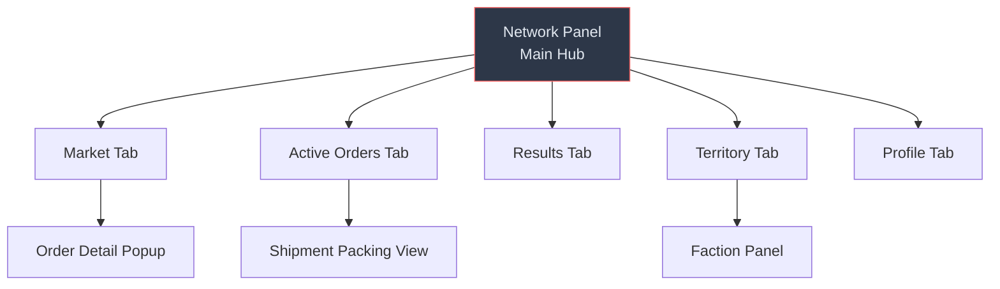

# 10 · UI & UX

> Parent: [00_overview.md](./00_overview.md) · Architecture: [01_architecture.md](./01_architecture.md)

---

## 10.1 UI Architecture

All underworld UI is built using Elin's `ELayer` dialog system — the same pattern used by [SkyreaderLadderDialog](Documents/ElinMods/SkyreaderGuild/SkyreaderLadderDialog.cs) for custom mod panels.

### 10.1.1 UI Entry Points

| Entry Point | Trigger | Panel Opened |
|-------------|---------|-------------|
| Fixer NPC interaction | Click on Fixer NPC → "Talk" | Network Panel (full hub) |
| Contraband Chest | Click on chest → "Check Network" | Market Screen (quick view) |
| Keyboard shortcut | Configurable hotkey (BepInEx config) | Network Panel |

### 10.1.2 Panel Hierarchy



---

## 10.2 Network Panel — Main Hub

### 10.2.1 Implementation

```csharp
/// <summary>
/// Main hub panel for the underworld network.
/// Tabbed interface showing market, active orders, results, territory, and profile.
/// Pattern: SkyreaderLadderDialog.cs — ELayer-based custom dialog.
/// </summary>
public class LayerUnderworldNetwork : ELayer
{
    private UITabBar tabBar;
    private Transform contentArea;
    
    // Tab panels (lazy-initialized)
    private MarketPanel marketPanel;
    private ActiveOrdersPanel ordersPanel;
    private ResultsPanel resultsPanel;
    private TerritoryPanel territoryPanel;
    private ProfilePanel profilePanel;
    
    public override void OnInit()
    {
        base.OnInit();
        
        // Build tabbed layout
        tabBar = CreateTabBar();
        contentArea = CreateContentArea();
        
        // Default to Market tab
        tabBar.Select(0);
        ShowTab("market");
        
        // Fetch fresh data from server
        RefreshData();
    }
    
    private void ShowTab(string tabId)
    {
        // Hide all panels, show selected
        switch (tabId)
        {
            case "market":
                EnsurePanel(ref marketPanel);
                marketPanel.Refresh();
                break;
            case "orders":
                EnsurePanel(ref ordersPanel);
                ordersPanel.Refresh();
                break;
            case "results":
                EnsurePanel(ref resultsPanel);
                resultsPanel.Refresh();
                break;
            case "territory":
                EnsurePanel(ref territoryPanel);
                territoryPanel.Refresh();
                break;
            case "profile":
                EnsurePanel(ref profilePanel);
                profilePanel.Refresh();
                break;
        }
    }
    
    private async void RefreshData()
    {
        var client = UnderworldPlugin.Instance.NetworkClient;
        
        // Fetch all data in parallel where possible
        var orders = await client.GetAvailableOrders();
        var results = await client.GetShipmentResults();
        var territories = await client.GetTerritories();
        var status = await client.GetPlayerStatus();
        
        // Update panels with fresh data
        marketPanel?.SetOrders(orders);
        resultsPanel?.SetResults(results);
        territoryPanel?.SetTerritories(territories);
        profilePanel?.SetStatus(status);
    }
}
```

### 10.2.2 Tab Specifications

| Tab | Content | Data Source |
|-----|---------|-------------|
| **Market** | Available orders grid: client name, product, quantity, potency req, payout, deadline | `GET /api/orders/available` |
| **Active Orders** | Accepted orders with timer countdown, "Ship" button for each | Local `OrderManager` cache |
| **Results** | Resolved shipments: outcome, payout received, rep change, enforcement events | `GET /api/shipments/results` |
| **Territory** | Territory list: name, heat level (color-coded), controlling faction, order count | `GET /api/territories` |
| **Profile** | Player stats: rank, total rep, gold, faction membership, reputation per territory | `GET /api/player/status` |

---

## 10.3 Market Screen

### 10.3.1 Order List Layout

Each order displays as a row item:

```
┌──────────────────────────────────────────────────────┐
│ [Returning Customer]     Derphy Underground          │
│ Wants: 8-15× Tonic    Potency ≥40    Toxicity ≤60   │
│ Payout: 4,000gp        Deadline: 47h remaining       │
│                                         [Accept]      │
└──────────────────────────────────────────────────────┘
```

### 10.3.2 Filtering

| Filter | Options |
|--------|---------|
| Territory | All / specific territory dropdown |
| Client Type | All / Street / Regular / Dependent / Broker / Syndicate |
| Product Type | All / Tonic / Powder / Elixir / Salts |
| Sort | Payout (high-low), Deadline (soonest), Quantity (low-high) |

### 10.3.3 Accept Flow

1. Player clicks "Accept" on an order
2. Client sends `POST /api/orders/accept`
3. On success: order moves to Active Orders tab, timer starts
4. On failure (already claimed): show "This contract has been taken." and refresh list

---

## 10.4 Shipment Packing View

When the player clicks "Ship" on an active order, this view opens over the chest contents:

```
┌──────────────────────────────────────────────────────┐
│ CONTRACT #42 — Returning Customer                     │
│ Requires: 8-15× Tonic, Potency ≥40, Toxicity ≤60    │
│──────────────────────────────────────────────────────│
│ CHEST CONTENTS:                                       │
│  • 5× Whisper Tonic (Potency: 45, Toxicity: 8)      │
│  • 3× Whisper Tonic (Potency: 52, Toxicity: 12)     │
│  • 2× Dream Powder  (Potency: 61, Toxicity: 15)     │
│──────────────────────────────────────────────────────│
│ SUMMARY:                                              │
│  Total: 10 items                           ✓ Meets   │
│  Avg Potency: 51                           ✓ Meets   │
│  Avg Toxicity: 11                          ✓ Meets   │
│  Nerve Cost: 10                            ✓ Can pay │
│──────────────────────────────────────────────────────│
│                          [Cancel]    [Ship Contents]  │
└──────────────────────────────────────────────────────┘
```

The summary dynamically updates as items are added/removed from the chest. Requirements are color-coded: green (✓ meets), red (✗ insufficient).

---

## 10.5 Territory Overlay

### 10.5.1 Territory List View

```
┌──────────────────────────────────────────────────────┐
│ TERRITORY               HEAT    FACTION    ORDERS    │
│──────────────────────────────────────────────────────│
│ Derphy Underground      ██░░░   Night Owls    12    │
│ Kapul Docks             ███░░   Contested      8    │
│ Yowyn Farmlands         █░░░░   —              5    │
│ Palmia Black Market     ████░   Red Hand       3    │
│ Mysilia Backways        ██░░░   —              7    │
│ Lumiest Canals          ███░░   Night Owls     6    │
└──────────────────────────────────────────────────────┘
```

Heat displayed as a filled bar with color coding:
- Green (0-30): Clear
- Yellow (31-50): Elevated
- Orange (51-70): High
- Red (71-85): Critical
- Pulsing Red (86-100): Lockdown

### 10.5.2 Faction Detail (on territory click)

Shows faction control scores for the selected territory and the player's local reputation there.

---

## 10.6 Fixer Dialog

### 10.6.1 Initial Introduction

When the player first interacts with the Fixer NPC, a custom dialog sequence introduces the underworld network:

```
Fixer: "You look like someone who understands that the 
        official markets don't serve everyone's needs."
        
Fixer: "I represent a network of... entrepreneurs. 
        We match supply with demand — discretely."
        
Fixer: "Interested? Check the board when you're ready.
        I'll be here."
        
[Opens Network Panel for the first time]
```

### 10.6.2 Implementation

The dialog uses Elin's `DramaCustomSequence` or a simple `Msg.Say()` chain with callback:

```csharp
public class TraitUnderworldFixer : TraitUnique
{
    private bool introShown = false;
    
    public override bool OnUse(Chara c)
    {
        if (!c.IsPC) return false;
        
        if (!introShown)
        {
            ShowIntroDialog(() => {
                introShown = true;
                UnderworldPlugin.Instance.UI.OpenNetworkPanel();
            });
            return true;
        }
        
        UnderworldPlugin.Instance.UI.OpenNetworkPanel();
        return true;
    }
    
    private void ShowIntroDialog(System.Action onComplete)
    {
        var lines = new[]
        {
            "You look like someone who understands that the official markets don't serve everyone's needs.",
            "I represent a network of... entrepreneurs. We match supply with demand — discretely.",
            "Interested? Check the board when you're ready. I'll be here.",
        };
        
        // Sequential message display
        ShowDialogSequence(lines, onComplete);
    }
}
```

---

## 10.7 Offline Mode UI

When the server is unreachable, the UI degrades gracefully:

| Feature | Offline Behavior |
|---------|-----------------|
| Market tab | Shows "Network offline — check connection" message |
| Active Orders tab | Shows cached orders with "status unknown" |
| Results tab | Shows "Pending — reconnect to check" |
| Territory tab | Shows last known state with "Last updated X ago" |
| Profile tab | Shows cached rank/rep with "Offline" badge |
| Crafting | Fully functional (no server dependency) |
| Contraband chest | Ship button shows "Network required" |

---

## 10.8 Testing & Verification

### UI Integration Tests

| Test | Steps | Expected |
|------|-------|----------|
| Panel opens | Click Fixer NPC | Network Panel appears without crash |
| Intro dialog | First interaction with Fixer | Introduction text sequence plays |
| Subsequent opens | Click Fixer again | Panel opens directly (no intro replay) |
| Tab switching | Click each tab | Content area updates correctly |
| Market refresh | Open market tab | Orders fetched and displayed |
| Accept order | Click Accept on order | Order moves to Active tab |
| Ship packing | Click Ship on active order | Packing view shows chest contents summary |
| Submit shipment | Pack items, click Ship Contents | Items removed, result shown |
| Offline indicator | Disconnect server, open panel | "Network offline" message displayed |
| Hotkey | Press configured hotkey | Panel toggles open/closed |

### Visual Tests (Manual)

- All text is readable against dark fantasy UI background
- Heat bars display correct colors at each threshold
- Tab switching is instant (no loading spinner for cached data)
- Order rows are not cut off or overlapping
- Faction names display correctly (including unicode)
- Timer countdowns update in real-time
