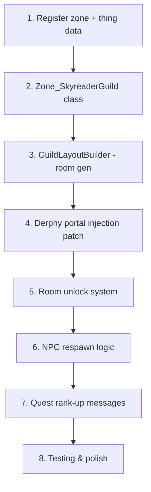

# Phase 8: Skyreader Guild HQ — Astral Plane Zone

Build a physical guild headquarters for the Skyreader Guild, located on the astral plane, accessible through a portal in Derphy.

## Background & Design Philosophy

The Skyreader Guild currently has no physical home. This phase adds a dedicated guild zone — a small, thematic astral observatory complex — that the player can visit and that grows as their guild rank increases.

**Key decisions:**
- **Fully programmatic map generation** in C# (no `.map` file dependency). A hardcoded room layout ensures consistent furniture placement.
- **Rooms unlock progressively** based on guild rank.
- **Access via Derphy**: A fixed portal appears in Derphy when the guild quest is active.
- **Reuse vanilla `TraitNewZone`** for zone linking — no custom portal traits.

---

## User Review Required

> [!IMPORTANT]
> **Zone Persistence Model**: Our guild zone follows the same pattern as `Zone_Vernis`: inherits from `Zone_Civilized` with `ShouldRegenerate => false`. This is the exact same mechanism Elin uses for persistent, non-regenerating civilized zones. The map is saved on game save via `_OnBeforeSave()` → `map.Save(pathSave)`, and since `dateExpire` defaults to `0`, the zone will never be garbage-collected by `CanDestroy()`. This is verified in the decompiled source.

> [!IMPORTANT]
> **Portal Re-injection in Derphy**: Since `Zone_Civilized.ShouldRegenerate => true` (and Vernis overrides it to `false`, but Derphy does not), Derphy's map regenerates periodically. Our Harmony patch on `Zone.Activate()` will check **every time** the player enters Derphy whether a portal Thing already exists in `EClass._map.things`. If it doesn't, we re-create it. No player flags are used — this is purely a map-scan approach, making it resilient to regeneration.

> [!IMPORTANT]
> **Reusing Vanilla Portal System**: Instead of writing custom `TraitGuildPortal` / `TraitGuildReturnPortal` classes, we will leverage Elin's built-in `TraitNewZone` with `CreateExternalZone`. The mechanism works as follows:
> - A Thing with trait type `TraitNewZone` (or a subclass like `TraitStairs`) and `trait[1]` set to our zone ID (`srg_guild_hq`) will auto-create the zone via `SpatialGen.Create()` the first time a player uses it, and will cache the link via `c_uidZone` thereafter.
> - For the **return portal** inside the guild zone back to Derphy, we use `TraitStairsUp` (standard stairs behavior) which naturally exits to the parent zone. Alternatively, we can register the guild zone as a child of Derphy in the spatial hierarchy, making a standard stairway Thing work automatically.
> - Both portals use vanilla tile 751 (voidgate) for the astral aesthetic, with `AutoEnter => false` so the player isn't teleported accidentally.

---

## Proposed Changes

### Component 1: Zone Registration & Data

#### [MODIFY] [SkyreaderGuild.cs](file:///c:/Users/someuser/Documents/ElinMods/SkyreaderGuild/SkyreaderGuild.cs)

Add a `RegisterGuildZone(SourceManager)` call from `OnStartCore()` that registers the `srg_guild_hq` zone row:

```csharp
// Zone source data
zone.id = "srg_guild_hq";
zone.name = "Skyreader Observatory";
zone.name_JP = "星読みの天文台";
zone.type = "SkyreaderGuild.Zone_SkyreaderGuild";
zone.parent = "derphy";            // Child of Derphy in the spatial hierarchy
zone.idFile = new string[0];       // No static map file — fully programmatic
zone.idGen = "";
zone.idBiome = "";
zone.idPlaylist = "Dungeon";
zone.tag = new string[] { "light" };
zone.idProfile = "";
zone.pos = new int[] { 0, 0, 343 };
zone.textFlavor = "An observatory adrift in the astral plane, home to the Skyreader's Guild.";
zone.textFlavor_JP = "星界に漂う天文台。星読みのギルドの本拠地。";
```

Also register two Thing source entries:
- `srg_guild_entrance` — Derphy-side portal. Trait: `NewZone`, trait params: `[, srg_guild_hq]`. Tile: 751 (voidgate). Category: `stairs`.
- `srg_guild_exit` — Guild-side return portal. Trait: `StairsUp` (exits to parent zone). Tile: 751. Category: `stairs`.

Both things will have `CanBeHeld = false`, `CanBeDestroyed = false` (inherited from `TraitNewZone`).

---

### Component 2: The Guild Zone Class

#### [NEW] [Zone_SkyreaderGuild.cs](file:///c:/Users/someuser/Documents/ElinMods/SkyreaderGuild/Zone_SkyreaderGuild.cs)

A custom zone class inheriting from `Zone_Civilized` with `ShouldRegenerate => false` — the same pattern as `Zone_Vernis`:

```csharp
public class Zone_SkyreaderGuild : Zone_Civilized
{
    // PERSISTENCE: Same as Zone_Vernis — map is saved, never regenerated
    public override bool ShouldRegenerate => false;
    
    // SAFETY: No combat, no crime
    public override bool HasLaw => true;
    public override bool AllowCriminal => false;
    
    // DISPLAY
    public override bool UseFog => false;            // Fully visible
    public override string IDPlayList => "Dungeon";
    public override string IDSceneTemplate => "Indoor";
    
    // BUILDING: Players cannot modify the guild
    public override bool RestrictBuild => true;
    public override bool CanDigUnderground => false;
    
    // MAP: Not explorable on the world map
    public override bool IsExplorable => false;
    public override bool HiddenInRegionMap => true;
    
    // SPAWNING: No random mobs
    public override float PrespawnRate => 0f;
    public override int MaxSpawn => 0;
    
    public override void OnGenerateMap()
    {
        // Called once, on first entry only (ShouldRegenerate = false)
        GuildLayoutBuilder.Build(map, this);
    }
}
```

**Map Generation (`OnGenerateMap()`):**
Called exactly once. After this, the map is saved in the save file and loaded from disk on subsequent visits.

**Room Unlocking** is handled via a Harmony postfix on `Zone.Activate()` — see Component 5.

---

### Component 3: Guild Layout Builder

#### [NEW] [GuildLayoutBuilder.cs](file:///c:/Users/someuser/Documents/ElinMods/SkyreaderGuild/GuildLayoutBuilder.cs)

**Approach: Fixed Layout with Defined Room Rectangles**

Since this is a guild HQ (not a dungeon), we use a hardcoded floorplan for pixel-perfect furniture placement.

```
Map: 50×50 tiles
┌─────────────────────────────────────────────┐
│                  (void)                      │
│  ┌─────────┐   ┌───────────┐                │
│  │ ENTRY   │───│ CENTRAL   │                │
│  │ VESTIB. │   │ ATRIUM    │                │
│  │ (T1)    │   │ (T1)      │                │
│  └─────────┘   └─────┬─────┘                │
│                      │                       │
│        ┌─────────────┼──────────────┐        │
│        │             │              │        │
│  ┌─────┴───┐   ┌─────┴─────┐ ┌─────┴───┐    │
│  │ STUDY   │   │ OBSERV-   │ │ FORGE   │    │
│  │ HALL    │   │ ATORY     │ │ ROOM    │    │
│  │ (T2)    │   │ (T3)      │ │ (T4)    │    │
│  └─────────┘   └───────────┘ └─────────┘    │
│                      │                       │
│                ┌─────┴─────┐                 │
│                │ SANCTUM   │                 │
│                │ (T5/T6)   │                 │
│                └───────────┘                 │
│                                             │
└─────────────────────────────────────────────┘
```

**Room Definitions:**

| Room | Min Rank | Size | Purpose & Key Furniture |
|------|----------|------|------------------------|
| **Entry Vestibule** | Wanderer (T1) | 8×8 | Spawn point. Return portal, `srg_aurora_lamp` ×2, `srg_constellation_rug`. Arkyn stands here. |
| **Central Atrium** | Wanderer (T1) | 12×10 | Main hall. `srg_astrological_codex` (crafting station), bookshelves (vanilla `bookshelf`), `srg_celestial_globe`. Light sources. |
| **Study Hall** | Seeker (T2) | 10×8 | Research wing. `srg_starfall_table`, `srg_lunar_armchair` ×2, vanilla bookshelves + writing desks. |
| **Cosmic Observatory** | Researcher (T3) | 10×10 | Star-gazing. `srg_zodiac_dresser`, `srg_cosmic_mirror`, `srg_planisphere_cabinet`, `srg_celestial_globe`. |
| **Astral Forge** | Cosmos-Addled (T4) | 8×8 | Crafting room. `srg_astral_chandelier`, `srg_stardust_bed`, vanilla `anvil`, `srg_meteorite_statue`. |
| **Starseeker Sanctum** | Cosmos-Applied (T5) | 10×10 | Inner sanctum. `srg_eclipse_hearth`, `srg_meteorite_statue`, `srg_astral_chandelier`. Archivist NPC at T6. |

**Tile Palette** (will validate against `SourceBlock_Floor.md` / `SourceBlock_Block.md` during implementation):

| Element | Material | Tile | Notes |
|---------|----------|------|-------|
| Astral Floor | crystal | ornate stone | Main interior |
| Void Floor (corridor) | obsidian | stone | Corridors |
| Astral Wall | crystal | stone wall | Room walls |
| Void Barrier | obsidian | stone wall | Locked-room blocking walls |
| Exterior | — | — | Empty cells outside building |

**Builder API:**

```csharp
public static class GuildLayoutBuilder
{
    public static void Build(Map map, Zone zone)
    {
        // 1. Fill entire map with void (impassable)
        FillVoid(map);
        
        // 2. Carve each room: floor tiles + walls
        foreach (var room in RoomDefinitions)
            CarveRoom(map, room);
        
        // 3. Connect rooms with corridors
        ConnectRooms(map);
        
        // 4. Place furniture in T1 rooms (always unlocked)
        PlaceBaseFurniture(map, zone);
        
        // 5. Place "astral void barrier" walls at doorways to locked rooms
        SealLockedRooms(map);
        
        // 6. Place return portal (srg_guild_exit) in Entry Vestibule
        PlaceReturnPortal(map, zone);
        
        // 7. Spawn Arkyn in the Entry Vestibule
        SpawnArkyn(zone);
    }
}
```

---

### Component 4: Derphy Portal Injection

#### [MODIFY] [SkyreaderGuild.cs](file:///c:/Users/someuser/Documents/ElinMods/SkyreaderGuild/SkyreaderGuild.cs)

A Harmony `[HarmonyPostfix]` on `Zone.Activate()` that runs **every time** the player enters Derphy:

```csharp
[HarmonyPatch(typeof(Zone), "Activate")]
public static class GuildPortalInjectionPatch
{
    public static void Postfix(Zone __instance)
    {
        // Only for Derphy ground floor
        if (__instance.id != "derphy" || __instance.lv != 0) return;
        
        // Only if guild quest is active
        if (!EClass.game.quests.IsStarted<QuestSkyreader>()) return;
        
        // Check if portal already exists in the map — NO player flags
        foreach (Thing t in EClass._map.things)
        {
            if (t.id == "srg_guild_entrance") return; // Already present
        }
        
        // Find a suitable placement point (fixed offset from center, or a known coord)
        Point portalPoint = FindPortalPlacement(__instance);
        
        // Create the portal Thing  
        Thing portal = ThingGen.Create("srg_guild_entrance");
        // TraitNewZone with param[1] = "srg_guild_hq" will auto-create zone on first use
        __instance.AddCard(portal, portalPoint).Install();
        
        Msg.SayRaw("<color=#b3e0ff>A shimmering astral gateway materializes. The Skyreader's Guild beckons.</color>");
    }
    
    private static Point FindPortalPlacement(Zone zone)
    {
        // Try a fixed offset from map center, fallback to random walkable surface
        Map map = EClass._map;
        int cx = map.bounds.CenterX;
        int cz = map.bounds.CenterZ;
        // Offset to avoid spawning on top of NPCs/buildings
        Point p = new Point(cx - 5, cz - 5);
        if (p.IsValid && !p.HasBlock && p.HasFloor) return p;
        return map.bounds.GetRandomSurface(centered: true, walkable: true);
    }
}
```

**Why `Activate()` and not `OnVisit()`**: `Activate()` is the core lifecycle method called every time a zone becomes active. `OnVisit()` doesn't exist as a virtual method on `Zone` (confirmed via grep). The map is fully loaded by the time `Activate()` completes its import/load block, so scanning `EClass._map.things` is safe in a postfix.

> [!NOTE]
> **Regeneration resilience**: When Derphy regenerates (monthly), the portal Thing is destroyed as part of the old map. On the player's next visit, the postfix fires, scans the newly-regenerated map, finds no portal, and re-creates it. Zero player flags needed.

---

### Component 5: Room Unlocking System

#### [MODIFY] [SkyreaderGuild.cs](file:///c:/Users/someuser/Documents/ElinMods/SkyreaderGuild/SkyreaderGuild.cs) or [Zone_SkyreaderGuild.cs](file:///c:/Users/someuser/Documents/ElinMods/SkyreaderGuild/Zone_SkyreaderGuild.cs)

A Harmony postfix on `Zone.Activate()` for our guild zone:

```csharp
[HarmonyPatch(typeof(Zone), "Activate")]
public static class GuildLayoutUpdatePatch
{
    public static void Postfix(Zone __instance)
    {
        if (__instance.id != "srg_guild_hq") return;
        UpdateGuildLayout(__instance);
    }
}
```

**Unlock state tracking**: Instead of player flags, we track unlock state via **Thing existence on the map** (e.g., "does the Study Hall furniture exist?") or by checking whether the void barrier walls still exist at specific coordinates. This keeps state fully serialized in the map itself — no external flags to manage.

```csharp
private static readonly (string roomId, GuildRank minRank, string message)[] UnlockStages = 
{
    ("study",   GuildRank.Seeker,        "The astral mists part, revealing the Study Hall."),
    ("obs",     GuildRank.Researcher,    "The celestial dome overhead clears. The Observatory is open."),
    ("forge",   GuildRank.CosmosAddled,  "A resonance of cosmic fire. The Astral Forge has awakened."),
    ("sanctum", GuildRank.CosmosApplied, "The Starseeker Sanctum opens before you."),
};

public static void UpdateGuildLayout(Zone zone)
{
    QuestSkyreader quest = EClass.game.quests.Get<QuestSkyreader>();
    if (quest == null) return;
    GuildRank rank = quest.GetCurrentRank();
    
    foreach (var stage in UnlockStages)
    {
        if (rank >= stage.minRank && IsRoomStillSealed(zone, stage.roomId))
        {
            RemoveVoidBarriers(zone, stage.roomId);
            PlaceRoomFurniture(zone, stage.roomId);
            Msg.SayRaw($"<color=#b3e0ff>{stage.message}</color>");
        }
    }
    
    // Archivist NPC at Understander (T6) in the Sanctum
    if (rank >= GuildRank.Understander && !ArchivistExists(zone))
    {
        SpawnArchivist(zone);
        Msg.SayRaw("<color=#b3e0ff>The Astral Archivist materializes within the Sanctum.</color>");
    }
    
    // Ensure Arkyn is present (respawn if missing)
    EnsureArkynPresent(zone);
}

private static bool IsRoomStillSealed(Zone zone, string roomId)
{
    // Check if the void barrier blocks still exist at the doorway for this room
    var doorway = GuildLayoutBuilder.GetDoorwayCoords(roomId);
    Cell cell = EClass._map.cells[doorway.x, doorway.z];
    return cell.HasBlock; // Barrier still present = room still sealed
}
```

---

### Component 6: Quest & Rank-Up Integration

#### [MODIFY] [SkyreaderGuild.cs](file:///c:/Users/someuser/Documents/ElinMods/SkyreaderGuild/SkyreaderGuild.cs) — `QuestSkyreader.OnRankUp()`

Update rank-up messages to mention the guild HQ:

```csharp
case GuildRank.Seeker:
    msg += " New rooms have opened in the Skyreader Observatory.";
    break;
```

---

## Implementation Order



1. **Zone + Thing registration** — Zone row `srg_guild_hq`, Things `srg_guild_entrance` and `srg_guild_exit`
2. **Zone class** — `Zone_SkyreaderGuild` skeleton with `OnGenerateMap()`
3. **Layout builder** — Room definitions, floor/wall painting, furniture placement
4. **Derphy injection** — `Zone.Activate()` postfix for portal re-injection on every visit
5. **Room unlocking** — Barrier detection + removal + furniture spawning per rank
6. **NPC management** — Arkyn respawn, Archivist spawn at T6
7. **Quest integration** — Updated rank-up messages referencing the Observatory
8. **Testing** — Build, deploy, validate each tier

---

## Open Questions

> [!NOTE]
> **Spatial Hierarchy**: Registering the guild zone as `parent = "derphy"` makes it a child of Derphy in the spatial tree. This means `TraitStairsUp` in the guild zone would naturally exit to Derphy (parent zone). Alternative: register as a child of the world region and use `TraitNewZone` with `IsTeleport` + zone ID targeting. The parent approach is simpler and aligns with how sub-zones (like Vernis Mine) work.

> [!NOTE]
> **Floor & Wall Aesthetics**: Exact tile/material IDs will be validated during implementation against the source data. We'll iterate visually in-game once the basic structure is rendering.

> [!NOTE]
> **Derphy Portal Coordinates**: The current plan uses a fixed offset from map center. We could research exact Derphy map coordinates to place it more immersively (e.g., in the alley behind a building). This can be a polish pass after the core system works.

---

## Verification Plan

### Automated Tests
1. **Build**: `dotnet build SkyreaderGuild.csproj` — must compile cleanly
2. **Deploy**: Copy DLL to `D:\Steam\steamapps\common\Elin\BepInEx\plugins\SkyreaderGuild\`
3. **Log Check**: Verify no errors in `BepInEx\LogOutput.log` on game start

### Manual Verification
1. **Portal appears in Derphy**: Visit Derphy with active guild quest → portal materializes
2. **Portal re-injection**: Leave Derphy, wait for regen, return → portal re-appears
3. **Guild zone loads**: Step through portal → zone generates with Entry Vestibule + Atrium
4. **Return portal works**: Use exit stairs → back in Derphy
5. **Room unlocking**: Reach each rank threshold, re-enter guild → new rooms unlock with correct furniture
6. **Persistence**: Save/load → guild zone and unlocked rooms persist
7. **NPC presence**: Arkyn in vestibule every visit, Archivist in sanctum at T6+
8. **Re-entry**: Leave/re-enter multiple times → no duplicate furniture, no errors
