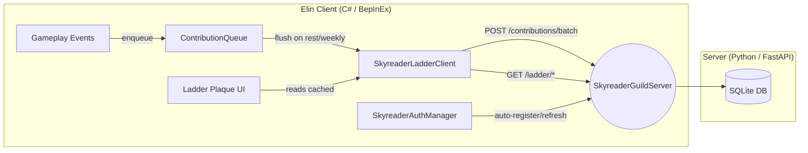

# Global Skyreader Ladder — Implementation Plan (v2)

## Goal

Add a global leaderboard ("Starlight Ladder") to the SkyreaderGuild mod. Players silently earn Starlight Score through existing gameplay actions (extractions, rift clears, boss kills, meteor core harvests). Scores are batched and uploaded to a lightweight backend. A **Starlight Ladder plaque** in the Guild HQ Atrium shows the player's rank, percentile, and the top 20 globally.

## Architecture Overview



---

## Design Decisions

> [!IMPORTANT]
> **Server is distributable and self-hostable.** The `SkyreaderGuildServer` directory will be a standalone Python project with a `requirements.txt` and `README.md` with hosting instructions. All server connection info (URL, port) is configurable via BepInEx config so players can run their own servers or point to a community-hosted one.

> [!NOTE]
> **Display names follow Elin's Palmia Times convention.** Elin's built-in online features (newspaper chat, death reports, marriage announcements, wish broadcasts) use `EClass.pc.NameTitled` — the player character's in-game name with an optional permadeath star prefix. We will do the same: the client sends `EClass.pc.NameTitled` as `display_name` during registration and updates it on each contribution flush. No separate username/password needed.

> [!NOTE]
> **Framework choice: FastAPI over Flask.** FastAPI gives us automatic OpenAPI docs, Pydantic validation, and async support — all valuable for a stateless REST API. Flask would work but requires more boilerplate.

> [!NOTE]
> **Database: SQLite.** Zero deployment friction, single-file DB, trivially backupable. Sufficient for this scale. Migration path to PostgreSQL exists if needed.

---

## Proposed Changes

### Component 1: Backend Server (`SkyreaderGuildServer/`)

> [!NOTE]
> New Python project at `ElinMods\ElinMods\SkyreaderGuildServer\`

#### [NEW] [requirements.txt](file:///ElinMods\ElinMods/SkyreaderGuildServer/requirements.txt)
```
fastapi>=0.115.0
uvicorn[standard]>=0.34.0
pydantic>=2.0
python-jose[cryptography]>=3.3.0
```

#### [NEW] [README.md](file:///ElinMods\ElinMods/SkyreaderGuildServer/README.md)

Self-hosting instructions: install Python 3.10+, `pip install -r requirements.txt`, `uvicorn main:app --host 0.0.0.0 --port 8000`. Optional: nginx reverse proxy + certbot for HTTPS.

#### [NEW] [main.py](file:///ElinMods\ElinMods/SkyreaderGuildServer/main.py)

Entry point. Creates FastAPI app, includes auth/contributions/ladder routers, runs DB init on startup.

#### [NEW] [database.py](file:///ElinMods\ElinMods/SkyreaderGuildServer/database.py)

SQLite connection management using Python's `sqlite3` module (no ORM). Creates tables on first run:

| Table | Columns | Notes |
|---|---|---|
| `guild_accounts` | `id` (UUID PK), `install_key` (UNIQUE), `display_name` (TEXT), `highest_rank` (INT), `created_at`, `last_seen_at` | One row per installation |
| `auth_tokens` | `token` (TEXT PK), `account_id` (FK), `created_at`, `expires_at` | JWT tokens, 90-day expiry |
| `astral_contributions` | `id` (UUID PK), `player_id` (FK), `type` (TEXT), `amount` (INT), `local_event_id` (TEXT UNIQUE), `created_at` | Idempotent via `local_event_id` |
| `ladder_snapshot` | `player_id` (PK FK), `display_name` (TEXT), `total_score` (INT), `last_updated_at` | Rebuilt on each contribution batch |

#### [NEW] [auth.py](file:///ElinMods\ElinMods/SkyreaderGuildServer/auth.py)

Router with:
- `POST /guild/register-anon` — accepts `{ install_key, display_name, game_version, mod_version }`. Upserts `guild_accounts`, generates JWT (HMAC-SHA256, 90-day), returns `{ auth_token, account_id }`.
- `POST /guild/refresh-token` — accepts `{ install_key }`, returns fresh token.
- `get_current_account(request)` FastAPI dependency — validates Bearer token, returns account or 401.

#### [NEW] [contributions.py](file:///ElinMods\ElinMods/SkyreaderGuildServer/contributions.py)

Router with:
- `POST /contributions/batch` — accepts `{ display_name, contributions: [{ type, amount, local_event_id, timestamp }] }`. Validates types ∈ `{Extraction, RiftClear, BossKill, MeteorCoreHarvest}`, clamps amounts (0–10000), inserts with `ON CONFLICT(local_event_id) DO NOTHING`. Updates `ladder_snapshot` for this player via `SUM(amount)`. Also updates `display_name` on the account and snapshot (so name changes propagate naturally).

#### [NEW] [ladder.py](file:///ElinMods\ElinMods/SkyreaderGuildServer/ladder.py)

Router with:
- `GET /ladder/global?limit=50` — top N from `ladder_snapshot` by `total_score DESC`. Response: `{ entries: [{ display_name, total_score, rank }] }`.
- `GET /ladder/self` — caller's `{ display_name, rank, total_score, percentile, total_players }`.

---

### Component 2: Client Networking (C# mod)

#### [NEW] [SkyreaderAuthManager.cs](file:///ElinMods\ElinMods/SkyreaderGuild/SkyreaderAuthManager.cs)

Handles invisible authentication:
- On first guild join, checks for `installKey` in `{mod_folder}/skyreader_identity.json`.
- If missing, generates a GUID and calls `POST /guild/register-anon` with `display_name = EClass.pc.NameTitled`.
- Stores `{ installKey, authToken, accountId }` locally.
- Provides `GetAuthHeaders()` for other clients. If a request returns 401, auto-calls `refresh-token` and retries once.
- Uses `System.Net.Http.HttpClient` (available in .NET 4.8).

#### [NEW] [SkyreaderLadderClient.cs](file:///ElinMods\ElinMods/SkyreaderGuild/SkyreaderLadderClient.cs)

Network client for ladder operations:
- **Contribution queue**: in-memory `List<PendingContribution>`, each with `{ type, amount, localEventId, timestamp }`.
- `EnqueueContribution(type, amount)` — adds to queue with a generated GUID as `localEventId`.
- `FlushContributions()` — if queue is non-empty, serializes and `POST /contributions/batch` with `display_name = EClass.pc.NameTitled`. On success, clears queue. On failure, retains for retry.
- `FetchGlobalLadder(limit)` — `GET /ladder/global?limit={limit}`, caches result.
- `FetchSelfRank()` — `GET /ladder/self`, caches result.
- All HTTP runs on a background thread — never blocks the game loop.
- **Cached ladder data** stored in `LadderCacheData` object for the plaque UI to read.

---

### Component 3: Guild HQ Ladder Plaque (In-Game UI)

#### [NEW] [TraitLadderPlaque.cs](file:///ElinMods\ElinMods/SkyreaderGuild/TraitLadderPlaque.cs)

Custom trait for the "Starlight Ladder" wall plaque furniture. On interact:

1. If online features are disabled or no cached data exists, display: *"The stars are quiet today."*
2. Otherwise, build a text-based display via `Msg.SayRaw` or a simple `UIContextMenu`/dialog showing:
   - **Your Position**: `"Rank #42 — 1,280 Starlight (Top 15%)"` 
   - **Top 20 Entries**: numbered list of `display_name` + `total_score`
3. On interaction, triggers a background `FetchGlobalLadder(20)` + `FetchSelfRank()` refresh if cached data is older than 1 in-game day.

The interaction pattern follows how `TraitAstrologicalCodex` and other guild furniture currently work — a right-click interact that produces contextual text/menu.

#### [MODIFY] [GuildLayoutBuilder.cs](file:///ElinMods\ElinMods/SkyreaderGuild/GuildLayoutBuilder.cs)

Add the ladder plaque to the **Atrium** room's furniture list:

```csharp
// In the "atrium" entry of RoomFurniture:
new Placement("srg_ladder_plaque", 23, 20, true, -1, true, true, "atrium_ladder_plaque"),
```

This places it on the south wall of the Atrium, near the existing bookshelves — thematically fitting as a "community notice board" among the study materials. The `WallMounted` and `RequiresAdjacentBlock` flags ensure it auto-detects wall direction.

#### Asset Registration

The `srg_ladder_plaque` item needs a source sheet entry. Following the existing pattern used by other SRG assets:

- **SourceThing row**: `id=srg_ladder_plaque`, `category=furniture_small`, `trait=TraitLadderPlaque`, visual tile matching existing plaque/sign assets (e.g., `board_wanted` or `sign` tile ids).
- Added to the CWL sheet or registered programmatically in `OnStartCore()` alongside other custom items.

---

### Component 4: Plugin Modifications

#### [MODIFY] [SkyreaderGuild.cs](file:///ElinMods\ElinMods/SkyreaderGuild/SkyreaderGuild.cs)

1. **New config entries** in `Awake()`:
   - `ConfigServerUrl` — string, default `"http://localhost:8000"`, description: *"URL of the SkyreaderGuild ladder server. Change this to connect to a community server or self-hosted instance."*
   - `ConfigEnableOnlineFeatures` — bool, default `false`, description: *"Enable connection to the Skyreader ladder server for global rankings."*

2. **Initialize clients** in `Awake()`:
   - Create static `SkyreaderAuthManager` and `SkyreaderLadderClient` instances (lazy-initialized when online features are enabled and quest is active).

3. **Hook contribution sources** — add `SkyreaderLadderClient.EnqueueContribution()` calls at existing guild-point-award sites:

   | Source | Type | Location |
   |---|---|---|
   | Astral Extractor extraction | `Extraction` | `TraitAstralExtractor.PerformExtraction` |
   | Boss kill reward | `BossKill` | `SpawnLootPatch.HandleBossKillReward` |
   | Meteor core harvest | `MeteorCoreHarvest` | `TraitMeteorCore` on use |

   > [!NOTE]
   > Rift clears (`RiftClear`) are deferred — we need a clean hook for "rift completed" vs "rift visited". We'll add this once we identify the right event.

4. **Flush trigger** — new logic in the existing `GameDate.AdvanceDay` patch:
   - Every 7 in-game days, call `SkyreaderLadderClient.FlushContributions()` on a background thread.
   - Also flush when visiting the Guild HQ (already have an `OnVisit` patch for `srg_guild_hq`).

#### [MODIFY] [SkyreaderGuild.csproj](file:///ElinMods\ElinMods/SkyreaderGuild/SkyreaderGuild.csproj)

Add `<Compile>` entries for:
- `SkyreaderAuthManager.cs`
- `SkyreaderLadderClient.cs`
- `TraitLadderPlaque.cs`

Add `System.Net.Http` reference:
```xml
<Reference Include="System.Net.Http" />
```

---

## Verification Plan

### Server Tests
1. Run `pytest` against FastAPI with `TestClient`:
   - Register anonymous account → receive token
   - Submit contribution batch → verify ladder updates
   - Fetch global ladder → verify ordering and display names
   - Fetch self rank → verify percentile calculation
   - Duplicate `local_event_id` → verify idempotency (no double-counting)
   - Invalid/clamped amounts → verify clamping behavior

2. Swagger UI manual testing: `http://localhost:8000/docs`

### Client Build
- `dotnet build` SkyreaderGuild.csproj to verify C# compilation with new files

### Integration Test
1. Start server locally
2. Use curl to register + submit contributions + view ladder
3. Load mod in Elin with `ConfigEnableOnlineFeatures = true` and `ConfigServerUrl = http://localhost:8000`
4. Perform extractions, visit Guild HQ, interact with ladder plaque
5. Verify contributions appear on the server and plaque displays correctly
