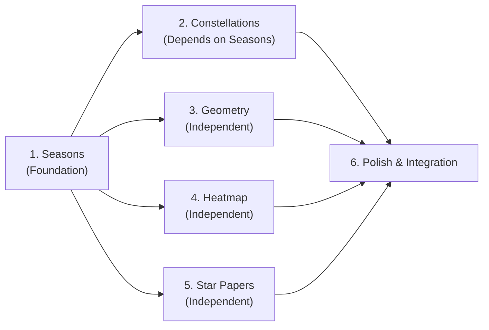

# Phase 9 Implementation Plan — Remaining Async Multiplayer Features

> **Completed:** Authentication (§2), Contributions (§4.2–4.3), Ladder (§4.4), Ladder Plaque UI
> **Remaining:** Seasons (§9), Constellations (§5), Geometry (§6), Heatmap (§7), Star Papers (§8)

---

## Key Design Decisions (Confirmed)

| Decision | Resolution |
|----------|-----------|
| **Aggregation** | Lazy, on-demand. Aggregate tables recomputed during read requests if `last_aggregated_at` > 10 minutes stale. No cron jobs. |
| **Auth on reads** | All endpoints require Bearer token. No public reads. |
| **Profanity filter** | Basic server-side word-blocklist. Elin has adult content; we only filter the worst. |
| **Season duration** | 4 real-world weeks per season. Configurable via `seed_seasons.py` row durations. |
| **Constellation rewards** | Cosmetic title + small crafting material drops (as described in research doc). |
| **Region mapping** | Derived from Elin's `GlobalTile.idBiome` and `EloMap.TileInfo.source.alias` — see Region Mapping section below. |
| **Constellation theming** | Named after Elin's religion domains (Wind, Earth, Element, Harvest, Luck) to anchor in established lore. |

---

## Workflow Structure

The work is organized as a **linear pipeline with parallelizable tracks** identified. Dependencies are explicit.



**Tracks 3, 4, 5 are independent of each other** and can be implemented in any order after Track 1. Track 2 depends on Track 1 (seasons table). Track 6 is final integration.

---

## Region Mapping — Derived from Elin's World Map

After investigating the decompiled source, the best region heuristic uses Elin's existing **`GlobalTile.idBiome`** from the world map. Here's how it works:

**Elin's `EloMap.TileInfo`** (see [EloMap.cs](file:///c:/Users/mcounts/Documents/ElinMods/Elin-Decompiled-main/Elin/EloMap.cs#L30-L87)) provides `source.idBiome` for any world-map coordinate. The `GlobalTile` table ([SourceBlock_GlobalTile.md](file:///c:/Users/mcounts/Documents/ElinMods/elin_readable_game_data/SourceBlock_GlobalTile.md)) maps tile types to biomes:

| GlobalTile alias | idBiome | Our Region ID |
|-----------------|---------|---------------|
| `plain`, `road` | Plain (empty = Plain) | `plains` |
| `forest`, `forest_cherry` | `Forest`, `Forest_cherry` | `forest` |
| `snow`, `snow_edge`, `cliff_snow` | `Snow` | `snowlands` |
| `beach` | `Sand` | `coast` |
| `sea`, `underseas` | `Water`, `Undersea` | `sea` |
| `mountain`, `rock` | `Mud` | `highlands` |

**Client-side resolution** (in `SkyreaderCometClient.cs`):

```csharp
// Zone already carries its Tile via Spatial.Tile (EloMap.TileInfo)
// Zone_Field.IdBiome resolves through Tile.source.idBiome
string biome = EClass._zone.IdBiome; // "Plain", "Forest", "Snow", "Sand", etc.
string regionId = MapBiomeToRegion(biome);

static string MapBiomeToRegion(string biome)
{
    switch (biome)
    {
        case "Forest":
        case "Forest_cherry": return "forest";
        case "Snow": return "snowlands";
        case "Sand": return "coast";
        case "Water":
        case "Undersea": return "sea";
        case "Mud": return "highlands";
        default: return "plains"; // Plain, Underground, Sky, etc.
    }
}
```

For **named towns** (Derphy, Palmia, etc.), fall back to their `parent` zone's world-map coordinates and look up the `GlobalTile` at those coords. The Spatial `x`/`y` fields ([Spatial.cs:L93-L115](file:///c:/Users/mcounts/Documents/ElinMods/Elin-Decompiled-main/Elin/Spatial.cs#L93-L115)) give world-map position directly.

---

## Constellation Theming — Leveraging Elin's Religions

Elin has 12 established patron deities with domain names ([SourceGame_Religion.md](file:///c:/Users/mcounts/Documents/ElinMods/elin_readable_game_data/SourceGame_Religion.md)):

| God | Domain | Our Constellation Name |
|-----|--------|----------------------|
| Lulwy | Wind | **The Gale** |
| Opatos | Earth | **The Mountain** |
| Itzpalt | Element | **The Flame** |
| Kumiromi | Harvest | **The Harvest** |
| Ehekatl | Luck | **The Cat's Eye** |

Each season rotates which 5 constellations are active. The names and flavor texts anchor firmly in Elin's existing mythological vocabulary. This is NOT a religion system — it's purely thematic naming.

---

# Track 1 — Seasonal Sky Phenomena (Foundation)

> **Must be completed first.** Seasons table is the foreign key for Constellations, Geometry, and Heatmap aggregates.

## Server

### [MODIFY] [database.py](file:///c:/Users/mcounts/Documents/ElinMods/SkyreaderGuildServer/database.py)

Add `sky_seasons` table to `init_db()`:

```sql
CREATE TABLE IF NOT EXISTS sky_seasons (
    id TEXT PRIMARY KEY,
    name TEXT NOT NULL,
    description TEXT NOT NULL,
    starts_at TEXT NOT NULL,       -- ISO 8601 UTC
    ends_at TEXT NOT NULL,         -- ISO 8601 UTC
    duration_days INTEGER NOT NULL DEFAULT 28,
    modifiers TEXT NOT NULL DEFAULT '{}'  -- JSON blob
);
CREATE INDEX IF NOT EXISTS idx_season_range ON sky_seasons(starts_at, ends_at);
```

The `modifiers` JSON blob schema:
```json
{
    "meteorChanceMultiplier": 1.3,
    "skysignWeights": { "DimensionalGateway": 1.5, "AstralExposure": 1.0 },
    "yithSpawnBonus": { "Weaver": 0.2 },
    "gpMultiplier": { "Extraction": 1.0, "RiftClear": 1.0, "BossKill": 1.25 },
    "geometryBias": "Star"
}
```

### [NEW] [seasons.py](file:///c:/Users/mcounts/Documents/ElinMods/SkyreaderGuildServer/seasons.py)

FastAPI router at `/sky-season`. **One endpoint**, auth required:

**`GET /sky-season/current`** — Returns the active season. Implementation:

```python
from fastapi import APIRouter, Depends
from auth import get_current_account
import json

router = APIRouter(prefix="/sky-season", tags=["seasons"])

DEFAULT_SEASON = {
    "id": "default",
    "name": "Season of Stars",
    "description": "The heavens hold steady. No particular phenomena dominate the sky.",
    "starts_at": None,
    "ends_at": None,
    "duration_days": 28,
    "modifiers": {}
}

@router.get("/current")
def get_current_season(account=Depends(get_current_account)):
    db = get_db()
    now = datetime.utcnow().isoformat() + "Z"
    row = db.execute(
        "SELECT * FROM sky_seasons WHERE starts_at <= ? AND ends_at > ? LIMIT 1",
        (now, now)
    ).fetchone()
    if row is None:
        return DEFAULT_SEASON
    return {
        "id": row["id"],
        "name": row["name"],
        "description": row["description"],
        "starts_at": row["starts_at"],
        "ends_at": row["ends_at"],
        "duration_days": row["duration_days"],
        "modifiers": json.loads(row["modifiers"])
    }
```

### [NEW] [seed_seasons.py](file:///c:/Users/mcounts/Documents/ElinMods/SkyreaderGuildServer/seed_seasons.py)

CLI script that inserts season rows AND their associated constellations and comet regions. Run manually to populate the DB before/after each season rotation.

**Season definitions** (4 weeks each, configurable via `duration_days`):

```python
SEASONS = [
    {
        "id": "crimson_showers",
        "name": "Season of Crimson Showers",
        "description": "Meteors fall with unusual frequency, their crimson trails painting the night sky.",
        "modifiers": {
            "meteorChanceMultiplier": 1.3,
            "skysignWeights": {"DimensionalGateway": 1.5},
            "geometryBias": "Star"
        }
    },
    {
        "id": "whispering_tides",
        "name": "Season of Whispering Tides",
        "description": "The astral currents shift, carrying the echoes of cleansed starlight further.",
        "modifiers": {
            "gpMultiplier": {"Extraction": 1.2},
            "geometryBias": "Crescent"
        }
    },
    {
        "id": "hollow_eye",
        "name": "Season of the Hollow Eye",
        "description": "Yith incursions intensify. The rift between dimensions feels thin.",
        "modifiers": {
            "gpMultiplier": {"BossKill": 1.25},
            "yithSpawnBonus": {"Weaver": 0.15, "Ancient": 0.1}
        }
    },
    {
        "id": "frozen_radiance",
        "name": "Season of Frozen Radiance",
        "description": "Starlight crystallizes in the cold. Rifts yield geometric perfection.",
        "modifiers": {
            "gpMultiplier": {"RiftClear": 1.15},
            "geometryBias": "Diamond"
        }
    },
]
```

**Comet regions** (seeded alongside seasons, from Elin biome analysis):

```python
COMET_REGIONS = [
    ("plains", "The Plains", "Rolling grassland, roads, and farmland."),
    ("forest", "The Woodlands", "Dense forests and ancient groves."),
    ("snowlands", "The Snowlands", "Frozen tundra and permafrost."),
    ("coast", "The Coast", "Shorelines, beaches, and salt marshes."),
    ("highlands", "The Highlands", "Mountain passes and rocky terrain."),
    ("sea", "The Deep Sea", "Open ocean and underwater ruins."),
]
```

### [MODIFY] [main.py](file:///c:/Users/mcounts/Documents/ElinMods/SkyreaderGuildServer/main.py)

```python
import seasons
app.include_router(seasons.router)
```

---

## Client

### [NEW] [SkyreaderSeasonClient.cs](file:///c:/Users/mcounts/Documents/ElinMods/SkyreaderGuild/SkyreaderSeasonClient.cs)

Manages season data polling and caching. Full implementation detail:

**Fields:**
```csharp
private SkySeason _cachedSeason;
private DateTime _lastFetchedUtc = DateTime.MinValue;
private DateTime _cachedEndsAtUtc = DateTime.MinValue;
private string _lastAnnouncedSeasonId = "";
```

**`RefreshSeasonIfStale()`** — Called from `MeteorSpawnOnDayAdvance.Postfix()`. Fetch conditions:
1. No cache exists (`_cachedSeason == null`), OR
2. Real wall-clock time has passed `_cachedEndsAtUtc`, OR
3. More than 6 real-world hours since last fetch (fallback staleness check).

Uses `SkyreaderAuthManager.SendWithAuthRetryAsync("GET", "/sky-season/current")`.

**`GetCurrentModifiers()`** — Returns cached modifiers or empty defaults. Never blocks. Never throws.

**`SeasonModifiers` class** — POCO with properties:
```csharp
public class SeasonModifiers
{
    public float MeteorChanceMultiplier { get; set; } = 1.0f;
    public Dictionary<string, float> SkysignWeights { get; set; } = new();
    public Dictionary<string, float> YithSpawnBonus { get; set; } = new();
    public Dictionary<string, float> GpMultiplier { get; set; } = new();
    public string GeometryBias { get; set; } = "";
}
```

**`SkySeason` class** — POCO matching the server response:
```csharp
public class SkySeason
{
    public string Id { get; set; }
    public string Name { get; set; }
    public string Description { get; set; }
    public string StartsAt { get; set; }
    public string EndsAt { get; set; }
    public SeasonModifiers Modifiers { get; set; }
}
```

**Resilience**: If fetch fails, log warning, keep existing cache (or defaults). No player-visible error.

### [MODIFY] [SkyreaderGuild.cs](file:///c:/Users/mcounts/Documents/ElinMods/SkyreaderGuild/SkyreaderGuild.cs)

Changes:
1. Add field: `internal static SkyreaderSeasonClient SeasonClient;`
2. In `Awake()`, initialize alongside `LadderClient`:
   ```csharp
   SeasonClient = new SkyreaderSeasonClient(AuthManager, serverUrl, Logger);
   ```
3. Add convenience method:
   ```csharp
   internal static SeasonModifiers GetSeasonModifiers()
       => SeasonClient?.GetCurrentModifiers() ?? new SeasonModifiers();
   ```
4. In `MeteorSpawnOnDayAdvance.Postfix()` (~L632), add:
   ```csharp
   SeasonClient?.RefreshSeasonIfStale();
   ```

### [MODIFY] [MeteorManager.cs](file:///c:/Users/mcounts/Documents/ElinMods/SkyreaderGuild/MeteorManager.cs)

In `TrySpawnMeteor()`, multiply the base meteor chance (`ConfigMeteorBaseChance.Value`) by `SkyreaderGuild.GetSeasonModifiers().MeteorChanceMultiplier`. Cap the multiplied value at 3.0 to prevent pathological server data from breaking gameplay:

```csharp
float baseChance = ConfigMeteorBaseChance.Value;
float seasonMult = Math.Min(SkyreaderGuild.GetSeasonModifiers().MeteorChanceMultiplier, 3.0f);
float adjustedChance = baseChance * seasonMult;
```

### [MODIFY] [SkyreaderGuild.cs — `AstralRiftThemingPatch.SpawnYithPack()`](file:///c:/Users/mcounts/Documents/ElinMods/SkyreaderGuild/SkyreaderGuild.cs#L840-L874)

Read `YithSpawnBonus` from season modifiers. During pack composition, for each Yith tier with a bonus > 0, increase its chance of being selected:

```csharp
var bonuses = SkyreaderGuild.GetSeasonModifiers().YithSpawnBonus;
// When selecting from eligible list, add weighted duplicates for bonus tiers
foreach (var kvp in bonuses)
{
    if (eligible.Contains($"srg_yith_{kvp.Key.ToLower()}"))
    {
        int extra = (int)(kvp.Value * 5); // 0.2 → 1 extra entry
        for (int e = 0; e < extra; e++) eligible.Add($"srg_yith_{kvp.Key.ToLower()}");
    }
}
```

### [MODIFY] [TraitAstralExtractor.cs](file:///c:/Users/mcounts/Documents/ElinMods/SkyreaderGuild/TraitAstralExtractor.cs)

When rolling Skysign effects, read `SkysignWeights` from season modifiers. Adjust the random weight table for each effect type. If a weight of `1.5` is present for `DimensionalGateway`, multiply that outcome's default weight by 1.5.

### [MODIFY] [SkyreaderGuild.cs — `SkyreaderGuildLayoutUpdatePatch.Postfix()`](file:///c:/Users/mcounts/Documents/ElinMods/SkyreaderGuild/SkyreaderGuild.cs#L1337-L1354)

After `GuildLayoutBuilder.UpdateUnlockedLayout()`, check if the season has changed:

```csharp
var season = SeasonClient?.GetCachedSeason();
if (season != null && season.Id != SeasonClient.LastAnnouncedSeasonId)
{
    SeasonClient.LastAnnouncedSeasonId = season.Id;
    Msg.SayRaw($"<color=#b3e0ff>The heavens shift, Skyreader. We have entered the {season.Name}. {season.Description}</color>");
}
```

---

## Arkyn Seasonal Dialog — Python Script Changes

> [!IMPORTANT]
> Arkyn's dialog text is defined in the mod's CharaText row in `SourceCard.xlsx` (the `idText` column on the Chara sheet references `SourceChara_CharaText`). The existing `add_meteor_items.py` script manages all SourceCard rows.

### [MODIFY] [add_meteor_items.py](file:///c:/Users/mcounts/Documents/ElinMods/SkyreaderGuild/worklog/scripts/add_meteor_items.py)

Add the new furniture SourceThing rows to `EXPECTED_THINGS`. For each new interactive furniture item, add an entry following the established pattern (see existing entries like `srg_ladder_plaque` at L461):

```python
# ── Interactive Furniture: Online Features ───────────────────────
"srg_constellation_board": {
    "name_JP": "",
    "name": "constellation board",
    "category": "deco",
    "_tileType": "ObjBig",
    "_idRenderData": "@obj",
    "tiles": 1552,
    "defMat": "oak",
    "value": 3000,
    "LV": 15,
    "chance": 0,
    "quality": 3,
    "weight": 5000,
    "trait": "ConstellationBoard",
    "tag": "noShop,noWish",
    "roomName": "Observatory",
    "detail_JP": "",
    "detail": "A board displaying the five patron constellations of the season. Each tells a different cosmic story.",
},
"srg_geometry_orrery": {
    "name_JP": "",
    "name": "geometry orrery",
    "category": "deco",
    "_tileType": "ObjBig",
    "_idRenderData": "@obj",
    "tiles": 1552,
    "defMat": "bronze",
    "value": 4000,
    "LV": 15,
    "chance": 0,
    "quality": 3,
    "weight": 8000,
    "trait": "GeometryOrrery",
    "tag": "noShop,noWish",
    "roomName": "Observatory",
    "detail_JP": "",
    "detail": "A mechanical device tracking the dominant geometry of astral rifts across all Skyreaders.",
},
"srg_comet_heatmap_table": {
    "name_JP": "",
    "name": "comet tracking table",
    "category": "deco",
    "_tileType": "ObjBig",
    "_idRenderData": "@obj",
    "tiles": 1552,
    "defMat": "oak",
    "value": 2500,
    "LV": 10,
    "chance": 0,
    "quality": 3,
    "weight": 6000,
    "trait": "CometHeatmapTable",
    "tag": "noShop,noWish",
    "roomName": "Observatory",
    "detail_JP": "",
    "detail": "A table showing comet contamination levels across the world's regions.",
},
"srg_star_paper_shelf": {
    "name_JP": "",
    "name": "star paper shelf",
    "category": "deco",
    "_tileType": "ObjBig",
    "_idRenderData": "@obj",
    "tiles": 1552,
    "defMat": "oak",
    "value": 2000,
    "LV": 10,
    "chance": 0,
    "quality": 3,
    "weight": 7000,
    "trait": "StarPaperShelf",
    "tag": "noShop,noWish",
    "roomName": "Library",
    "detail_JP": "",
    "detail": "A shelf housing anonymous research notes submitted by Skyreaders across the world.",
},
"srg_star_paper_desk": {
    "name_JP": "",
    "name": "star paper writing desk",
    "category": "deco",
    "_idRenderData": "@obj",
    "tiles": 1552,
    "defMat": "oak",
    "value": 1800,
    "LV": 10,
    "chance": 0,
    "quality": 3,
    "weight": 4000,
    "trait": "StarPaperWritingDesk",
    "tag": "noShop,noWish",
    "roomName": "Library",
    "detail_JP": "",
    "detail": "A writing desk for composing star papers. The ink shimmers faintly.",
},
```

> [!WARNING]
> Per agents.md: SourceThing xlsx cells must use `sharedStrings.xml` (not inline strings), and numeric sort columns must stay numeric/blank. The existing `normalize_shared_strings()` function in `add_meteor_items.py` handles this automatically.

---

## Server Tests

### [NEW] [tests/test_seasons.py](file:///c:/Users/mcounts/Documents/ElinMods/SkyreaderGuildServer/tests/test_seasons.py)

Following the exact pattern of [test_ladder.py](file:///c:/Users/mcounts/Documents/ElinMods/SkyreaderGuildServer/tests/test_ladder.py):

- `test_current_season_with_active_row` — Insert a season covering `now()`, register+auth, verify `GET /sky-season/current` returns it.
- `test_current_season_with_no_active_row` — Verify default season is returned (no 404/500).
- `test_season_modifiers_are_valid_json` — Verify the modifiers field round-trips correctly.
- `test_unauthenticated_returns_401` — Verify unauthenticated access is rejected.

---

# Track 2 — Constellation Allegiances (Depends on Track 1)

## Server

### [MODIFY] [database.py](file:///c:/Users/mcounts/Documents/ElinMods/SkyreaderGuildServer/database.py)

Add tables to `init_db()`:

```sql
CREATE TABLE IF NOT EXISTS constellations (
    id TEXT PRIMARY KEY,
    season_id TEXT NOT NULL REFERENCES sky_seasons(id),
    name TEXT NOT NULL,
    description TEXT NOT NULL,
    lore_domain TEXT NOT NULL DEFAULT '',  -- Elin religion domain reference
    goal_config TEXT NOT NULL DEFAULT '{}'  -- JSON: {"Extraction": 150000, "RiftClear": 80000}
);

CREATE TABLE IF NOT EXISTS constellation_memberships (
    player_id TEXT NOT NULL REFERENCES guild_accounts(id) ON DELETE CASCADE,
    constellation_id TEXT NOT NULL REFERENCES constellations(id) ON DELETE CASCADE,
    joined_at TEXT NOT NULL,
    PRIMARY KEY (player_id, constellation_id)
);

CREATE TABLE IF NOT EXISTS constellation_progress (
    constellation_id TEXT NOT NULL REFERENCES constellations(id) ON DELETE CASCADE,
    metric_type TEXT NOT NULL,
    current_amount INTEGER NOT NULL DEFAULT 0,
    last_aggregated_at TEXT NOT NULL,
    PRIMARY KEY (constellation_id, metric_type)
);
```

### [NEW] [constellations.py](file:///c:/Users/mcounts/Documents/ElinMods/SkyreaderGuildServer/constellations.py)

Router at `/constellations`. **All endpoints require auth.**

**`GET /constellations/current`** — Auth required. Returns all constellations for the current season with aggregate progress. Implementation:

1. Look up current season (same query as `seasons.py`).
2. If no active season, return `{"season_id": null, "constellations": []}`.
3. Fetch all constellations where `season_id` matches.
4. **Lazy aggregation**: For each constellation, check `constellation_progress.last_aggregated_at`. If older than 10 minutes:
   - For each metric in `goal_config`, SUM contributions from all members of that constellation since `season.starts_at`:
     ```sql
     SELECT SUM(ac.amount) FROM astral_contributions ac
     JOIN constellation_memberships cm ON cm.player_id = ac.player_id
     WHERE cm.constellation_id = ? AND ac.type = ? AND ac.submitted_at >= ?
     ```
   - UPDATE `constellation_progress` rows.
5. Check if the authenticated player has a membership for any constellation in this season.
6. Return response:
   ```json
   {
     "season_id": "crimson_showers",
     "season_name": "Season of Crimson Showers",
     "player_constellation_id": "gale_crimson" | null,
     "constellations": [
       {
         "id": "gale_crimson",
         "name": "The Gale",
         "description": "Lulwy's wind scatters the meteor trails...",
         "lore_domain": "Wind",
         "goals": {"Extraction": 150000, "RiftClear": 80000},
         "progress": {"Extraction": 42000, "RiftClear": 15000},
         "member_count": 23,
         "goals_met": false
       }
     ]
   }
   ```

**`POST /constellations/join`** — Auth required. Body: `{ "constellation_id": "gale_crimson" }`.
- Verify the constellation exists and belongs to the current season.
- Check if the player already has a membership for ANY constellation in the current season → HTTP 409.
- Insert `constellation_memberships` row.
- Return `{"joined": true, "constellation_id": "gale_crimson"}`.

### [MODIFY] [main.py](file:///c:/Users/mcounts/Documents/ElinMods/SkyreaderGuildServer/main.py)

```python
import constellations
app.include_router(constellations.router)
```

### [MODIFY] [seed_seasons.py](file:///c:/Users/mcounts/Documents/ElinMods/SkyreaderGuildServer/seed_seasons.py)

Add constellation seeding per season. Example for `crimson_showers`:

```python
CONSTELLATIONS = {
    "crimson_showers": [
        ("gale_crimson", "The Gale", "Lulwy's wind scatters the meteor trails. Followers of the Gale track extraction across storm-swept lands.", "Wind", {"Extraction": 150000}),
        ("mountain_crimson", "The Mountain", "Opatos's endurance. The Mountain stands firm against the crimson rain.", "Earth", {"RiftClear": 80000}),
        ("flame_crimson", "The Flame", "Itzpalt's fire mirrors the meteor showers. Those aligned see magic in the chaos.", "Element", {"Extraction": 100000, "BossKill": 20}),
        ("harvest_crimson", "The Harvest", "Kumiromi's growth feeds on starfall. The Harvest transforms destruction into bounty.", "Harvest", {"Extraction": 120000}),
        ("eye_crimson", "The Cat's Eye", "Ehekatl's luck shines brightest when stars fall. Chance favors the bold.", "Luck", {"RiftClear": 60000, "Extraction": 60000}),
    ],
    # ... repeat for other seasons with different goal mixes
}
```

---

## Client

### [NEW] [SkyreaderConstellationClient.cs](file:///c:/Users/mcounts/Documents/ElinMods/SkyreaderGuild/SkyreaderConstellationClient.cs)

**Fields:**
```csharp
private ConstellationBoardView _cachedView;
private DateTime _lastFetchedUtc = DateTime.MinValue;
private string _playerConstellationId;
```

**Methods:**
- `FetchConstellationsAsync()` — Calls `GET /constellations/current`. Caches for 1 in-game week (same pattern as ladder). Updates `_playerConstellationId`.
- `JoinConstellationAsync(string constellationId)` — Calls `POST /constellations/join`. On success, updates `_playerConstellationId` and forces cache refresh.
- `GetCachedView()` — Returns `_cachedView` or null.
- `HasJoinedThisSeason` — Property checking `_playerConstellationId != null`.

**`ConstellationBoardView`** — POCO matching server response, deserialized via Newtonsoft.Json.

### [NEW] [SkyreaderConstellationDialog.cs](file:///c:/Users/mcounts/Documents/ElinMods/SkyreaderGuild/SkyreaderConstellationDialog.cs)

Two modes, determined by `ConstellationClient.HasJoinedThisSeason`:

**Mode 1 — Choosing** (no constellation for current season):
- Header: "Choose Your Patron Constellation"
- Shows 5 constellation options with `name`, `lore_domain`, `description`.
- Each entry is a clickable `UIButton`. On click → confirmation dialog → `JoinConstellationAsync()`.
- On success, switch to Mode 2.

**Mode 2 — Viewing** (already joined):
- Header: "Constellation Allegiance — [Season Name]"
- Player's constellation highlighted at top.
- For each constellation: name, member_count, progress bar for each goal metric.
- If `goals_met: true`, show: "✦ Goals achieved! The stars have answered." + claim button.
- Claim button grants 3× `srg_meteorite_source` + 25 GP + `Msg.SayRaw` cosmetic title.
- Claim tracked locally via `constellationRewardClaimed_{seasonId}` in the identity file.

Uses `UINote` + `Dialog` pattern identical to [SkyreaderLadderDialog.cs](file:///c:/Users/mcounts/Documents/ElinMods/SkyreaderGuild/SkyreaderLadderDialog.cs).

### [NEW] [TraitConstellationBoard.cs](file:///c:/Users/mcounts/Documents/ElinMods/SkyreaderGuild/TraitConstellationBoard.cs)

```csharp
public class TraitConstellationBoard : TraitItem
{
    public override string LangUse => "View Constellation Board";
    public override bool CanUse(Chara c) => true;
    public override bool OnUse(Chara c)
    {
        SkyreaderConstellationDialog.Open();
        return true;
    }
}
```

### [MODIFY] [GuildLayoutBuilder.cs](file:///c:/Users/mcounts/Documents/ElinMods/SkyreaderGuild/GuildLayoutBuilder.cs)

Add placement in the **Observatory** room (Researcher rank, already exists):
```csharp
new Placement("srg_constellation_board", 22, 39, true, "obs_constellation_board"),
```

---

## Server Tests

### [NEW] [tests/test_constellations.py](file:///c:/Users/mcounts/Documents/ElinMods/SkyreaderGuildServer/tests/test_constellations.py)

- `test_join_constellation_and_view_progress` — Register, seed season+constellations, join, submit contributions, verify progress updates.
- `test_cannot_join_twice_in_same_season` — Join one → attempt join another → HTTP 409.
- `test_lazy_aggregation_updates_progress` — Verify progress is recomputed if stale.
- `test_current_with_no_active_season` — Returns empty list.
- `test_unauthenticated_returns_401`.

---

# Track 3 — Astral Geometry Observation Network (Independent of Track 2)

## Server

### [MODIFY] [database.py](file:///c:/Users/mcounts/Documents/ElinMods/SkyreaderGuildServer/database.py)

Add tables:

```sql
CREATE TABLE IF NOT EXISTS geometry_samples (
    id TEXT PRIMARY KEY,
    player_id TEXT NOT NULL REFERENCES guild_accounts(id) ON DELETE CASCADE,
    danger_band INTEGER NOT NULL,    -- 1-10 (DangerLv / 10, capped)
    shape_type TEXT NOT NULL,
    room_count INTEGER NOT NULL,
    sampled_at TEXT NOT NULL
);
CREATE INDEX IF NOT EXISTS idx_geom_sampled ON geometry_samples(sampled_at);

CREATE TABLE IF NOT EXISTS geometry_aggregates (
    season_id TEXT NOT NULL,
    danger_band INTEGER NOT NULL,
    shape_type TEXT NOT NULL,
    count INTEGER NOT NULL DEFAULT 0,
    last_aggregated_at TEXT NOT NULL,
    PRIMARY KEY (season_id, danger_band, shape_type)
);
```

### [NEW] [geometry.py](file:///c:/Users/mcounts/Documents/ElinMods/SkyreaderGuildServer/geometry.py)

Router at `/geometry`. **All endpoints require auth.**

**Allowed shapes enum** (from [RiftLayoutShaper.cs](file:///c:/Users/mcounts/Documents/ElinMods/SkyreaderGuild/RiftLayoutShaper.cs)):
```python
VALID_SHAPES = {"Circle", "Ellipse", "Diamond", "Crescent", "Cross", "Star", "LShape", "Irregular"}
```

**`POST /geometry/sample`** — Auth required. Body:
```json
{ "danger_band": 3, "shape_type": "Star", "room_count": 5 }
```
Validates `shape_type ∈ VALID_SHAPES` and `1 <= danger_band <= 10`. Generates UUID for `id`. Inserts row.

**`GET /geometry/summary`** — Auth required. Returns aggregate shape distribution. **Lazy aggregation** (10-minute window):

For the current season, group `geometry_samples` by `danger_band` and `shape_type`, COUNT each group, and update `geometry_aggregates`. Return:

```json
{
    "season_name": "Season of Crimson Showers",
    "total_samples": 1500,
    "bands": {
        "1": {"Circle": 0.4, "Star": 0.2, "Diamond": 0.15, "Crescent": 0.1, "Ellipse": 0.08, "Cross": 0.04, "LShape": 0.02, "Irregular": 0.01},
        "2": { ... }
    },
    "dominant_shape": "Star",
    "dominant_flavor": "Star-shaped rifts blaze across the firmament this season.",
    "geometry_bias": "Star"
}
```

`dominant_shape` = shape with highest total count across all bands.

**Flavor text map:**
```python
SHAPE_FLAVORS = {
    "Circle": "Circular rifts suggest cosmic harmony. The spheres are in alignment.",
    "Ellipse": "Elliptical rifts stretch across the void, traces of orbital decay.",
    "Diamond": "Diamond-cut rifts gleam with crystalline precision.",
    "Crescent": "Crescent rifts wax and wane with the astral tides.",
    "Cross": "Cross-shaped rifts mark the intersection of dimensional fault lines.",
    "Star": "Star-shaped rifts blaze across the firmament this season.",
    "LShape": "L-shaped rifts suggest broken symmetry. Something is off-balance.",
    "Irregular": "The rifts defy classification. Chaos reigns in the geometry.",
}
```

### [MODIFY] [main.py](file:///c:/Users/mcounts/Documents/ElinMods/SkyreaderGuildServer/main.py)

```python
import geometry
app.include_router(geometry.router)
```

---

## Client

### [NEW] [SkyreaderGeometryClient.cs](file:///c:/Users/mcounts/Documents/ElinMods/SkyreaderGuild/SkyreaderGeometryClient.cs)

**Sampling** — After `RiftLayoutShaper.Reshape()` completes:
1. Compute `dangerBand = Math.Clamp(zone.DangerLv / 10, 1, 10)`.
2. Get the dominant `shapeType` from the reshape result.
3. Get `roomCount` (already tracked in RiftLayoutShaper).
4. Enqueue a `GeometrySample` locally.
5. Send `POST /geometry/sample` during the next contribution flush.

**Viewing** — `FetchGeometrySummaryAsync()` → `GET /geometry/summary`. Cached for 1 in-game week.

### [MODIFY] [RiftLayoutShaper.cs](file:///c:/Users/mcounts/Documents/ElinMods/SkyreaderGuild/RiftLayoutShaper.cs)

Currently `Reshape()` returns `void`. Modify to track and expose the dominant shape:

1. Add a `lastDominantShape` field (string) and `lastShapedCount` field (int).
2. During the reshape pass, accumulate a `Dictionary<string, int>` of shape→count.
3. After reshaping, set `lastDominantShape` to the shape with highest count.
4. After `Reshape()` returns in `AstralRiftThemingPatch.Postfix()`, call:
   ```csharp
   SkyreaderGuild.EnqueueGeometrySample(
       zone.DangerLv,
       RiftLayoutShaper.LastDominantShape,
       RiftLayoutShaper.LastShapedCount
   );
   ```

### [NEW] [SkyreaderGeometryDialog.cs](file:///c:/Users/mcounts/Documents/ElinMods/SkyreaderGuild/SkyreaderGeometryDialog.cs)

Shows the Geometry Orrery UI:
- Header: "Astral Geometry Observation Network — [Season Name]"
- Per-shape bar chart showing global share percentage.
- Dominant shape highlighted with its flavor text.
- If season `geometryBias` matches dominant shape, show: "The cosmos resonates with this season's alignment."
- Total sample count shown.

### [NEW] [TraitGeometryOrrery.cs](file:///c:/Users/mcounts/Documents/ElinMods/SkyreaderGuild/TraitGeometryOrrery.cs)

```csharp
public class TraitGeometryOrrery : TraitItem
{
    public override string LangUse => "Observe the Geometry Orrery";
    public override bool CanUse(Chara c) => true;
    public override bool OnUse(Chara c)
    {
        SkyreaderGeometryDialog.Open();
        return true;
    }
}
```

### [MODIFY] [GuildLayoutBuilder.cs](file:///c:/Users/mcounts/Documents/ElinMods/SkyreaderGuild/GuildLayoutBuilder.cs)

Add placement in **Observatory** room:
```csharp
new Placement("srg_geometry_orrery", 27, 39, true, "obs_geometry_orrery"),
```

### Optional: Geometry Resonance Hook

In `AstralRiftThemingPatch.Postfix()`, if the season's `geometryBias` shape's global share crosses 50% in the player's danger band:
- Increase that shape's weight in `RiftLayoutShaper.SelectShape()`.
- Display: `"The rift shudders in geometric resonance..."`.

---

## Server Tests

### [NEW] [tests/test_geometry.py](file:///c:/Users/mcounts/Documents/ElinMods/SkyreaderGuildServer/tests/test_geometry.py)

- `test_submit_sample_and_fetch_summary`
- `test_invalid_shape_type_rejected` — Verify HTTP 422 for non-enum shapes.
- `test_lazy_aggregation`
- `test_dominant_shape_calculation`
- `test_unauthenticated_returns_401`

---

# Track 4 — Comet-Touched Heatmap (Independent of Track 2)

## Server

### [MODIFY] [database.py](file:///c:/Users/mcounts/Documents/ElinMods/SkyreaderGuildServer/database.py)

Add tables:

```sql
CREATE TABLE IF NOT EXISTS comet_regions (
    id TEXT PRIMARY KEY,
    name TEXT NOT NULL,
    description TEXT NOT NULL
);

CREATE TABLE IF NOT EXISTS comet_heat_reports (
    id TEXT PRIMARY KEY,
    player_id TEXT NOT NULL REFERENCES guild_accounts(id) ON DELETE CASCADE,
    region_id TEXT NOT NULL REFERENCES comet_regions(id),
    touched_count INTEGER NOT NULL DEFAULT 0,
    cleansed_count INTEGER NOT NULL DEFAULT 0,
    reported_at TEXT NOT NULL
);

CREATE TABLE IF NOT EXISTS comet_heat_buckets (
    season_id TEXT NOT NULL,
    region_id TEXT NOT NULL REFERENCES comet_regions(id),
    touched_reports INTEGER NOT NULL DEFAULT 0,
    cleansed_reports INTEGER NOT NULL DEFAULT 0,
    last_aggregated_at TEXT NOT NULL,
    PRIMARY KEY (season_id, region_id)
);
```

### [NEW] [comet.py](file:///c:/Users/mcounts/Documents/ElinMods/SkyreaderGuildServer/comet.py)

Router at `/comet`. **All endpoints require auth.**

**`POST /comet/report`** — Auth required. Body:
```json
{ "region_id": "forest", "touched_count": 3, "cleansed_count": 2 }
```
Validates `region_id` exists in `comet_regions`. Inserts a report row with UUID id.

**`GET /comet/heatmap`** — Auth required. **Lazy aggregation** (10 min):

```json
{
    "season_name": "Season of Crimson Showers",
    "regions": [
        {
            "id": "plains",
            "name": "The Plains",
            "touched": 1000,
            "cleansed": 800,
            "ratio": 0.8,
            "status": "Calm"
        }
    ]
}
```

**Status tiers** based on `cleansed / max(touched, 1)`:
- ≥ 0.8 → `"Calm"` 🟢
- ≥ 0.5 → `"Stirring"` 🟡
- ≥ 0.2 → `"Troubled"` 🟠
- < 0.2 → `"Overrun"` 🔴

### [MODIFY] [main.py](file:///c:/Users/mcounts/Documents/ElinMods/SkyreaderGuildServer/main.py)

```python
import comet
app.include_router(comet.router)
```

---

## Client

### [NEW] [SkyreaderCometClient.cs](file:///c:/Users/mcounts/Documents/ElinMods/SkyreaderGuild/SkyreaderCometClient.cs)

**Region detection** — Uses the biome mapping from the Region Mapping section above:

```csharp
private string GetCurrentRegionId()
{
    string biome = EClass._zone?.IdBiome ?? "Plain";
    return MapBiomeToRegion(biome);
}
```

**Session tracking** — Two per-region counters:
```csharp
private Dictionary<string, int> _touchedDelta = new();
private Dictionary<string, int> _cleansedDelta = new();
```

- `IncrementTouched(string regionId, int count)` — Called from `TagMeteorTouchedOnCivilizedVisit.Postfix()`.
- `IncrementCleansed(string regionId, int count)` — Called from `TraitAstralExtractor` after cleansing.

**Reporting** — `FlushHeatReports()` called:
1. On region change (when `GetCurrentRegionId()` differs from last known value).
2. On day boundary (piggyback on `MeteorSpawnOnDayAdvance`).
3. On guild HQ visit.

For each region with non-zero deltas, sends `POST /comet/report` and resets counters.

**Viewing** — `FetchHeatmapAsync()` → `GET /comet/heatmap`. Cached for 1 in-game week.

### [MODIFY] [SkyreaderGuild.cs](file:///c:/Users/mcounts/Documents/ElinMods/SkyreaderGuild/SkyreaderGuild.cs)

1. Add `internal static SkyreaderCometClient CometClient;`
2. Initialize in `Awake()`.
3. In `TagMeteorTouchedOnCivilizedVisit.Postfix()`, after tagging touched targets:
   ```csharp
   CometClient?.IncrementTouched(CometClient.GetCurrentRegionId(), taggedCount);
   ```
4. In `FlushLadderContributions()`, also call `CometClient?.FlushHeatReports()`.

### [MODIFY] [TraitAstralExtractor.cs](file:///c:/Users/mcounts/Documents/ElinMods/SkyreaderGuild/TraitAstralExtractor.cs)

After successfully cleansing a target, call:
```csharp
SkyreaderGuild.CometClient?.IncrementCleansed(
    SkyreaderGuild.CometClient.GetCurrentRegionId(), 1);
```

### [NEW] [SkyreaderHeatmapDialog.cs](file:///c:/Users/mcounts/Documents/ElinMods/SkyreaderGuild/SkyreaderHeatmapDialog.cs)

Displays the heatmap as a region list:
- Header: "Comet Contamination Report — [Season Name]"
- Per region: name, status icon (🟢/🟡/🟠/🔴), touched vs cleansed counts.
- Player's current region highlighted.
- Bottom text: "Your extractions contribute to your region's purity."

### [NEW] [TraitCometHeatmapTable.cs](file:///c:/Users/mcounts/Documents/ElinMods/SkyreaderGuild/TraitCometHeatmapTable.cs)

```csharp
public class TraitCometHeatmapTable : TraitItem
{
    public override string LangUse => "View Comet Heatmap";
    public override bool CanUse(Chara c) => true;
    public override bool OnUse(Chara c)
    {
        SkyreaderHeatmapDialog.Open();
        return true;
    }
}
```

### [MODIFY] [GuildLayoutBuilder.cs](file:///c:/Users/mcounts/Documents/ElinMods/SkyreaderGuild/GuildLayoutBuilder.cs)

Add placement in the **Atrium** room (Wanderer rank):
```csharp
new Placement("srg_comet_heatmap_table", 19, 27, true, "atrium_comet_heatmap_table"),
```

### Feedback Hooks

In `TagMeteorTouchedOnCivilizedVisit.Postfix()`, after entering a civilized zone, check the heatmap cache for the current region:
- `"Calm"` → no message
- `"Stirring"` → `"Starlight traces cling to the air here. The region stirs."`
- `"Troubled"` → `"The celestial contamination here is heavy. Touched entities are common."`
- `"Overrun"` → `"The stars weep over this land. Contamination is severe."` + boost `ConfigMeteorTouchedTagChance` by +15%.

---

## Server Tests

### [NEW] [tests/test_comet.py](file:///c:/Users/mcounts/Documents/ElinMods/SkyreaderGuildServer/tests/test_comet.py)

- `test_report_and_fetch_heatmap`
- `test_status_tiers` — Verify all 4 status mappings.
- `test_lazy_aggregation`
- `test_unknown_region_rejected` — Verify HTTP 422 for invalid region_id.
- `test_unauthenticated_returns_401`

---

# Track 5 — Star Papers & Guild Library (Independent of Track 2)

## Server

### [MODIFY] [database.py](file:///c:/Users/mcounts/Documents/ElinMods/SkyreaderGuildServer/database.py)

Add tables:

```sql
CREATE TABLE IF NOT EXISTS research_notes (
    id TEXT PRIMARY KEY,
    player_id TEXT NOT NULL REFERENCES guild_accounts(id) ON DELETE CASCADE,
    title TEXT NOT NULL,
    body TEXT NOT NULL,
    created_at TEXT NOT NULL,
    rating INTEGER NOT NULL DEFAULT 0
);
CREATE INDEX IF NOT EXISTS idx_notes_rating ON research_notes(rating DESC);

CREATE TABLE IF NOT EXISTS research_note_ratings (
    player_id TEXT NOT NULL REFERENCES guild_accounts(id) ON DELETE CASCADE,
    note_id TEXT NOT NULL REFERENCES research_notes(id) ON DELETE CASCADE,
    value INTEGER NOT NULL,       -- 1 or -1
    rated_at TEXT NOT NULL,
    PRIMARY KEY (player_id, note_id)
);

CREATE TABLE IF NOT EXISTS research_note_pulls (
    player_id TEXT NOT NULL REFERENCES guild_accounts(id) ON DELETE CASCADE,
    note_id TEXT NOT NULL REFERENCES research_notes(id) ON DELETE CASCADE,
    pulled_at TEXT NOT NULL,
    PRIMARY KEY (player_id, note_id)
);
```

### [NEW] [research_notes.py](file:///c:/Users/mcounts/Documents/ElinMods/SkyreaderGuildServer/research_notes.py)

Router at `/research-notes`. **All endpoints require auth.**

**Profanity blocklist** — Basic minimum viable filter:
```python
BLOCKED_WORDS = {"fuck", "shit", "nigger", "faggot", "retard", "kike", "cunt"}
# Only the most extreme slurs. Elin itself has adult content.

def check_profanity(text: str) -> bool:
    words = set(text.lower().split())
    return bool(words & BLOCKED_WORDS)
```

**`POST /research-notes/create`** — Auth required. Body: `{ "title": "...", "body": "..." }`.
- Validates: `3 <= len(title) <= 80`, `10 <= len(body) <= 800`.
- Profanity check on both fields → HTTP 400 if matched.
- Rate limit: `COUNT(*) FROM research_notes WHERE player_id = ? AND created_at >= ?` (start of UTC day) — max 3 per day → HTTP 429.
- Generates UUID for `id`. Inserts row.
- Returns `{"id": "...", "created": true}`.

**`GET /research-notes/pull?limit=5`** — Auth required. Returns up to `limit` (max 10) notes the player hasn't seen, excluding own notes, preferring higher-rated:

```sql
SELECT rn.* FROM research_notes rn
WHERE rn.id NOT IN (SELECT note_id FROM research_note_pulls WHERE player_id = ?)
  AND rn.player_id != ?
ORDER BY rn.rating DESC, rn.created_at DESC
LIMIT ?
```

Also inserts `research_note_pulls` rows for each returned note to prevent re-serving.

**`POST /research-notes/rate`** — Auth required. Body: `{ "note_id": "...", "value": 1 }` where `value ∈ {1, -1}`.
- Upserts `research_note_ratings` (one per player per note).
- After upsert, recalculates: `UPDATE research_notes SET rating = (SELECT COALESCE(SUM(value), 0) FROM research_note_ratings WHERE note_id = ?) WHERE id = ?`
- Returns `{"rated": true, "new_rating": 5}`.

### [MODIFY] [main.py](file:///c:/Users/mcounts/Documents/ElinMods/SkyreaderGuildServer/main.py)

```python
import research_notes
app.include_router(research_notes.router)
```

---

## Client

### [NEW] [SkyreaderStarPaperClient.cs](file:///c:/Users/mcounts/Documents/ElinMods/SkyreaderGuild/SkyreaderStarPaperClient.cs)

**Writing:**
- `SubmitStarPaperAsync(string title, string body)` → `POST /research-notes/create`.
- On success: grant 25 GP via `AddGuildPoints()`, enqueue an `Extraction` contribution for ladder, create an in-game `srg_star_paper_copy` item in inventory (cosmetic keepsake).

**Reading:**
- `PullStarPapersAsync()` → `GET /research-notes/pull?limit=5`. Stores results in memory.
- Called once per in-game week when visiting Guild HQ.
- `GetCachedPapers()` returns the list.

**Rating:**
- `RateStarPaperAsync(string noteId, int value)` → `POST /research-notes/rate`.

### [NEW] [SkyreaderStarPaperWriteDialog.cs](file:///c:/Users/mcounts/Documents/ElinMods/SkyreaderGuild/SkyreaderStarPaperWriteDialog.cs)

Text-entry UI for composing a star paper:
- Title field (max 80 chars) via Elin's `Dialog.InputName()`.
- Body field (max 800 chars) via a second `Dialog.InputName()` or multi-line input if available.
- "Submit Star Paper" confirmation.
- On success: `Msg.SayRaw("Your star paper has been submitted to the Guild Library.")` + GP award.
- **Rank gate**: Requires `Understander` rank.

### [NEW] [SkyreaderStarPaperReadDialog.cs](file:///c:/Users/mcounts/Documents/ElinMods/SkyreaderGuild/SkyreaderStarPaperReadDialog.cs)

Shows pulled star papers:
- Header: "Guild Library — Star Papers"
- List of papers with title, body preview (first 100 chars), and current rating.
- "Read Full Paper" expands to show full body.
- "Mark as Insightful" (rate +1) / "Dismiss" (rate -1) buttons.
- Rating updates are fire-and-forget.

### [NEW] [TraitStarPaperShelf.cs](file:///c:/Users/mcounts/Documents/ElinMods/SkyreaderGuild/TraitStarPaperShelf.cs)

```csharp
public class TraitStarPaperShelf : TraitItem
{
    public override string LangUse => "Browse Star Papers";
    public override bool CanUse(Chara c) => true;
    public override bool OnUse(Chara c)
    {
        SkyreaderStarPaperReadDialog.Open();
        return true;
    }
}
```

### [NEW] [TraitStarPaperWritingDesk.cs](file:///c:/Users/mcounts/Documents/ElinMods/SkyreaderGuild/TraitStarPaperWritingDesk.cs)

```csharp
public class TraitStarPaperWritingDesk : TraitItem
{
    public override string LangUse => "Write a Star Paper";
    public override bool CanUse(Chara c)
    {
        var quest = EClass.game.quests.Get<QuestSkyreader>();
        return quest != null && quest.GetCurrentRank() >= GuildRank.Understander;
    }
    public override bool OnUse(Chara c)
    {
        if (!CanUse(c))
        {
            Msg.SayRaw("You must achieve the rank of Understander to contribute star papers.");
            return false;
        }
        SkyreaderStarPaperWriteDialog.Open();
        return true;
    }
}
```

### [MODIFY] [GuildLayoutBuilder.cs](file:///c:/Users/mcounts/Documents/ElinMods/SkyreaderGuild/GuildLayoutBuilder.cs)

Two placements:
- **Atrium** (Wanderer rank — reading shelf accessible to all):
  ```csharp
  new Placement("srg_star_paper_shelf", 23, 20, true, "atrium_star_paper_shelf"),
  ```
- **Study Hall** (Seeker rank — writing desk physically accessible, but rank-gated by trait):
  ```csharp
  new Placement("srg_star_paper_desk", 14, 13, true, "study_star_paper_desk"),
  ```

---

## Server Tests

### [NEW] [tests/test_research_notes.py](file:///c:/Users/mcounts/Documents/ElinMods/SkyreaderGuildServer/tests/test_research_notes.py)

- `test_create_and_pull_note` — Create note, pull as different player, verify content.
- `test_profanity_filter_rejects` — Create with blocked word → HTTP 400.
- `test_rate_limit_per_day` — Create 3 notes → OK. 4th → HTTP 429.
- `test_rating_updates_score` — Rate +1, verify rating increased.
- `test_pull_excludes_own_notes` — Player's own notes not returned in pull.
- `test_pull_excludes_already_pulled` — Same pull twice returns different notes.
- `test_unauthenticated_returns_401`.

---

# Track 6 — Polish & Integration

## Seasonal HQ Decorations

### [MODIFY] [GuildLayoutBuilder.cs](file:///c:/Users/mcounts/Documents/ElinMods/SkyreaderGuild/GuildLayoutBuilder.cs)

Add `DecorateForSeason(Zone zone, string seasonId)` method:

- Called from both `Build()` and `UpdateUnlockedLayout()`.
- Swaps decorative elements in the Atrium based on the cached season:
  - `"crimson_showers"` → Use existing vanilla crystal items with `defMat` override to "ruby" or "rubinus". Red-tinted lighting.
  - `"whispering_tides"` → "sapphire" material crystals. Blue-tinted banners.
  - `"hollow_eye"` → "obsidian" material. Dark crystals.
  - `"frozen_radiance"` → "diamond" material. Ice-white accents.
- If no active season or season is "default", use neutral "glass" material decorations.
- Implementation: find existing decoration Things by their placement tag, call `thing.ChangeMaterial(material)`.

## Config Validation

### [MODIFY] [SkyreaderGuild.cs](file:///c:/Users/mcounts/Documents/ElinMods/SkyreaderGuild/SkyreaderGuild.cs)

- All new clients (`SeasonClient`, `ConstellationClient`, `CometClient`, `GeometryClient`, `StarPaperClient`) check `ConfigEnableOnlineFeatures.Value` before executing any network call.
- No new config entries — all new features gated behind the single existing online toggle.
- Add initialization of all 4 new clients in `Awake()`:
  ```csharp
  SeasonClient = new SkyreaderSeasonClient(AuthManager, serverUrl, Logger);
  ConstellationClient = new SkyreaderConstellationClient(AuthManager, serverUrl, Logger);
  GeometryClient = new SkyreaderGeometryClient(AuthManager, serverUrl, Logger);
  CometClient = new SkyreaderCometClient(AuthManager, serverUrl, Logger);
  StarPaperClient = new SkyreaderStarPaperClient(AuthManager, serverUrl, Logger);
  ```

## Asset Pipeline

### [MODIFY] [asset_specs.py](file:///c:/Users/mcounts/Documents/ElinMods/SkyreaderGuild/worklog/scripts/asset_specs.py)

Add entries for all new furniture items:

```python
"srg_constellation_board": furniture("@obj", FURNITURE_CANVAS_LARGE),
"srg_geometry_orrery": furniture("@obj", FURNITURE_CANVAS_LARGE),
"srg_comet_heatmap_table": furniture("@obj", FURNITURE_CANVAS_LARGE),
"srg_star_paper_shelf": furniture("@obj", FURNITURE_CANVAS_LARGE),
"srg_star_paper_desk": furniture("@obj"),
```

### Image Generation

Use the `generate_image` tool to create:
1. `srg_constellation_board` — A wooden board with star map illustrations, constellation lines drawn in gold, mounted on wall brackets.
2. `srg_geometry_orrery` — A bronze mechanical orrery with rotating geometric crystal shapes, gears visible.
3. `srg_comet_heatmap_table` — A wooden table with a glowing world map, regions highlighted in green/yellow/red.
4. `srg_star_paper_shelf` — A bookshelf with glowing scroll tubes and stacked star papers.
5. `srg_star_paper_desk` — A simple writing desk with quill, inkwell, and parchment.

### [MODIFY] [generate_assets.py](file:///c:/Users/mcounts/Documents/ElinMods/SkyreaderGuild/worklog/scripts/generate_assets.py)

Add the 5 new asset IDs to the generation list with appropriate prompts.

## Full SourceThing Summary

All new items needed in `EXPECTED_THINGS` in [add_meteor_items.py](file:///c:/Users/mcounts/Documents/ElinMods/SkyreaderGuild/worklog/scripts/add_meteor_items.py):

| Item ID | Category | Trait Class | _tileType | _idRenderData |
|---------|----------|-------------|-----------|---------------|
| `srg_constellation_board` | `deco` | `ConstellationBoard` | `ObjBig` | `@obj` |
| `srg_geometry_orrery` | `deco` | `GeometryOrrery` | `ObjBig` | `@obj` |
| `srg_comet_heatmap_table` | `deco` | `CometHeatmapTable` | `ObjBig` | `@obj` |
| `srg_star_paper_shelf` | `deco` | `StarPaperShelf` | `ObjBig` | `@obj` |
| `srg_star_paper_desk` | `deco` | `StarPaperWritingDesk` | (default) | `@obj` |

---

## Verification Plan

### Automated Tests

```bash
cd c:\Users\mcounts\Documents\ElinMods\SkyreaderGuildServer
python -m pytest tests/ -v
```

Expected: All existing tests pass + all new test files (6 files, ~30 test cases).

### Build Verification

```bash
cd c:\Users\mcounts\Documents\ElinMods\SkyreaderGuild
dotnet build
```

### In-Game Testing Checklist

For each track, after implementation:

1. **New furniture appears** in the correct room at the correct rank.
2. **Interacting** with each furniture piece opens the correct dialog.
3. **Online features degrade gracefully** when server is offline (no crashes, no player-visible errors, cached data shown).
4. **Season modifiers** actually affect meteor spawn rates, Skysign weights, and Yith spawns.
5. **Constellation join/view** flow works end-to-end.
6. **Geometry sampling** fires after Astral Rift generation and appears in the orrery.
7. **Comet reports** are sent on region change/day boundary.
8. **Star Paper write/read/rate** cycle works end-to-end.
9. **Seasonal decorations** change materials in the Atrium.
10. **Arkyn announces** the new season on first HQ visit after change.

### Browser API Testing

Use FastAPI interactive docs at `http://localhost:8000/docs` to manually verify all endpoints.
